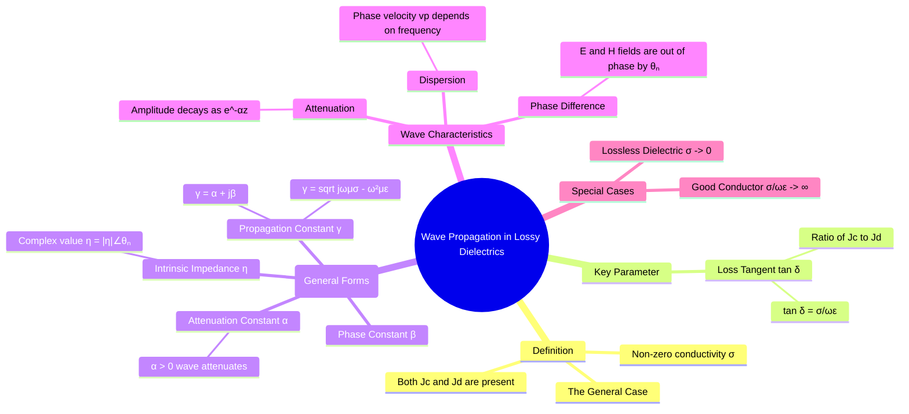

---
tags:
  - electromagnetic-fields
  - wave-propagation
  - dielectrics
  - lossy-media
  - gate
created: 2025-10-17
aliases:
  - Propagation in Imperfect Dielectrics
  - Lossy Dielectric Wave Propagation
subject: "[[Electromagnetic Fields]]"
parent:
  - Electromagnetic Waves
modified: 2026-08-04T10:49:11
---
### Wave Propagation in Lossy Dielectrics
#wave-propagation/lossy-dielectric

> A lossy dielectric is an imperfect dielectric material where the conductivity ($\sigma$) is non-zero but finite. This is the most general case for wave propagation. In such a medium, both conduction current ($\mathbf{J}_c$) and displacement current ($\mathbf{J}_d$) are present and significant. As an electromagnetic wave propagates through a lossy dielectric, its energy is gradually absorbed by the medium and converted into heat due to the conduction current, causing the wave's amplitude to attenuate.

---
#### Characterization: The Loss Tangent ($\tan \delta$)
#loss-tangent

The "lossiness" of a dielectric at a given frequency is characterized by the **loss tangent**, which is the ratio of the magnitude of the conduction current density to the displacement current density.
$$\boxed{\quad \tan \delta = \frac{|\mathbf{J}_c|}{|\mathbf{J}_d|} = \frac{\sigma}{\omega \varepsilon} \quad}$$
-   **Low-loss Dielectric**: If $\tan \delta \ll 1$, the material behaves mostly like a perfect dielectric.
-   **High-loss Dielectric / Quasi-conductor**: If $\tan \delta \gg 1$, the material behaves more like a conductor.

---
#### Wave Parameters in a Lossy Dielectric (General Case)
#wave-parameters/lossy-dielectric

These are the exact, general formulas from which the parameters for all other media types (lossless, conductor) can be derived.

1.  **Propagation Constant ($\gamma$)**:
    This is derived from the full complex expression:
    $$\gamma = \sqrt{j\omega\mu(\sigma + j\omega\varepsilon)}$$
    By separating the real and imaginary parts of $\gamma = \alpha + j\beta$, we get the exact expressions for $\alpha$ and $\beta$.
    -   **Attenuation Constant ($\alpha$)**:
        $$\boxed{\quad \alpha = \omega \sqrt{\frac{\mu\varepsilon}{2} \left[ \sqrt{1 + \left(\frac{\sigma}{\omega\varepsilon}\right)^2} - 1 \right]} \quad}$$
        Since $\sigma > 0$, $\alpha$ is always positive, meaning the wave is always attenuated.
    -   **Phase Constant ($\beta$)**:
        $$\boxed{\quad \beta = \omega \sqrt{\frac{\mu\varepsilon}{2} \left[ \sqrt{1 + \left(\frac{\sigma}{\omega\varepsilon}\right)^2} + 1 \right]} \quad}$$

2.  **Intrinsic Impedance ($\eta$)**:
    The impedance is a complex quantity:
    $$\boxed{\quad \eta = \sqrt{\frac{j\omega\mu}{\sigma + j\omega\varepsilon}} = \frac{\sqrt{\mu/\varepsilon}}{\sqrt{1 - j(\sigma/\omega\varepsilon)}} \quad}$$
    It can be written in polar form as $\eta = |\eta| \angle \theta_\eta$.
    -   **Magnitude $|\eta|$**: Determines the ratio of $|\mathbf{E}|$ to $|\mathbf{H}|$.
    -   **Phase Angle $\theta_\eta$**: Represents the angle by which the electric field $\mathbf{E}$ leads the magnetic field $\mathbf{H}$ in time. $0^\circ < \theta_\eta < 45^\circ$.

3.  **Phase Velocity ($v_p$)**:
    $$v_p = \frac{\omega}{\beta}$$
    Since $\beta$ is not a linear function of $\omega$, the phase velocity is frequency-dependent. Therefore, a lossy dielectric is a **dispersive medium**.

---
#### Special Cases Derived from the General Forms

The general equations for $\alpha$, $\beta$, and $\eta$ can be simplified for the ideal cases:

1.  **For a Lossless Dielectric ($\sigma = 0 \implies \tan \delta = 0$)**:
    -   $\alpha = \omega \sqrt{\frac{\mu\varepsilon}{2} [ \sqrt{1} - 1 ]} = 0$
    -   $\beta = \omega \sqrt{\frac{\mu\varepsilon}{2} [ \sqrt{1} + 1 ]} = \omega\sqrt{\mu\varepsilon}$
    -   $\eta = \sqrt{\frac{\mu}{\varepsilon}}$

2.  **For a Good Conductor ($\sigma/\omega\varepsilon \gg 1$)**:
    -   The square root term becomes $\sqrt{(\sigma/\omega\varepsilon)^2} = \sigma/\omega\varepsilon$.
    -   $\alpha \approx \omega \sqrt{\frac{\mu\varepsilon}{2} \left[ \frac{\sigma}{\omega\varepsilon} \right]} = \sqrt{\frac{\omega\mu\sigma}{2}}$
    -   $\beta \approx \omega \sqrt{\frac{\mu\varepsilon}{2} \left[ \frac{\sigma}{\omega\varepsilon} \right]} = \sqrt{\frac{\omega\mu\sigma}{2}}$
    -   $\eta \approx \sqrt{\frac{j\omega\mu}{\sigma}} = (1+j)\sqrt{\frac{\omega\mu}{2\sigma}}$

These results match the specific formulas for lossless dielectrics and good conductors, showing that the lossy dielectric is the unifying, general case.

---
### Related Concepts
#topic/related-concepts

> [[Electromagnetic Waves]]

[[Wave Propagation in Good Conductors]]
[[Wave Propagation in Lossless Dielectrics]]
[[Wave Propagation in Free Space]]
[[Uniform Plane Waves]]
[[Propagation Constant, Attenuation Constant, and Phase Constant]]
[[Intrinsic Impedance of a Medium]]
[[Conduction Current vs. Displacement Current]]