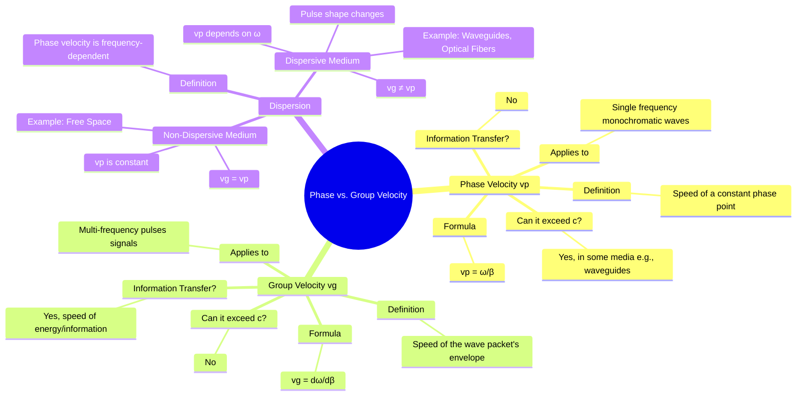

---
tags:
  - electromagnetic-fields
  - wave-propagation
  - dispersion
  - velocity
  - gate
created: 2025-10-17
aliases:
  - Phase and Group Velocity
  - vp and vg
subject: "[[Electromagnetic Fields]]"
parent:
  - Electromagnetic Waves
modified: 2026-08-04T10:11:30
---
### Phase Velocity and Group Velocity
#phase-velocity #group-velocity #dispersion

> In the study of wave propagation, it is crucial to distinguish between two types of velocity: **phase velocity**, which describes the speed of a single-frequency wave's phase, and **group velocity**, which describes the speed of a multi-frequency wave packet's envelope. Group velocity represents the speed at which information and energy are transmitted.

---
#### Phase Velocity ($v_p$)
#phase-velocity

The **phase velocity** is the rate at which the phase of a monochromatic (single-frequency) wave propagates in space. It is the speed of a point of constant phase, such as the crest of the wave.

It is defined as the ratio of the angular frequency ($\omega$) to the phase constant ($\beta$):
$$\boxed{\quad v_p = \frac{\omega}{\beta} \quad}$$
- For a wave described by $\cos(\omega t - \beta z)$, the phase is constant when $\omega t - \beta z = \text{const}$. Differentiating with respect to time gives $\omega - \beta(dz/dt) = 0$, so the velocity $dz/dt$ is $v_p = \omega/\beta$.
- In a lossless medium, $v_p = 1/\sqrt{\mu\varepsilon}$.
- **Important Note**: Phase velocity can be greater than the speed of light `c` in some media (e.g., inside a waveguide or certain plasmas). This does not violate the theory of relativity because a pure monochromatic wave extends infinitely in time and space and cannot carry information.

---
#### Group Velocity ($v_g$)
#group-velocity

The **group velocity** is the velocity with which the overall shape of the wave's amplitude (its envelope) propagates. This wave packet is formed by the superposition of waves of slightly different frequencies. Since any signal that carries information must have a finite duration (and thus be composed of multiple frequencies), group velocity represents the actual speed of information and energy transfer.

It is defined as the derivative of the angular frequency with respect to the phase constant:
$$\boxed{\quad v_g = \frac{d\omega}{d\beta} \quad}$$
- Group velocity can never exceed the speed of light, $v_g \le c$.

---
#### Dispersion
#dispersion

The relationship between phase and group velocity is determined by whether the medium is dispersive or non-dispersive.

-   **Non-Dispersive Medium**: A medium in which the phase velocity is independent of frequency ($v_p = \text{constant}$). In this case, the phase constant is a linear function of frequency, $\beta = \omega/v_p$.
    -   Examples: Free space, ideal lossless dielectrics.
    -   In a non-dispersive medium:
        $$v_g = \frac{d\omega}{d\beta} = \frac{d(v_p \beta)}{d\beta} = v_p$$
    -   **Result**: All frequency components travel at the same speed, so the wave packet propagates without changing its shape. Here, $v_g = v_p$.

-   **Dispersive Medium**: A medium in which the phase velocity is a function of frequency ($v_p(\omega)$).
    -   Examples: Lossy dielectrics, waveguides, optical fibers, water waves.
    -   In a dispersive medium, $v_g \neq v_p$.
    -   **Result**: Different frequency components of a signal travel at different speeds, causing the wave packet to spread out and change its shape over time. This phenomenon is called **dispersion**.

---
#### Relationship Between Phase and Group Velocity
#velocity-relationship

The general relationship between group and phase velocity can be found by applying the chain rule to the definition of $v_g$:
$$v_g = \frac{d\omega}{d\beta} = \frac{d(\beta v_p)}{d\beta} = v_p + \beta \frac{dv_p}{d\beta}$$
This shows that $v_g$ and $v_p$ are only equal if $dv_p/d\beta = 0$, which is the condition for a non-dispersive medium.

An alternative useful form is:
$$\boxed{\quad v_g = v_p - \lambda \frac{dv_p}{d\lambda} \quad}$$
-   **Normal Dispersion**: $dv_p/d\lambda < 0$ (velocity decreases as wavelength increases). In this case, $v_g < v_p$. This is common for light passing through glass.
-   **Anomalous Dispersion**: $dv_p/d\lambda > 0$ (velocity increases as wavelength increases). In this case, $v_g > v_p$.

---
### Related Concepts
#topic/related-concepts

> [[Propagation Constant, Attenuation Constant, and Phase Constant]]

[[Uniform Plane Waves]]
[[Wave Propagation in Lossy Dielectrics]]
[[Waveguides]]
[[Optical Fibers]]
[[Signal & Systems]]
