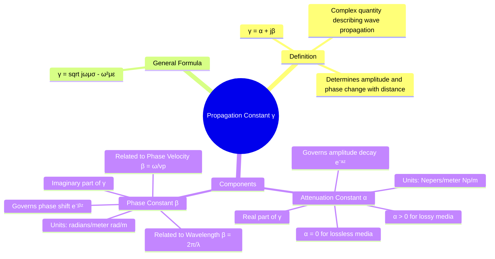

---
tags:
  - electromagnetic-fields
  - wave-propagation
  - gate
created: 2025-10-17
aliases:
  - Propagation Constant
  - γ, α, β
  - Attenuation Constant
  - Phase Constant
subject: "[[Electromagnetic Fields]]"
parent:
  - Electromagnetic Waves
modified: 2026-08-04T10:18:11
---
### Propagation Constant, Attenuation Constant, and Phase Constant
#propagation-constant #attenuation-constant #phase-constant

> The **Propagation Constant ($\gamma$)** is a complex quantity that characterizes how an electromagnetic wave's amplitude and phase change as it propagates through a medium. It is one of the most important parameters in wave analysis, as its real and imaginary parts—the **Attenuation Constant ($\alpha$)** and the **Phase Constant ($\beta$)**—respectively describe the wave's decay and phase shift with distance.

---
#### The Propagation Constant ($\gamma$)
#propagation-constant

The propagation constant, $\gamma$, appears in the phasor representation of a uniform plane wave, for example, one traveling in the $+z$ direction:
$$\mathbf{E}(z) = E_0 e^{-\gamma z} \mathbf{\hat{a}}_x$$
It is a complex number defined as:
$$\gamma = \alpha + j\beta$$
The general formula for the propagation constant, derived from the wave equation for a general lossy medium, is:
$$\boxed{\quad \gamma = \sqrt{j\omega\mu(\sigma + j\omega\varepsilon)} \quad}$$

---
#### Attenuation Constant ($\alpha$)
#attenuation-constant

The **Attenuation Constant ($\alpha$)** is the **real part** of the propagation constant $\gamma$.
-   **Physical Meaning**: It measures the rate at which the wave's amplitude decreases as it propagates. The amplitude of the wave at a distance $z$ is proportional to $e^{-\alpha z}$.
-   **Units**: Nepers per meter (Np/m). A Neper represents a decay factor of $1/e$. For practical purposes, it's often converted to decibels per meter (dB/m) using the relation: $1 \text{ Np/m} \approx 8.686 \text{ dB/m}$.
-   **Value in Media**:
    -   For **lossless media** (free space, perfect dielectrics), $\sigma = 0$, which results in $\alpha = 0$. The wave propagates with no loss of amplitude.
    -   For **lossy media** (lossy dielectrics, conductors), $\sigma > 0$, which results in $\alpha > 0$. The wave amplitude decays exponentially.
-   **General Formula**:
    $$\boxed{\quad \alpha = \text{Re}\{\gamma\} = \omega \sqrt{\frac{\mu\varepsilon}{2} \left[ \sqrt{1 + \left(\frac{\sigma}{\omega\varepsilon}\right)^2} - 1 \right]} \quad}$$

---
#### Phase Constant ($\beta$)
#phase-constant #wavenumber

The **Phase Constant ($\beta$)** is the **imaginary part** of the propagation constant $\gamma$. It is also known as the **wavenumber**.
-   **Physical Meaning**: It measures the rate of phase shift in radians per unit distance as the wave propagates. The phase of the wave at a distance $z$ includes the term $- \beta z$.
-   **Units**: Radians per meter (rad/m).
-   **Relationship to Wavelength ($\lambda$)**: The wavelength is the distance over which the phase changes by $2\pi$.
    $$\boxed{\quad \beta = \frac{2\pi}{\lambda} \quad}$$
-   **Relationship to Phase Velocity ($v_p$)**: The phase constant links the temporal frequency ($\omega$) to the spatial variation.
    $$\boxed{\quad \beta = \frac{\omega}{v_p} \quad}$$
-   **General Formula**:
    $$\boxed{\quad \beta = \text{Im}\{\gamma\} = \omega \sqrt{\frac{\mu\varepsilon}{2} \left[ \sqrt{1 + \left(\frac{\sigma}{\omega\varepsilon}\right)^2} + 1 \right]} \quad}$$

---
### Summary for Different Media

| Medium Type                | Condition                         | Attenuation Constant ($\alpha$)                     | Phase Constant ($\beta$)                          |
| -------------------------- | --------------------------------- | --------------------------------------------------- | ------------------------------------------------- |
| **Free Space**             | $\sigma=0, \varepsilon=\varepsilon_0, \mu=\mu_0$ | $0$                                                 | $\omega\sqrt{\mu_0\varepsilon_0} = \omega/c$       |
| **Lossless Dielectric**    | $\sigma=0$                        | $0$                                                 | $\omega\sqrt{\mu\varepsilon}$                     |
| **Good Conductor**         | $\sigma/\omega\varepsilon \gg 1$  | $\approx \sqrt{\pi f \mu \sigma}$                     | $\approx \sqrt{\pi f \mu \sigma} \quad (\alpha \approx \beta)$ |
| **Lossy Dielectric**       | General case                      | Exact formula                                       | Exact formula                                     |

---
### Related Concepts
#topic/related-concepts

> [[Electromagnetic Waves]]

[[Uniform Plane Waves]]
[[Phase Velocity and Group Velocity]]
[[Intrinsic Impedance of a Medium]]
[[Wave Propagation in Lossy Dielectrics]]
[[Wave Propagation in Good Conductors]]
[[Wave Propagation in Lossless Dielectrics]]
[[Wave Propagation in Free Space]]
