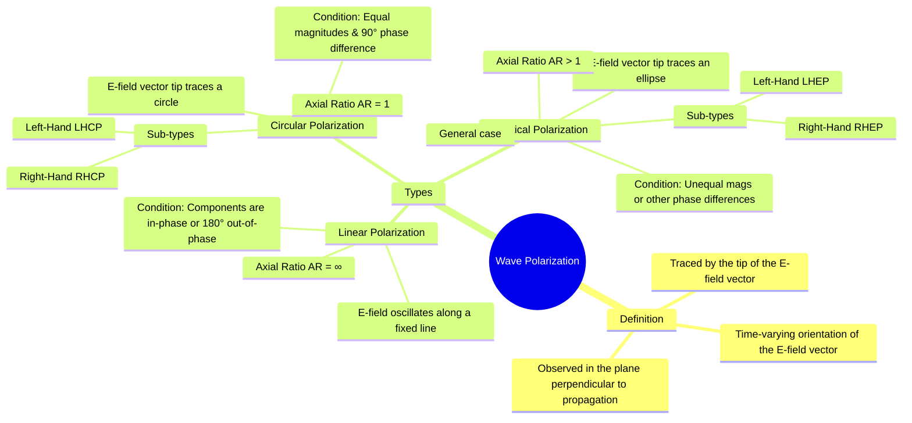

---
tags:
  - electromagnetic-fields
  - wave-propagation
  - polarization
  - gate
created: 2025-10-17
aliases:
  - Polarization
  - Wave Polarization
  - EM Wave Polarization
  - Wave Polarization (Linear, Circular, and Elliptical)
  - "Example : Linear Polarization : Wave Polarization"
subject: "[[Electromagnetic Fields]]"
parent:
  - Electromagnetic Waves
modified: 2026-08-04T10:48:23
---
### Wave Polarization
#wave-polarization

> **Wave Polarization** describes the orientation and time variation of the electric field vector of an electromagnetic wave as it propagates. More specifically, it is the geometric figure (line, circle, or ellipse) traced by the tip of the electric field vector over one cycle, as observed in a fixed plane perpendicular to the direction of propagation.

The magnetic field $\mathbf{H}$ has a corresponding polarization, but by convention, the polarization of the wave is defined by the electric field $\mathbf{E}$.

---
#### Linear Polarization
#linear-polarization

A wave is linearly polarized if the electric field vector is always confined to a single line in the plane of polarization.

-   **Condition**: Occurs if the wave has only one E-field component, or if its two orthogonal transverse components are perfectly **in-phase** (phase difference $\delta=0$) or **180° out-of-phase** ($\delta=\pm\pi$).
-   **Example 1 (Single Component)**:
    $\mathbf{E}(z,t) = E_0 \cos(\omega t - \beta z) \mathbf{\hat{a}}_x$
-   **Example 2 (Two In-Phase Components)**:
    $\mathbf{E}(z,t) = E_{x0} \cos(\omega t - \beta z) \mathbf{\hat{a}}_x + E_{y0} \cos(\omega t - \beta z) \mathbf{\hat{a}}_y$
    This wave is linearly polarized along a line tilted at an angle $\tan^{-1}(E_{y0}/E_{x0})$ with respect to the x-axis.

---
#### Circular Polarization
#circular-polarization

A wave is circularly polarized if the tip of the electric field vector traces a circle in the plane of polarization, rotating with angular frequency $\omega$.

-   **Conditions**:
    1.  The wave has two orthogonal transverse components.
    2.  The magnitudes of the two components are equal ($|E_{x0}| = |E_{y0}| = E_0$).
    3.  The phase difference between the components is exactly $\pm 90^\circ$ ($\delta = \pm \pi/2$).

-   **Right-Hand Circular Polarization (RHCP)**:
    -   **Definition**: The E-field vector rotates **clockwise** as seen by an observer looking in the direction of propagation ($\mathbf{\hat{a}}_k$). (IEEE convention).
    -   **Condition**: The y-component **lags** the x-component by 90° ($\delta = -\pi/2$).
    -   **Equation**: $\mathbf{E}(z,t) = E_0[\cos(\omega t - \beta z)\mathbf{\hat{a}}_x + \cos(\omega t - \beta z - \pi/2)\mathbf{\hat{a}}_y] = E_0[\cos(\omega t - \beta z)\mathbf{\hat{a}}_x + \sin(\omega t - \beta z)\mathbf{\hat{a}}_y]$

-   **Left-Hand Circular Polarization (LHCP)**:
    -   **Definition**: The E-field vector rotates **counter-clockwise** as seen by an observer looking in the direction of propagation.
    -   **Condition**: The y-component **leads** the x-component by 90° ($\delta = +\pi/2$).
    -   **Equation**: $\mathbf{E}(z,t) = E_0[\cos(\omega t - \beta z)\mathbf{\hat{a}}_x + \cos(\omega t - \beta z + \pi/2)\mathbf{\hat{a}}_y] = E_0[\cos(\omega t - \beta z)\mathbf{\hat{a}}_x - \sin(\omega t - \beta z)\mathbf{\hat{a}}_y]$

---
#### Elliptical Polarization
#elliptical-polarization

A wave is elliptically polarized if the tip of the electric field vector traces an ellipse. This is the most general state of polarization.

-   **Condition**: It occurs under any conditions that do not produce linear or circular polarization. This includes:
    -   The magnitudes are unequal ($|E_{x0}| \neq |E_{y0}|$) but the phase difference is $\pm 90^\circ$.
    -   The magnitudes are equal, but the phase difference is not $0, \pm 90^\circ, \text{ or } \pm 180^\circ$.
    -   Both magnitudes are unequal and the phase difference is not $0$ or $\pm 180^\circ$.
-   Like circular polarization, it has a **handedness** (Right-Hand Elliptical or Left-Hand Elliptical) determined by the direction of rotation.

---
#### General Representation and Analysis

A general plane wave propagating in the $+z$ direction can be written as:
$$\mathbf{E}(z,t) = E_{x0} \cos(\omega t - \beta z) \mathbf{\hat{a}}_x + E_{y0} \cos(\omega t - \beta z + \delta) \mathbf{\hat{a}}_y$$
where $\delta$ is the phase difference of the y-component with respect to the x-component.

The polarization state is determined by the values of $|E_{x0}|, |E_{y0}|$, and $\delta$.

| Condition                                         | Phase Difference ($\delta$)                       | Polarization State |
| ------------------------------------------------- | ------------------------------------------------- | ------------------ |
| (Any)                                             | $0$ or $\pm \pi$                                  | Linear             |
| $|E_{x0}| = |E_{y0}|$                              | $-\pi/2$                                          | RHCP               |
| $|E_{x0}| = |E_{y0}|$                              | $+\pi/2$                                          | LHCP               |
| All other combinations                            | (Any)                                             | Elliptical         |

---
#### Axial Ratio (AR)
#axial-ratio

The **Axial Ratio** is the ratio of the major axis to the minor axis of the polarization ellipse. It is a measure of the "circularity" of the wave.
-   **Circular Polarization**: AR = 1 (major axis = minor axis).
-   **Elliptical Polarization**: 1 < AR < $\infty$.
-   **Linear Polarization**: AR = $\infty$ (minor axis = 0).

---
### Related Concepts
#topic/related-concepts

> [[Uniform Plane Waves]]

[[Intrinsic Impedance of a Medium]]
[[Wave Propagation in Free Space]]
[[Reflection and Refraction of Plane Waves at Normal Incidence]]
[[Antennas]]
[[Optics]]
