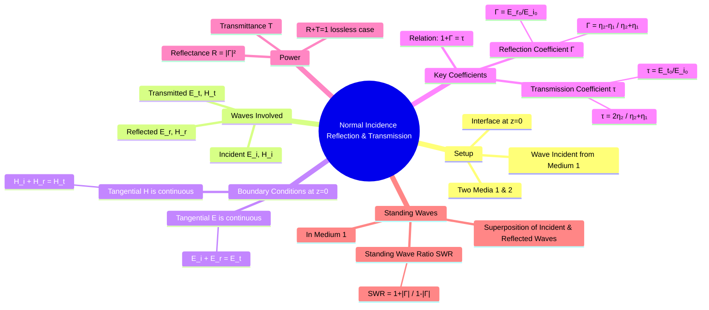

---
tags:
  - electromagnetic-fields
  - wave-propagation
  - reflection
  - boundary-conditions
  - gate
created: 2025-10-17
aliases:
  - Normal Incidence Reflection
  - EM Wave Reflection at Normal Incidence
subject: "[[Electromagnetic Fields]]"
parent:
  - Electromagnetic Waves
modified: 2026-08-04T10:23:33
---
### Reflection and Refraction of Plane Waves at Normal Incidence
#wave-reflection #normal-incidence #boundary-conditions

> When a uniform plane wave traveling in one medium strikes the boundary of a second medium, part of the wave's energy is reflected back into the first medium, and the remaining part is transmitted (refracted) into the second medium. **Normal incidence** describes the case where the wave propagation vector is perpendicular to the boundary surface.

---
#### Wave Representation
#wave-reflection/setup

Consider a boundary between two media at the z=0 plane. A uniform plane wave (incident wave) travels from medium 1 ($\eta_1, \gamma_1$) in the $+z$ direction and strikes the boundary. This creates a reflected wave traveling in the $-z$ direction in medium 1 and a transmitted wave traveling in the $+z$ direction in medium 2 ($\eta_2, \gamma_2$).

Assuming the E-field is polarized in the $\mathbf{\hat{a}}_x$ direction:
-   **Incident Wave**:
    $\mathbf{E}_i(z) = E_{i0} e^{-\gamma_1 z} \mathbf{\hat{a}}_x$
    $\mathbf{H}_i(z) = \frac{E_{i0}}{\eta_1} e^{-\gamma_1 z} \mathbf{\hat{a}}_y$
-   **Reflected Wave**:
    $\mathbf{E}_r(z) = E_{r0} e^{+\gamma_1 z} \mathbf{\hat{a}}_x$
    $\mathbf{H}_r(z) = -\frac{E_{r0}}{\eta_1} e^{+\gamma_1 z} \mathbf{\hat{a}}_y$ (Note the sign change due to $\mathbf{\hat{a}}_k = -\mathbf{\hat{a}}_z$)
-   **Transmitted Wave**:
    $\mathbf{E}_t(z) = E_{t0} e^{-\gamma_2 z} \mathbf{\hat{a}}_x$
    $\mathbf{H}_t(z) = \frac{E_{t0}}{\eta_2} e^{-\gamma_2 z} \mathbf{\hat{a}}_y$

---
#### Reflection and Transmission Coefficients
#reflection-coefficient #transmission-coefficient

The amplitudes of the reflected and transmitted waves are determined by the boundary conditions, which state that the total tangential components of $\mathbf{E}$ and $\mathbf{H}$ must be continuous across the boundary at $z=0$.

1.  $\mathbf{E}_{tan1}(0) = \mathbf{E}_{tan2}(0) \implies E_{i0} + E_{r0} = E_{t0}$
2.  $\mathbf{H}_{tan1}(0) = \mathbf{H}_{tan2}(0) \implies \frac{E_{i0}}{\eta_1} - \frac{E_{r0}}{\eta_1} = \frac{E_{t0}}{\eta_2}$

Solving these two equations for the ratios $E_{r0}/E_{i0}$ and $E_{t0}/E_{i0}$ gives the reflection and transmission coefficients.

-   **Reflection Coefficient ($\Gamma$)**: The ratio of the reflected E-field amplitude to the incident E-field amplitude.
    $$\boxed{\quad \Gamma = \frac{E_{r0}}{E_{i0}} = \frac{\eta_2 - \eta_1}{\eta_2 + \eta_1} \quad}$$
-   **Transmission Coefficient ($\tau$)**: The ratio of the transmitted E-field amplitude to the incident E-field amplitude.
    $$\boxed{\quad \tau = \frac{E_{t0}}{E_{i0}} = \frac{2\eta_2}{\eta_2 + \eta_1} \quad}$$
These coefficients are fundamental in describing the interaction at the boundary. They are related by:
$$\boxed{\quad 1 + \Gamma = \tau \quad}$$

---
#### Power Reflection and Transmission
#power-reflection #power-transmission

The coefficients can be related to the flow of power. For lossless media, the time-averaged power densities are proportional to $|E|^2/\eta$.
-   **Reflectance (R)**: The fraction of incident power that is reflected.
    $$\boxed{\quad R = \frac{P_{avg, reflected}}{P_{avg, incident}} = \left|\frac{E_{r0}}{E_{i0}}\right|^2 = |\Gamma|^2 \quad}$$
-   **Transmittance (T)**: The fraction of incident power that is transmitted.
    $$\boxed{\quad T = \frac{P_{avg, transmitted}}{P_{avg, incident}} = \frac{\eta_1}{\eta_2} \left|\frac{E_{t0}}{E_{i0}}\right|^2 = \frac{\eta_1}{\eta_2} |\tau|^2 \quad}$$
For lossless media, energy is conserved, so:
$$\boxed{\quad R + T = 1 \implies |\Gamma|^2 + \frac{\eta_1}{\eta_2}|\tau|^2 = 1 \quad}$$

---
#### Special Case: Boundary with a Perfect Conductor
#perfect-conductor-reflection

For a perfect conductor, the field inside is zero. Therefore, $\eta_2=0$.
-   **Reflection Coefficient**: $\Gamma = \frac{0 - \eta_1}{0 + \eta_1} = -1$
-   **Transmission Coefficient**: $\tau = \frac{2(0)}{0 + \eta_1} = 0$

**Interpretation**:
-   $\Gamma = -1$: The wave is **totally reflected** with a 180° phase inversion of the electric field.
-   $\tau = 0$: No energy is transmitted into the conductor.
-   The total E-field at the boundary is $E_{i0} + E_{r0} = E_{i0}(1+\Gamma) = 0$, as expected for a perfect conductor.
-   The [[Standing Wave Ratio (SWR)]] is infinite.

---
### Related Concepts
#topic/related-concepts

> [[Standing Wave Ratio (SWR)]]

[[Intrinsic Impedance of a Medium]]
[[Uniform Plane Waves]]
[[Poynting Theorem]]
[[Transmission Lines]]
[[Boundary Conditions for Electrostatic Fields]]
[[Waveguides]]
