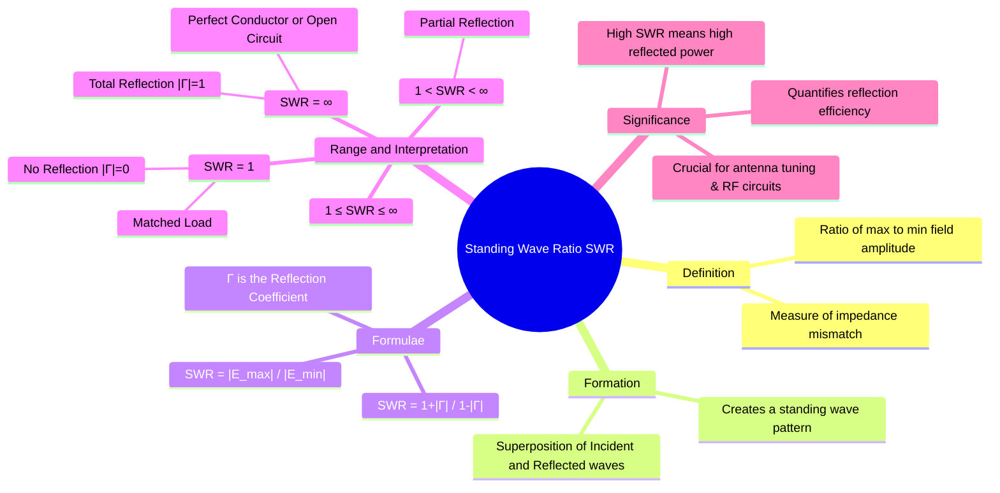

---
tags:
  - electromagnetic-fields
  - wave-propagation
  - reflection
  - standing-waves
  - gate
created: 2025-10-17
aliases:
  - SWR
  - VSWR
  - Voltage Standing Wave Ratio
subject: "[[Electromagnetic Fields]]"
parent: "[[Reflection and Refraction of Plane Waves at Normal Incidence]]"
modified: 2026-08-04T10:33:06
---
### Standing Wave Ratio (SWR)
#standing-wave-ratio #swr #impedance-matching

> The **Standing Wave Ratio (SWR)** is a dimensionless quantity that provides a measure of the impedance mismatch between a transmission medium and its load. It describes the degree to which a wave is reflected at a boundary. SWR is defined as the ratio of the maximum amplitude to the minimum amplitude of the total field in the standing wave pattern that results from the superposition of incident and reflected waves.

In the context of transmission lines, it is often called the Voltage Standing Wave Ratio (VSWR).

---
#### Formation of Standing Waves
#standing-waves

When a wave is partially or totally reflected at a boundary, the total field in the first medium is the sum of the forward-traveling incident wave and the backward-traveling reflected wave.
$$\mathbf{E}_{total}(z) = \mathbf{E}_{incident}(z) + \mathbf{E}_{reflected}(z)$$
For a wave incident from $z<0$ onto a boundary at $z=0$:
$$\mathbf{E}_{total}(z) = E_{i0}e^{-j\beta_1 z} \mathbf{\hat{a}}_x + \Gamma E_{i0}e^{+j\beta_1 z} \mathbf{\hat{a}}_x$$
This interference creates a "standing wave" pattern, which is not a propagating wave but a stationary pattern of constructive and destructive interference with fixed locations of maximum and minimum field strength.

---
#### Definition and Formulae
#swr/formula

SWR is defined as the ratio of the maximum amplitude ($|E_{max}|$) to the minimum amplitude ($|E_{min}|$) along the medium.

The maximum amplitude occurs when the incident and reflected waves interfere constructively:
$$|E_{max}| = |E_{i0}| + |E_{r0}| = |E_{i0}| + |\Gamma E_{i0}| = |E_{i0}|(1 + |\Gamma|)$$
The minimum amplitude occurs when they interfere destructively:
$$|E_{min}| = |E_{i0}| - |E_{r0}| = |E_{i0}| - |\Gamma E_{i0}| = |E_{i0}|(1 - |\Gamma|)$$
Therefore, the SWR is:
$$\boxed{\quad SWR = \frac{|E_{max}|}{|E_{min}|} = \frac{|E_{i0}|(1 + |\Gamma|)}{|E_{i0}|(1 - |\Gamma|)} = \frac{1 + |\Gamma|}{1 - |\Gamma|} \quad}$$
The reflection coefficient $|\Gamma|$ can also be expressed in terms of SWR:
$$\boxed{\quad |\Gamma| = \frac{SWR - 1}{SWR + 1} \quad}$$

---
#### Range and Interpretation
#swr/interpretation

The magnitude of the reflection coefficient $|\Gamma|$ ranges from 0 to 1. This means the SWR has a range from 1 to infinity.

-   **SWR = 1**:
    -   This occurs when $|\Gamma|=0$ (no reflection).
    -   This is the ideal **matched condition**. All power is transmitted to the second medium.
    -   $|E_{max}| = |E_{min}|$, so the total field amplitude is constant, and there is only a pure traveling wave.

-   **SWR = ∞**:
    -   This occurs when $|\Gamma|=1$ (total reflection).
    -   This happens at the boundary with a **perfect conductor** ($\Gamma = -1$) or in a transmission line terminated by an open or short circuit.
    -   $|E_{min}| = 0$. The wave is a pure standing wave, and no net power is transferred.

-   **1 < SWR < ∞**:
    -   This occurs when $0 < |\Gamma| < 1$ (partial reflection).
    -   This is the most common practical case, resulting in a partial standing wave. There is both a standing wave component and a traveling wave component that carries power.

---
#### Significance in Engineering
#swr/significance

SWR is a critical parameter in RF and microwave engineering.
-   **Measure of Match**: It is a practical, measurable quantity that indicates how well an antenna is matched to its transmitter, or how well a load is matched to a transmission line.
-   **Power Loss**: A high SWR implies a large reflection coefficient, meaning a significant portion of the power sent from the source is reflected back. This reflected power represents a loss of transmitted power and can potentially damage the source (e.g., a high-power transmitter).
-   **System Performance**: In communication systems, high SWR leads to signal distortion and reduced efficiency. Antenna tuning aims to minimize the SWR (ideally to 1) at the desired operating frequency.

---
### Related Concepts
#topic/related-concepts

> [[Reflection and Refraction of Plane Waves at Normal Incidence]]

[[Intrinsic Impedance of a Medium]]
[[Uniform Plane Waves]]
[[Transmission Lines]]
[[Antennas]]
[[Waveguides]]
