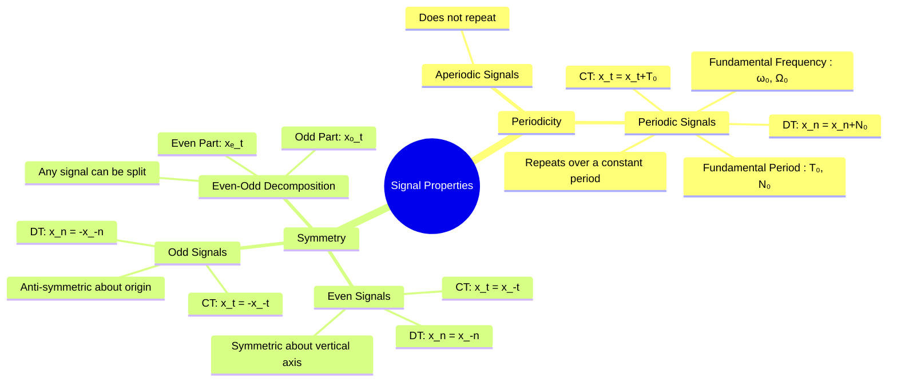

---
tags:
  - signal-processing
  - signals-and-systems
  - signal-properties
  - periodicity
  - symmetry
  - gate-ee
created: 2025-09-23
aliases:
  - Periodic and Aperiodic Signals
  - Even and Odd Signals
  - Signal Symmetry
  - Signal Properties (Periodic & Aperiodic, Even & Odd)
  - fundamental frequency
  - fundamental period
  - fundamental angular frequency
  - Transformations of the Independent Variable (Time Shifting, Scaling, Reversal)
subject: "[[Signals & Systems]]"
parent:
  - Signals & Systems - Fundamentals
modified: 2026-07-23T16:33:15
---

---
### Signal Properties (Periodic/Aperiodic, Even/Odd)
#signal-properties #periodicity #symmetry

> Classifying signals based on their periodicity and symmetry is a fundamental step in signal analysis. These properties determine which mathematical tools are most appropriate for analysis (e.g., [[Fourier Series Representation of Periodic Functions|Fourier Series for periodic signals]]) and can greatly simplify calculations involving transforms and convolutions.

#### Periodicity
#periodic-signals #aperiodic-signals

This property describes whether a signal exhibits a repeating pattern over time.

##### Periodic Signals
A signal is **periodic** if it repeats its values at regular intervals.

-   **Continuous-Time (CT)**: A signal $x(t)$ is periodic if there exists a positive constant $T$ such that:
    $$\boxed{\quad x(t) = x(t+T) \quad \text{for all } t \quad}$$
    The smallest positive value of $T$ for which this holds is called the **fundamental period**, denoted $T_0$. The **fundamental frequency** is $f_0 = 1/T_0$ (Hz) or $\omega_0 = 2\pi/T_0$ (rad/s).
    -   *Example*: $x(t) = \sin(\omega_0 t)$ is periodic with $T_0 = 2\pi/\omega_0$.

-   **Discrete-Time (DT)**: A signal $x[n]$ is periodic if there exists a positive integer $N$ such that:
    $$\boxed{\quad x[n] = x[n+N] \quad \text{for all } n \quad}$$
    The smallest such positive integer $N$ is the **fundamental period**, $N_0$. The **fundamental angular frequency** is $\Omega_0 = 2\pi/N_0$.
    -   A discrete-time sinusoid $x[n] = \cos(\Omega_0 n)$ is periodic *only if* its frequency $\Omega_0$ is a rational multiple of $2\pi$. That is, $\Omega_0 = 2\pi(k/N)$ for some integers $k$ and $N$. This is a crucial difference from the CT case.

##### Aperiodic Signals
A signal that is not periodic is called **aperiodic** or non-periodic.
-   *Examples*: $x(t) = e^{-at}u(t)$, the [[Ramp, Signum, Rectangular Pulse, and Sinc Functions|rectangular pulse function]], or a [[Continuous-Time Unit Impulse and Unit Step Functions|single impulse]].

---
#### Symmetry (Even and Odd Signals)
#even-signals #odd-signals #signal-symmetry

This property describes a signal's symmetry with respect to the time origin ($t=0$ or $n=0$).

##### Even Signals
A signal is **even** if it is symmetric about the vertical axis.
-   **Condition**:
    -   CT: $x(t) = x(-t)$
    -   DT: $x[n] = x[-n]$
-   **Example**: $x(t) = \cos(\omega t)$ is an even signal.

##### Odd Signals
A signal is **odd** if it is anti-symmetric about the origin.
-   **Condition**:
    -   CT: $x(t) = -x(-t)$
    -   DT: $x[n] = -x[-n]$
-   **Property**: An odd signal must have a value of zero at the origin if it is defined there, i.e., $x(0) = 0$.
-   **Example**: $x(t) = \sin(\omega t)$ is an odd signal.

---
#### Even-Odd Decomposition
#even-odd-decomposition

> A key theorem in signal processing states that **any signal** can be uniquely expressed as the sum of an even component and an odd component.

Let $x(t)$ be any signal. Its even and odd parts, $x_e(t)$ and $x_o(t)$, are given by:

-   **Even Part**:
    $$\boxed{\quad x_e(t) = \frac{1}{2} [x(t) + x(-t)] \quad}$$
-   **Odd Part**:
    $$\boxed{\quad x_o(t) = \frac{1}{2} [x(t) - x(-t)] \quad}$$

So, $x(t) = x_e(t) + x_o(t)$. The same formulas apply to discrete-time signals by replacing $t$ with $n$. This decomposition is very useful for simplifying the calculation of [[Fourier Transforms]] and other integrals.

#### Properties of Symmetry for Operations
-   Even × Even = Even
-   Odd × Odd = Even
-   Even × Odd = Odd
-   The integral of an odd function over a symmetric interval $[-A, A]$ is always zero.
-   The integral of an even function over $[-A, A]$ is twice the integral over $[0, A]$.

---
### Related Concepts
#signal-properties/related-concepts

> [[Signal Definition and Classification (CT vs DT)]]

[[Transformations of the Independent Variable]]
[[Fourier Series|Fourier Series]] (Defined for periodic signals)
[[Fourier Transforms]] (Symmetry properties simplify the transform)
[[Energy and Power Signals]]
