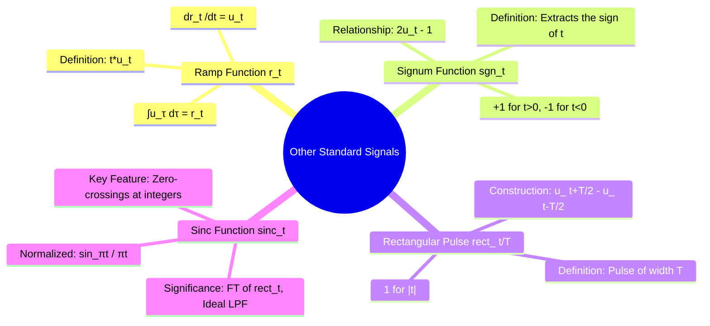

---
tags:
  - signal-processing
  - signals-and-systems
  - standard-signals
  - ramp-function
  - signum-function
  - rectangular-pulse
  - sinc-function
  - gate-ee
created: 2025-09-23
aliases:
  - Standard Signals
  - Ramp Function
  - Signum Function
  - Rect Function
  - Sinc Function
  - Normalized Sinc Function
subject: "[[Signals & Systems]]"
parent:
  - Standard Signals
modified: 2026-07-23T16:34:11
---
### Ramp, Signum, Rectangular Pulse, and Sinc Functions
#standard-signals #ramp-function #signum-function #rectangular-pulse #sinc-function

> Beyond the fundamental impulse and step functions, several other standard signals are essential for the analysis and representation of signals and systems. These functions serve as building blocks and appear frequently in topics like Fourier analysis, filtering, and system response.

---
#### The Ramp Function
#ramp-function

The ramp function represents a signal that starts at zero and increases linearly with time.

-   **Definition**:
    $$\boxed{\quad r(t) = \begin{cases} t, & t \ge 0 \\ 0, & t < 0 \end{cases} \quad}$$
    It can be conveniently expressed using the unit step function:
    $$\boxed{\quad r(t) = t u(t) \quad}$$
-   **Relationship with Unit Step**: The ramp function is the integral of the unit step function, and conversely, the unit step is the derivative of the ramp function.
    $$ \frac{d}{dt} r(t) = u(t) $$
    $$ \int_{-\infty}^{t} u(\tau) d\tau = r(t) $$

---
#### The Signum Function
#signum-function

The signum (or sign) function extracts the sign of the independent variable.

-   **Definition**:
    $$\boxed{\quad \text{sgn}(t) = \begin{cases} 1, & t > 0 \\ -1, & t < 0 \\ 0, & t = 0 \end{cases} \quad}$$
-   **Relationship with Unit Step**: The signum function can be synthesized from the unit step function. This is a very useful identity.
    $$\boxed{\quad \text{sgn}(t) = 2u(t) - 1 \quad}$$
    Conversely, the unit step can be expressed using the signum function: $u(t) = \frac{1}{2}[\text{sgn}(t) + 1]$.

---
#### The Rectangular Pulse Function
#rectangular-pulse #rect-function

The rectangular pulse is a time-limited signal that has a constant amplitude for a finite duration and is zero otherwise. It is fundamental in Fourier analysis and digital communications.

-   **Definition**: A rectangular pulse of width $T$ centered at the origin is defined as:
    $$\boxed{\quad \text{rect}\left(\frac{t}{T}\right) = \Pi\left(\frac{t}{T}\right) = \begin{cases} 1, & |t| < T/2 \\ 0, & |t| > T/2 \end{cases} \quad}$$
    (The value at the edges $|t|=T/2$ is often defined as 0.5).

-   **Construction using Unit Steps**: A rectangular pulse can be constructed by subtracting a shifted unit step from another.
    $$\boxed{\quad \text{rect}\left(\frac{t}{T}\right) = u\left(t + \frac{T}{2}\right) - u\left(t - \frac{T}{2}\right) \quad}$$

---
#### The Sinc Function
#sinc-function

The sinc function is of paramount importance in signal processing, especially in the context of the [[Sampling]] theorem and ideal filter design.

![[sinc function.png]]

-   **Definition (Normalized)**: In engineering and signal processing, the **normalized** sinc function is standard:
    $$\boxed{\quad \text{sinc}(t) = \frac{\sin(\pi t)}{\pi t} \quad}$$
-   **Properties**:
    -   Value at the origin: By taking the limit as $t \to 0$, we find that $\text{sinc}(0) = 1$.
    -   **Zero-crossings**: The function is zero at all non-zero integer values of $t$.
        $$ \text{sinc}(t) = 0 \quad \text{for } t = \pm 1, \pm 2, \pm 3, \dots $$
-   **Significance**:
    -   **Fourier Transform**: The Fourier transform of a rectangular pulse is a sinc function, and vice-versa. $\text{rect}(t) \leftrightarrow \text{sinc}(f)$.
    -   **Ideal [[Low-Pass Filter]]**: The impulse response of an ideal low-pass filter is a sinc function.
> [!warning]- Bandwidth → Impulse (CTFT)
> For an ideal low-pass spectrum
> $$X(\omega)=1,\quad |\omega|<W_0$$
> the inverse Fourier transform is
> $$x(t)=\frac{\sin(W_0 t)}{\pi t}$$
> As $W_0 \to \infty$:
> $$X(\omega)\to 1 \;\Longleftrightarrow\; x(t)\to \delta(t)$$
> **Interpretation:** Increasing bandwidth compresses the sinc in time.

> [!success] Cutoff frequency from sinc (CTFT)
> In continuous-time Fourier transform,
> $$\frac{\sin(\omega_c t)}{\pi t} \;\Longleftrightarrow\; H(\omega)=1,\ |\omega|<\omega_c$$
> Hence, the cutoff frequency is **the coefficient of $t$ inside the sine**, not $\pi$.
> Do **not** confuse this with the normalized DSP sinc: $\dfrac{\sin(\pi t)}{\pi t}$.

---
### Related Concepts
#standard-signals/related-concepts

> [[Continuous-Time Unit Impulse and Unit Step Functions]]

[[Discrete-Time Unit Impulse and Unit Step Sequences]]
[[Fourier Transforms]] (The rect/sinc transform pair is fundamental)
[[Sampling]] (The sinc function is the ideal interpolation function)
[[Filtering Concepts]]