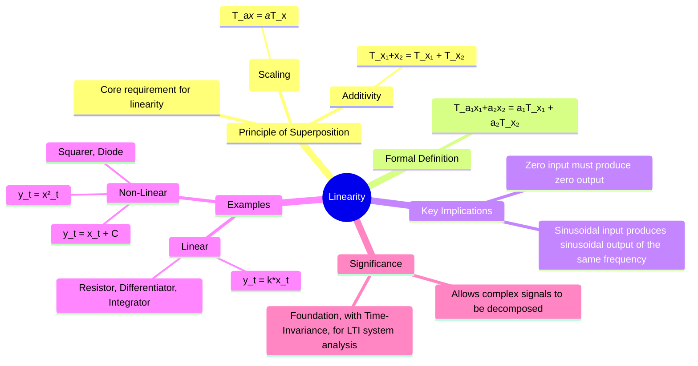

---
tags:
  - signal-processing
  - signals-and-systems
  - system-properties
  - linearity
  - superposition
  - gate-ee
created: 2025-09-24
aliases:
  - Linear Systems
  - Superposition Principle
  - "Example : Linearity"
  - Principle of Superposition
  - How to Test for Linearity?
  - Linearity and Superposition
subject: "[[Signals & Systems]]"
parent:
  - System Properties
modified: 2026-07-16
---
### Linearity
#linearity #superposition #linear-systems #system-properties

> **Linearity** is a crucial system property that vastly simplifies the analysis of [[Signals & Systems|signals and systems]]. A system is linear if it obeys the **principle of superposition**. This principle means that the response of the system to a [[weighted sum]] of inputs is equal to the weighted sum of the responses to each individual input. This property is the foundation of powerful analysis techniques like [[Continuous-Time Convolution Integral|convolution]] and [[Fourier Transforms|Fourier]] and [[The Laplace Transform|Laplace transforms]], which are central to the study of LTI systems.

---
#### The Principle of Superposition
#superposition

> [!refer]
> [[Superposition Theorem]] (in electric circuits)

A system is linear if and only if it satisfies the principle of superposition, which consists of two distinct properties: **Additivity** and **Homogeneity**.

1.  **Additivity**: The response to a sum of inputs is the sum of the individual responses.
    -   If an input $x_1(t)$ produces an output $y_1(t)$ and an input $x_2(t)$ produces $y_2(t)$, then...
    -   ...the input $x_1(t) + x_2(t)$ must produce the output $y_1(t) + y_2(t)$.
    $$\mathcal{T}\{x_1(t) + x_2(t)\} = \mathcal{T}\{x_1(t)\} + \mathcal{T}\{x_2(t)\}$$

2.  **Homogeneity (Scaling)**: Scaling the input by a constant factor scales the output by the same factor.
    -   If an input $x(t)$ produces an output $y(t)$, then...
    -   ...the input $a \cdot x(t)$ must produce the output $a \cdot y(t)$ for any constant $a$.
    $$\mathcal{T}\{a \cdot x(t)\} = a \cdot \mathcal{T}\{x(t)\}$$

---
#### Formal Definition of Linearity
#linearity/definition 

A system $\mathcal{T}$ is linear if, for any two inputs $x_1(t)$ and $x_2(t)$ and any two arbitrary constants $a_1$ and $a_2$, the following condition holds:
$$\boxed{\quad \mathcal{T}\{a_1 x_1(t) + a_2 x_2(t)\} = a_1 \mathcal{T}\{x_1(t)\} + a_2 \mathcal{T}\{x_2(t)\} \quad}$$
This single expression combines both additivity and homogeneity.

---
#### Key Implications of Linearity
#linearity/implications 

- **Zero-Input, Zero-Output**: A necessary (but not sufficient) condition for linearity is that a zero input must produce a zero output. This can be seen by setting the scaling constant $a=0$ in the homogeneity property. If a system has a non-zero output for a zero input (e.g., due to an offset or initial conditions), it is not linear.
- **Sinusoidal Fidelity**: If the input to a linear system is a sinusoid of a certain frequency, the output will also be a sinusoid of the exact same frequency, although its amplitude and phase may be different.

---
#### 🔥How to Test for Linearity
#system-testing

To formally check if a system is linear, apply the superposition principle:
1. Define two arbitrary inputs, $x_1(t)$ and $x_2(t)$, and find their respective outputs, $y_1(t) = \mathcal{T}\{x_1(t)\}$ and $y_2(t) = \mathcal{T}\{x_2(t)\}$.
2. Form a [[weighted sum]] of the outputs: $y_{out} = a_1 y_1(t) + a_2 y_2(t)$.
3. Form a new input that is the weighted sum of the original inputs: $x_{in}(t) = a_1 x_1(t) + a_2 x_2(t)$.
4. Find the system's response to this new input: $y_{new}(t) = \mathcal{T}\{x_{in}(t)\}$.
5. **Compare**: If $y_{new}(t) = y_{out}$, the system is **linear**. Otherwise, it is **non-linear**.

> [!pyq]- PYQ : 2024, 2022, 2021
> ![[ee_2024#^q37]]
> 
> ---
> ![[ee_2022#^q48]]
> 
> ---
> ![[ee_2021#^q6]]

> [!memory] Linear Systems
> #linear-systems-examples 
> 1. **Ideal Resistor**: $v(t) = R \cdot i(t)$.
> 2. **Differentiator**: $y(t) = \frac{d}{dt}x(t)$.
> 3. **Integrator**: $y(t) = \int_{-\infty}^{t}x(\tau)d\tau$.
> 4. **Scaling/Amplifier**: $y(t) = K \cdot x(t)$.

> [!memory] Non-Linear Systems
> #nonlinear-systems-examples 
> 1. **Squaring Device**: $y(t) = x^2(t)$. Fails both additivity and homogeneity.
> 2. **System with an Offset**: $y(t) = x(t) + C$. Fails homogeneity and the zero-input/zero-output test.
> 3. **Multiplier**: $y(t) = x(t) \cdot g(t)$. This is linear if $g(t)$ is a constant, but non-linear if $g(t)$ is another signal.
> 4. **Trigonometric/Logarithmic Functions**: $y(t) = \cos(x(t))$ or $y(t) = \log(x(t))$.

---
### Related Concepts
#linearity/related-concepts

> [[System Definition and Classification]]

[[Time-Invariance]]
[[LTI|Linear Time-Invariant (LTI) Systems]] (The class of systems that are both linear and time-invariant, forming the basis of modern signal processing)
[[Continuous-Time Convolution Integral]] (The mathematical operator that describes the input-output relationship of LTI systems)