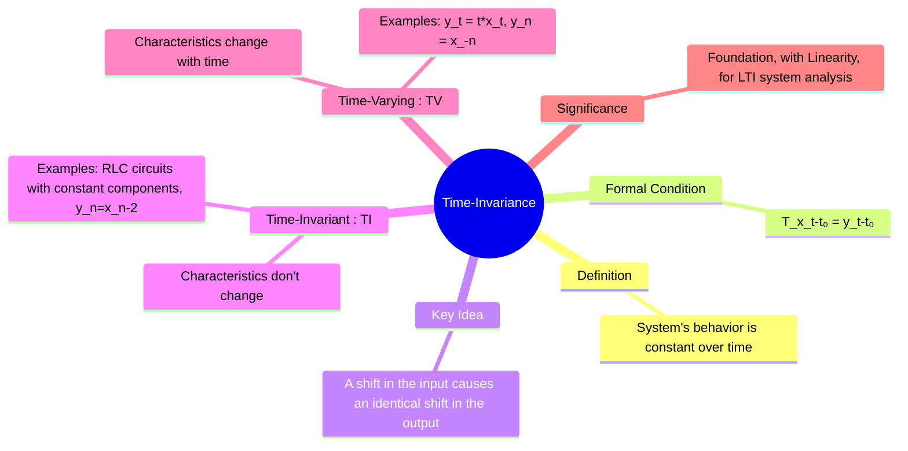

---
tags:
  - signal-processing
  - signals-and-systems
  - system-properties
  - time-invariance
  - lti
  - gate-ee
created: 2025-09-24
aliases:
  - Time-Invariant Systems
  - Shift-Invariant Systems
  - TIV Systems
  - "Example : Time-Invariance"
subject: "[[Signals & Systems]]"
parent:
  - System Properties
modified: 2026-07-22T10:44:59
---
### Time-Invariance
#time-invariant-systems #shift-invariance #system-properties

> **Time-Invariance** is a fundamental system property indicating that the system's behavior and characteristics are fixed over time. In a time-invariant system, if the input signal is shifted in time, the output signal is also shifted by the exact same amount, without any change in its shape. This property, when combined with [[Linearity in Electric Circuits]], defines the class of [[LTI|Linear Time-Invariant (LTI) systems]], which are the cornerstone of signal processing.

---
#### Time-Invariant (TI) Systems
#time-invariant-systems

A system is **time-invariant** (or shift-invariant) if a time shift in the input signal produces an identical time shift in the output signal. The system's response to an input does not depend on *when* the input is applied.

-   **Formal Definition**: Let $y(t) = \mathcal{T}\{x(t)\}$ be the output for an arbitrary input $x(t)$. The system is time-invariant if for any time shift $t_0$, the response to the shifted input $x(t-t_0)$ is the shifted output $y(t-t_0)$.
    $$\boxed{\quad y(t-t_0) = \mathcal{T}\{x(t-t_0)\} \quad}$$

##### Examples of Time-Invariant Systems
-   **Ideal Resistor**: $v(t) = R \cdot i(t)$. The resistance $R$ is constant and does not depend on time.
-   **Delay System**: $y[n] = x[n-5]$. A shift in the input sequence results in a corresponding shift in the output sequence.

---
#### Time-Varying Systems
#time-varying-systems

A system that is not time-invariant is called **time-varying**. The characteristics of a time-varying system change over time.

-   **Formal Condition**: $\mathcal{T}\{x(t-t_0)\} \neq y(t-t_0)$.
-   **Intuition**: The way the system processes an input depends on the time at which the input is applied.

##### Examples of Time-Varying Systems
-   **Time-Dependent Amplifier**: $y(t) = t \cdot x(t)$. The gain of this system is equal to the current time $t$. The output for an impulse applied at $t=1$ will be different (in shape) from the output for an impulse applied at $t=10$.
-   **Time Reversal**: $y[n] = x[-n]$. Shifting the input does not result in a simple shift of the output.
-   **Downsampler/Decimator**: $y[n] = x[2n]$.

---
#### 🔥How to Test for Time-Invariance
#system-testing

To formally check if a system is time-invariant, follow these steps:
1.  **Delay the Input**: Define a new input $x_1(t) = x(t-t_0)$. Find the system's output for this new input, let's call it $y_1(t) = \mathcal{T}\{x_1(t)\}$.
2.  **Delay the Output**: Take the original output $y(t) = \mathcal{T}\{x(t)\}$ and simply replace every instance of $t$ with $(t-t_0)$. Let's call this $y_2(t) = y(t-t_0)$.
3.  **Compare**: If $y_1(t) = y_2(t)$ for any arbitrary input $x(t)$ and any shift $t_0$, the system is **time-invariant**. Otherwise, it is **time-varying**.

> [!pyq]- PYQ : 2024, 2022, 2021
> ![[ee_2024#^q37]]
> 
> ---
> ![[ee_2022#^q48]]
> 
> ---
> ![[ee_2021#^q6]]

> [!example] Example Test
> Is the system $y(t) = t \cdot x(t)$ time-invariant?
>
> 1. **Delay Input**: Let $x_1(t) = x(t-t_0)$. The output is: $$y_1(t) = t \cdot x_1(t) = t \cdot x(t-t_0)$$
> 2. **Delay Output**: The original output is $y(t) = t \cdot x(t)$. Delaying it gives: $$y_2(t) = y(t-t_0) = (t-t_0) \cdot x(t-t_0)$$
> 3. **Compare**: Since $y_1(t) \neq y_2(t)$, the system is **time-varying**.

---
### Related Concepts
#time-invariance/related-concepts

> [[System Definition and Classification]]

[[Linearity in Electric Circuits]]
[[LTI|Linear Time-Invariant (LTI) Systems]] (Systems that are both linear and time-invariant)
[[Continuous-Time Convolution Integral]] (The mathematical operator for LTI systems)