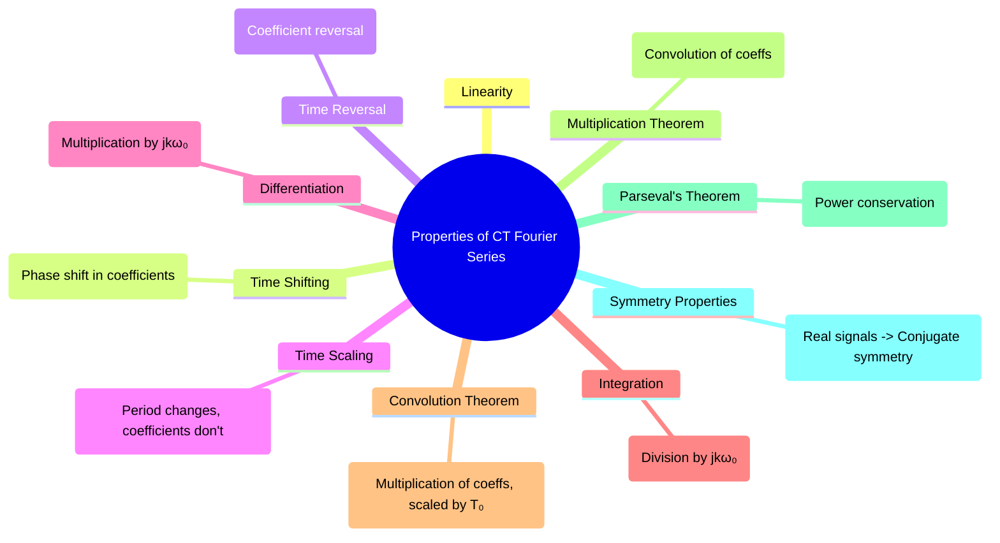

---
tags:
  - signal-processing
  - signals-and-systems
  - fourier-series
  - ctfs
  - fourier-properties
  - gate-ee
created: 2025-09-24
aliases:
  - CTFS Properties
  - Fourier Series Properties
  - Parseval's Theorem for Fourier Series
subject: "[[Signals & Systems]]"
parent:
  - Continuous-Time Fourier Series (CTFS)
modified: 2026-07-23T16:43:01
---
### Properties of Continuous-Time Fourier Series
#fourier-properties #ctfs #signal-analysis

> The properties of the Fourier Series are extremely useful as they allow us to determine the frequency spectrum of a modified signal without re-calculating the complex Fourier Series integrals from scratch. Understanding these properties provides deep insight into how time-domain operations affect a signal's frequency content.

Let $x(t)$ and $y(t)$ be periodic signals with period $T_0$ and let their Fourier Series coefficients be $c_k$ and $d_k$ respectively.
$$x(t) \stackrel{\mathcal{FS}}{\longleftrightarrow} c_k$$
$$y(t) \stackrel{\mathcal{FS}}{\longleftrightarrow} d_k$$

---
#### Core Properties

##### Linearity
If a signal $z(t)$ is a linear combination of $x(t)$ and $y(t)$, its Fourier coefficients are the same linear combination of the respective coefficients.
$$\boxed{\quad a x(t) + b y(t) \stackrel{\mathcal{FS}}{\longleftrightarrow} a c_k + b d_k \quad}$$

##### Time Shifting
A shift (delay) in the time domain corresponds to a linear phase shift in the frequency domain. The magnitude of the coefficients, $|c_k|$, remains unchanged.
$$\boxed{\quad x(t-t_0) \stackrel{\mathcal{FS}}{\longleftrightarrow} c_k e^{-j k \omega_0 t_0} \quad}$$

##### Differentiation
Differentiating a signal in the time domain corresponds to multiplying its Fourier coefficients by $jk\omega_0$. This property amplifies high-frequency components.
$$\boxed{\quad \frac{d x(t)}{dt} \stackrel{\mathcal{FS}}{\longleftrightarrow} (j k \omega_0) c_k \quad}$$
This is very useful for finding the FS of a triangular wave from a square wave.

##### Integration
Integration in the time domain corresponds to dividing the Fourier coefficients by $jk\omega_0$. This property attenuates high-frequency components.
$$\boxed{\quad \int_{-\infty}^{t} x(\tau) d\tau \stackrel{\mathcal{FS}}{\longleftrightarrow} \left(\frac{1}{j k \omega_0}\right) c_k \quad (k \neq 0) \quad}$$
The DC component ($k=0$) of the integrated signal must be handled separately.

##### Time Reversal
Reversing a signal in time reverses its sequence of Fourier coefficients.
$$x(-t) \stackrel{\mathcal{FS}}{\longleftrightarrow} c_{-k}$$
For a real signal $x(t)$, since $c_k = c_{-k}^*$, this means $x(-t) \leftrightarrow c_k^*$.

##### Time Scaling
If a signal is compressed or expanded in time ($x(at)$), its fundamental frequency changes, but its Fourier coefficients remain the same. The new period is $T' = T_0/|a|$ and the new fundamental frequency is $\omega'_0 = |a|\omega_0$.
$$x(at) \stackrel{\mathcal{FS}}{\longleftrightarrow} c_k \quad (\text{with new frequency } |a|\omega_0)$$

---
#### Convolution and Multiplication

##### Convolution Theorem
Convolution of two periodic signals in the time domain corresponds to the multiplication of their Fourier coefficients in the frequency domain, scaled by the period $T_0$.
$$\boxed{\quad x(t) * y(t) = \int_{T_0} x(\tau)y(t-\tau)d\tau \stackrel{\mathcal{FS}}{\longleftrightarrow} T_0 c_k d_k \quad}$$
**Note**: This is periodic convolution. The scaling factor $T_0$ is important.

##### Multiplication Theorem
Multiplication in the time domain corresponds to a discrete convolution of the Fourier coefficients in the frequency domain.
$$x(t)y(t) \stackrel{\mathcal{FS}}{\longleftrightarrow} \sum_{l=-\infty}^{\infty} c_l d_{k-l} = c_k * d_k$$

---
#### Parseval's Theorem for Fourier Series
#parsevals-theorem

Parseval's theorem relates the average power of a periodic signal in the time domain to the sum of the powers of its harmonic components. It is a statement of conservation of energy/power.
$$\boxed{\quad P = \frac{1}{T_0} \int_{T_0} |x(t)|^2 dt = \sum_{k=-\infty}^{\infty} |c_k|^2 \quad}$$
The term $|c_k|^2$ represents the power in the k-th harmonic. A plot of $|c_k|^2$ vs $k\omega_0$ is called the **power spectrum**.

---
#### Summary of Properties & Symmetries

| Property            | Time Domain                                       | Frequency Domain (Coefficients)                                   |
| ------------------- | ------------------------------------------------- | ----------------------------------------------------------------- |
| **Linearity**       | $ax(t) + by(t)$                                   | $ac_k + bd_k$                                                     |
| **Time Shift**      | $x(t-t_0)$                                        | $c_k e^{-jk\omega_0 t_0}$                                          |
| **Differentiation** | $\frac{dx(t)}{dt}$                                | $(jk\omega_0)c_k$                                                 |
| **Convolution**     | $x(t) * y(t)$                                     | $T_0 c_k d_k$                                                     |
| **Multiplication**  | $x(t)y(t)$                                        | $c_k * d_k$ (discrete convolution)                                |
| **Symmetry**        | $x(t)$ is Real                                    | $c_k = c_{-k}^*$ (Conjugate Symmetry)                             |
| **Symmetry**        | $x(t)$ is Real and Even                           | $c_k$ are Real and Even                                           |
| **Symmetry**        | $x(t)$ is Real and Odd                            | $c_k$ are Imaginary and Odd                                       |

---
### Related Concepts
#ctfs-properties/related-concepts

> [[Exponential Fourier Series]]

[[Trigonometric Fourier Series]]
[[Concept of Frequency Spectrum]]
[[Parseval's Theorem]]
[[Properties of the CTFT]] (The Fourier Transform properties are analogous but involve continuous frequency)
[[Signal Properties (Periodic/Aperiodic, Even & Odd)]]