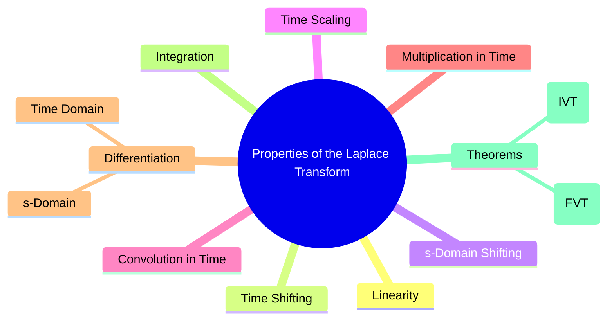

---
tags:
  - laplace-transform
  - integral-transform-properties
  - signals-and-systems
  - control-systems
created: 2025-09-24
aliases:
  - Laplace Transform Properties
  - "Properties : Laplace Transform (LT)"
  - Final Value Theorem
  - Final Value Theorem (FVT)
  - Initial Value Theorem
  - Initial Value Theorem (IVT)
subject: "[[Signals & Systems]]"
parent: "[[The Laplace Transform]]"
formula:
  - "Initial Value Theorem (IVT) : $$x(0^{+}) = \\lim_{s \\to \\infty} sX(s)$$"
  - "Final Value Theorem (FVT) : $$\\lim_{t \\to \\infty} x(t) = \\lim_{s \\to 0} sX(s)$$"
modified: 2026-07-23T16:47:09
---
### Properties of the Laplace Transform
#laplace-transform #s-domain #system-analysis

> The properties of the [[The Laplace Transform|Laplace Transform]] provide a powerful toolkit for manipulating signals and systems. They allow us to convert complex time-domain operations, such as differentiation and convolution, into simpler algebraic operations in the $s$-domain. This is the primary reason the Laplace Transform is indispensable for solving linear constant-coefficient differential equations and analyzing [[LTI]] systems.

> [!info]
> In the following properties, we assume the [[Unilateral Laplace Transform]] for causal signals where $x(t) \leftrightarrow X(s)$ and $y(t) \leftrightarrow Y(s)$.

---
###### 1. Linearity
#laplace-transform/properties #linearity

For any constants $a$ and $b$:
$$\boxed{\quad a x(t) + b y(t) \leftrightarrow a X(s) + b Y(s) \quad}$$
The ROC of the combined transform is at least the intersection of the individual ROCs ($\text{ROC}_x \cap \text{ROC}_y$).

###### 2. Time Shifting
#laplace-transform/properties #time-shifting

For a time delay $t_0 > 0$:
$$\boxed{\quad x(t-t_0)u(t-t_0) \leftrightarrow e^{-st_0} X(s) \quad}$$
A delay in the time domain corresponds to multiplication by a complex exponential (phase shift) in the s-domain. The ROC remains unchanged.

###### 3. s-Domain Shifting (Frequency Shifting)
#laplace-transform/properties #s-domain-shifting

For a complex constant $a$:
$$\boxed{\quad e^{-at} x(t) \leftrightarrow X(s+a) \quad}$$
Multiplication by an exponential in the time domain corresponds to a shift in the s-domain. The ROC of $X(s+a)$ is the ROC of $X(s)$ shifted by $\text{Re}\{-a\}$.

###### 4. Time Scaling
#laplace-transform/properties #time-scaling

For a constant $a > 0$:
$$\boxed{\quad x(at) \leftrightarrow \frac{1}{a} X\left(\frac{s}{a}\right) \quad}$$
Compression in time ($a>1$) leads to an expansion in the s-domain, and vice-versa. The ROC is also scaled: if the ROC for $X(s)$ is $R$, the ROC for $X(s/a)$ is $aR$.

###### 5. Convolution in Time Domain
#laplace-transform/properties #convolution

The Laplace transform of the convolution of two signals is the product of their individual Laplace transforms.
$$\boxed{\quad x(t) * y(t) \leftrightarrow X(s)Y(s) \quad}$$
This property is fundamental to LTI system analysis, as it converts the complex convolution operation into a simple multiplication. The ROC is at least $\text{ROC}_x \cap \text{ROC}_y$.

###### 6. Differentiation in Time Domain
#laplace-transform/properties #time-differentiation

This property converts differential equations into algebraic equations.
$$\boxed{\begin{align}
\mathcal{L}\left\{\frac{dx(t)}{dt}\right\} &= sX(s) - x(0^{-}) \\
\mathcal{L}\left\{\frac{d^2x(t)}{dt}\right\} &= s^2X(s) - sx(0^{-}) - x^\prime(0^{-})\\
\mathcal{L}\left\{\frac{d^n x(t)}{dt^n}\right\} &= s^n X(s) - s^{n-1}x(0^{-}) - \dots - x^{(n-1)}(0^{-})
\end{align}}$$
If all initial conditions are zero, differentiation in time corresponds to multiplication by $s$ in the s-domain.

###### 7. Integration in Time Domain
#laplace-transform/properties #time-integration

$$\boxed{\quad \mathcal{L}\left\{\int_{0^{-}}^t x(\tau)d\tau\right\} = \frac{X(s)}{s} \quad}$$
Integration in time corresponds to division by $s$ in the s-domain.

###### 8. s-Domain Differentiation
#laplace-transform/properties #s-domain-differentiation

Differentiation in the s-domain corresponds to multiplication by $-t$ in the time domain.
$$\boxed{\quad -t x(t) \leftrightarrow \frac{dX(s)}{ds} \quad}$$

###### 9. Initial Value Theorem (IVT)
#laplace-transform/properties #initial-value-theorem

This theorem allows finding the initial value of a signal $x(0^+)$ directly from its transform $X(s)$.
**Condition**: $X(s)$ must be a strictly proper rational function (degree of numerator < degree of denominator).
$$\boxed{\quad x(0^{+}) = \lim_{s \to \infty} sX(s) \quad}$$

###### 10. Final Value Theorem (FVT)
#laplace-transform/properties #final-value-theorem

This theorem allows finding the final (steady-state) value of a signal directly from its transform $X(s)$.
**Condition**: The system must be stable, meaning all poles of $sX(s)$ must lie strictly in the Left-Half Plane (LHP).
$$\boxed{\quad \lim_{t \to \infty} x(t) = \lim_{s \to 0} sX(s) \quad}$$

> [!failure] Mistake
> 1. Applying FVT to an *unstable system* (poles on $j\omega$-axis or in RHP) will give an **incorrect result**.
> 2. **NEVER** apply Final Value Theorem on a variable that is still expressed in terms of another Laplace variable.
> 	$$\text{Let } X_1(s) = \frac{X_2(s)+4}{s+4} \implies \lim_{s\to0}s\cdot \frac{X_2(s)+4}{s+4} \qquad \boxed{\quad \times \mathbf{Wrong} \quad}$$

> [!pyq]- PYQ : 2019, 2018
> ![[ee_2019#^q13]]
> 
> ---
> ![[ee_2018#^q46]]

---

### Related Concepts
#laplace-transform/related-concepts

> [[The Laplace Transform]]

[[Region of Convergence (ROC)]]
[[Inverse Laplace Transform using Partial Fraction Expansion]]
[[Solving Differential Equations using Laplace Transform]]
[[The Transfer Function H(s)]]
[[Properties of the Z-Transform]]
[[Steady-State Error]] & [[Steady-State Error for Disturbances]]
