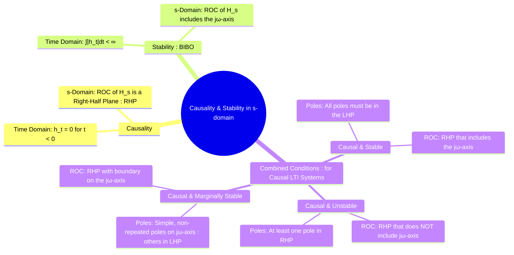

---
tags:
  - causality
  - stability
  - s-domain
  - lti-systems
  - transfer-function
  - roc
created: 2025-09-24
aliases:
  - s-domain stability
  - s-domain causality
  - Stability and Causality
subject: "[[Signals & Systems]]"
parent: "[[The Transfer Function H(s)]]"
modified: 2026-07-19
---
### Causality and Stability in the s-domain
#causality #stability #s-domain #system-properties

> The s-domain representation of a system, through its transfer function $H(s)$ and [[Region of Convergence (ROC)]], provides a direct and powerful method to determine its fundamental properties of [[causality]] and stability without needing to compute the time-domain [[Impulse Response of an LTI System|impulse response]]. These two properties are entirely dictated by the locations of the system's poles and the corresponding ROC.

---
#### Causality
#causality

A system is **causal** if its output at any time depends only on the present and past values of the input.
*   **Time-Domain Condition**: The impulse response $h(t)$ must be zero for all negative time.
    $$h(t) = 0 \quad \text{for} \quad t < 0$$
    This means the impulse response is a **right-sided signal**.

*   **s-Domain Condition**: From the [[Properties of the ROC]], a right-sided signal corresponds to an ROC that is a right-half plane.

> [!memory]
> An LTI system is causal if and only if the ROC of its transfer function H(s) is a right-half plane.

==For a rational transfer function, this means the ROC is to the right of the rightmost pole.==

---
#### Stability (BIBO)
#stability

A system is **Bounded-Input, Bounded-Output (BIBO) stable** if every bounded input produces a bounded output.
*   **Time-Domain Condition**: The impulse response $h(t)$ must be absolutely integrable.
    $$\int_{-\infty}^{\infty} |h(t)| dt < \infty$$
*   **s-Domain Condition**: This time-domain condition is equivalent to the existence of the Fourier Transform of $h(t)$. The Fourier transform is simply the Laplace transform evaluated at $s=j\omega$. This evaluation is only valid if the $j\omega$-axis is included in the ROC.
    $$\boxed{\quad \text{An LTI system is BIBO stable if and only if the ROC of its transfer function } H(s) \text{ includes the entire } j\omega\text{-axis.} \quad}$$

---
#### Conditions for Causal LTI Systems
#causal-stable-systems

In practice, we are most often concerned with systems that are both **causal and LTI**. Combining the conditions for causality and stability leads to the most important conclusion in system analysis:

1.  For the system to be **causal**, its ROC must be a right-half plane, to the right of the rightmost pole.
2.  For the system to be **stable**, this ROC must include the $j\omega$-axis.

For a right-half plane to include the $j\omega$-axis, its boundary (defined by the rightmost pole) must lie to the left of the $j\omega$-axis. This means that all poles of the system must lie strictly in the Left-Half Plane (LHP).

$$\boxed{\quad \text{A causal LTI system with a rational transfer function } H(s) \text{ is BIBO stable if and only if all of its poles lie in the Left-Half Plane (LHP).} \quad}$$

| System Type | Pole Locations | ROC Description |
| :--- | :--- | :--- |
| **Causal & Stable** | All poles in LHP | RHP that includes the $j\omega$-axis |
| **Causal & Unstable** | At least one pole in RHP | RHP that does **not** include the $j\omega$-axis |
| **Causal & Marginally Stable** | Simple (non-repeated) poles on $j\omega$-axis; all other poles in LHP | RHP whose boundary is the $j\omega$-axis |
| **Non-Causal & Stable**| Poles can be anywhere as long as ROC exists and includes the $j\omega$-axis| A vertical strip that includes the $j\omega$-axis |

---
### Related Concepts
#causality-stability/related-concepts

> [[The Transfer Function H(s)]]

[[Poles and Zeros of a Transfer Function]]
[[Region of Convergence (ROC)]]
[[The Laplace Transform]]
[[Stability (BIBO Stability)]]
[[Causality]]
[[Control Systems]]