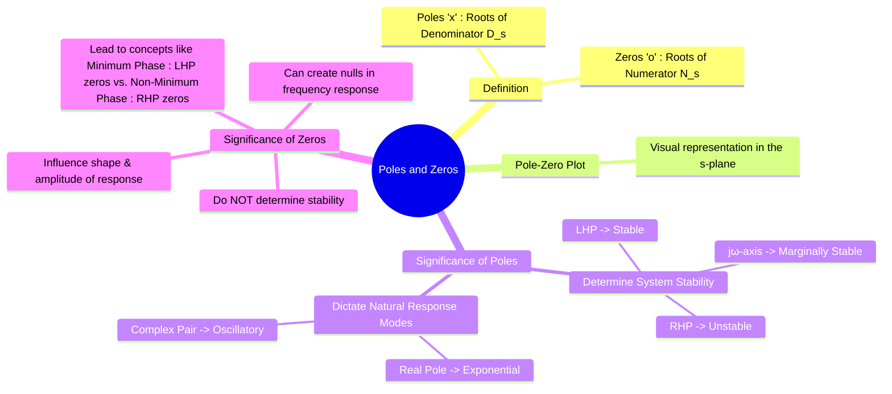

---
tags:
  - poles-and-zeros
  - transfer-function
  - s-domain
  - system-dynamics
  - stability
  - control-systems
created: 2025-09-24
aliases:
  - Poles and Zeros
  - s-plane analysis
  - Poles of a Transfer Function
  - Zeros of a Transfer Function
subject: "[[Signals & Systems]]"
parent: "[[The Transfer Function H(s)]]"
modified: 2026-07-23T16:47:45
---
### Poles and Zeros of a Transfer Function
#poles-and-zeros #s-plane #system-dynamics

> The poles and zeros of a transfer function are the fundamental building blocks that define the behavior of an LTI system. ==Their locations in the complex $s$-plane provide a powerful graphical method for assessing system stability and predicting the nature of its time-domain response without explicitly solving the differential equation.==

For a rational transfer function $H(s) = \frac{N(s)}{D(s)}$:

*   **Poles**: The **poles** are the roots of the denominator polynomial $D(s)$. They are the values of $s$ for which the transfer function's magnitude is infinite ($|H(s)| \to \infty$).
    $$\boxed{\quad \text{Poles are the roots of the characteristic equation } D(s) = 0. \quad}$$
*   **Zeros**: The **zeros** are the roots of the numerator polynomial $N(s)$. They are the values of $s$ for which the transfer function's magnitude is zero ($H(s) = 0$).

> [!examtip] Decoupling Poles from Initial Conditions
> A common point of confusion is assuming that because a Transfer Function $H(s)$ requires zero initial conditions ($y(0^-) = 0, y'(0^-) = 0$), the roots of its denominator change if the initial conditions are non-zero. 
> 
> They do **not**. 
> 
> * **The Core Mechanism:** When solving an [[Linear Constant-Coefficient Differential Equations (CT)|LCCDE]] with [[The Laplace Transform|Laplace transforms]], ==initial condition terms exclusively populate the *numerator* of the [[Zero-Input Response (ZIR)|Zero-Input Response]] ($Y_{ZIR}(s)$)==. The denominator remains the exact same characteristic polynomial ($D(s) = 0$) regardless of the system's initial energy state.
> 
> > [!memory] The Takeaway
> > ==Initial conditions only affect the scaling coefficients of the time-domain modes, never the locations of the poles themselves.==

> [!pyq]- PYQ : 2020
> ![[ee_2020#^q10]]

---
#### The Pole-Zero Plot
#pole-zero-plot

The locations of the poles and zeros are often visualized on the complex s-plane ($\sigma-j\omega$ plane).
*   **Poles** are marked with a cross (`x`).
*   **Zeros** are marked with a circle (`o`).

This plot, combined with the system gain constant $K$ and the [[Region of Convergence (ROC)]], completely specifies the system's transfer function.

---
#### Significance of Pole Locations
#poles #stability #natural-response

The poles of a system exclusively determine its **stability** and its **natural response modes** (the form of the transient response).

###### Poles and Stability

For a **causal** LTI system:

* **Poles in LHP** ($\text{Re}\{p\} < 0$): Stable system. The natural response decays to zero.
* **Poles in RHP** ($\text{Re}\{p\} > 0$): Unstable system. The natural response grows without bound.
* **Poles on $j\omega$-axis** ($\text{Re}\{p\} = 0$): Marginally stable system. A simple pole on the axis leads to a sustained or growing response.

> [!memory]
> ==The system is BIBO stable if and only if all its poles lie in the strict Left-Half Plane (LHP).==

---
###### Poles and Natural Response Modes

The location of a pole dictates the shape of a corresponding term in the system's impulse response $h(t)$:
1.  **Simple Pole on Real Axis ($s = -\sigma$)**: Corresponds to an exponential term $e^{-\sigma t}$. It is decaying if in LHP ($\sigma>0$) and growing if in RHP ($\sigma<0$).
2.  **Simple Pole at the Origin ($s = 0$)**: Corresponds to a unit step term $u(t)$ (an integrator).
3.  **Complex Conjugate Pair ($s = -\sigma \pm j\omega_d$)**: Corresponds to a damped sinusoidal term $e^{-\sigma t}\cos(\omega_d t + \phi)$.
    *   If in LHP ($\sigma>0$), the oscillation decays.
    *   If in RHP ($\sigma<0$), the oscillation grows.
    *   If on the $j\omega$-axis ($\sigma=0$), it is a sustained oscillation $\cos(\omega_d t + \phi)$.

---
#### Significance of Zero Locations
#zeros #frequency-response

Zeros do **not** affect the stability of a system, but they critically shape the system's response.
1.  **Amplitude of Response**: Zeros influence the residues in a partial fraction expansion, thereby affecting the amplitude and phase of each natural response mode. A zero placed near a pole can diminish the effect of that pole's mode.
2.  **Frequency Response Nulling**: A zero at $s=j\omega_0$ means the system's frequency response is zero at that frequency ($H(j\omega_0)=0$). The system will completely block any input sinusoid of frequency $\omega_0$.
3.  **Minimum vs. Non-Minimum Phase**:
    *   **Minimum Phase**: All zeros are in the LHP. For a given magnitude response, this system has the minimum possible phase lag.
    *   **Non-Minimum Phase**: One or more zeros are in the RHP. These systems exhibit an initial "inverse response" and have greater phase lag than their minimum-phase counterparts.

---
### Related Concepts
#poles-and-zeros/related-concepts

> [[The Transfer Function H(s)]]

[[Causality and Stability in the s-domain]]
[[Region of Convergence (ROC)]]
[[Inverse Laplace Transform using Partial Fraction Expansion]]
[[Control Systems]]
[[Frequency Response]]
[[Eigenvalues and Eigenvectors]]
