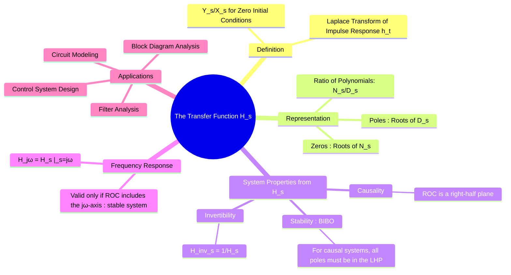

---
tags:
  - transfer-function
  - s-domain
  - lti-systems
  - control-systems
  - signals-and-systems
created: 2025-09-24
aliases:
  - Transfer Function
  - System Function
subject: "[[Signals & Systems]]"
parent: "[[The Laplace Transform]]"
modified: 2026-07-19
---
### The Transfer Function H(s)
#transfer-function #s-domain #lti-systems

> ==The **Transfer Function**, denoted $H(s)$, is a concise and powerful mathematical model that describes the input-output relationship of a linear time-invariant (LTI) system in the complex frequency domain (s-domain).== It captures the intrinsic dynamic properties of the system, independent of the input signal, and allows for straightforward analysis of system behavior, including stability and frequency response.

---
#### Definition of the Transfer Function
#transfer-function/definition

The transfer function $H(s)$ of an LTI system can be defined in two equivalent ways:

1. **As the ratio of output to input transforms**: ==It is the ratio of the [[The Laplace Transform|Laplace transform]] of the output signal, $Y(s)$, to the Laplace transform of the input signal, $X(s)$, <u>assuming all initial conditions are zero</u>.==
    $$\boxed{\quad H(s) = \frac{Y(s)}{X(s)} \bigg|_{\text{zero initial conditions}} \quad}$$
> [!pyq]- PYQ : GATE EE 2020
> ![[ee_2020#^q34]]

2. **As the transform of the impulse response**: ==It is the Laplace transform of the system's impulse response, $h(t)$.==
    $$\boxed{\quad H(s) = \mathcal{L}\{h(t)\} = \int_{0^{-}}^{\infty} h(t)e^{-st}dt \quad}$$

These definitions are linked by the [[Properties of Convolution|convolution property]]: $y(t) = h(t) * x(t) \leftrightarrow Y(s) = H(s)X(s)$.

---
#### Poles and Zeros
#poles-and-zeros

For systems described by LCCDEs, the transfer function is a rational function of $s$:
$$H(s) = \frac{N(s)}{D(s)} = K \frac{s^m + b_{m-1}s^{m-1} + \dots + b_0}{s^n + a_{n-1}s^{n-1} + \dots + a_0}$$
*   **Poles**: The roots of the denominator polynomial $D(s)$ are the **poles** of the system. They are the values of $s$ for which $H(s) \to \infty$. The poles determine the natural response modes of the system (e.g., exponential decay, oscillations).
*   **Zeros**: The roots of the numerator polynomial $N(s)$ are the **zeros** of the system. They are the values of $s$ for which $H(s) = 0$. Zeros can block or suppress certain frequencies or response modes.

---
#### System Properties from H(s)
#system-properties #causality #stability

The transfer function and its associated [[Region of Convergence (ROC)]] reveal fundamental system properties:

###### Causality
A system is **causal** if and only if the ROC of its transfer function $H(s)$ is a right-half plane, extending to the right of the rightmost pole.

###### Stability (BIBO)
A system is **Bounded-Input, Bounded-Output (BIBO) stable** if and only if the ROC of $H(s)$ includes the entire $j\omega$-axis ($\text{Re}\{s\}=0$).
> For a **causal** LTI system, this simplifies to a crucial condition:
> $$\boxed{\quad \text{A causal LTI system is BIBO stable if and only if all its poles lie in the Left-Half Plane (LHP).} \quad}$$

###### Invertibility
A system is **invertible** if an inverse system $H_{inv}(s)$ exists such that the original system's output can be recovered. The inverse is given by:
$$H_{inv}(s) = \frac{1}{H(s)}$$
The poles of the inverse system are the zeros of the original system, and vice versa.

---
#### Connection to Frequency Response
#frequency-response

The **[[Frequency Response from Transfer Function|frequency response]]** $H(j\omega)$ of a system describes its steady-state response to a sinusoidal input. It is obtained by evaluating the transfer function $H(s)$ on the $j\omega$-axis.
$$\boxed{\quad H(j\omega) = H(s)|_{s=j\omega} \quad}$$
This is only meaningful if the system is **stable**, because only then does the ROC of $H(s)$ include the $j\omega$-axis, ensuring the [[Fourier Transforms|Fourier Transform]] of the [[Transfer Function and Impulse Response|impulse response]] exists.
* **Magnitude Response**: $|H(j\omega)|$
* **Phase Response**: $\angle H(j\omega)$

---
### Related Concepts
#transfer-function/related-concepts

> [[The Laplace Transform]]

[[Transfer Function and Impulse Response]] (in Control System)
[[Impulse Response of an LTI System]]
[[Poles and Zeros of a Transfer Function]]
[[Causality and Stability in the s-domain]]
[[Impulse Response of an LTI System]]
[[Solving Differential Equations using Laplace Transform]]
[[Control Systems]]
[[Region of Convergence (ROC)]] (for Laplace Transform)
[[Driving-Point Functions]]