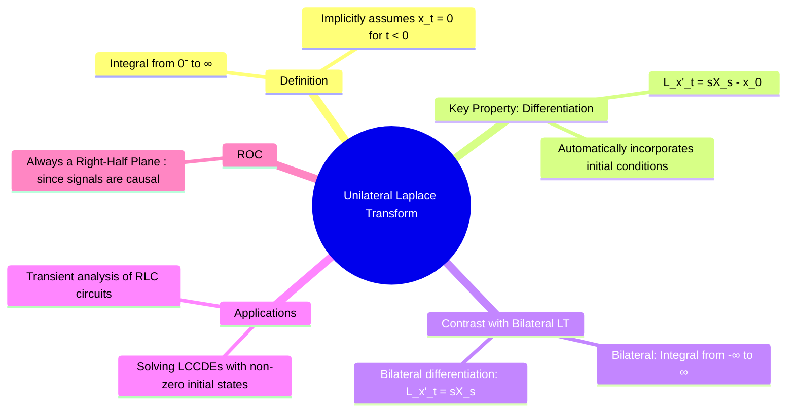

---
tags:
  - unilateral-laplace
  - one-sided-laplace
  - initial-conditions
  - signals-and-systems
  - circuit-analysis
created: 2025-09-24
aliases:
  - One-Sided Laplace Transform
  - Unilateral LT
subject: "[[Signals & Systems]]"
parent: "[[The Laplace Transform]]"
modified: 2026-07-23T16:48:00
---
### Unilateral Laplace Transform
#unilateral-laplace-transform #initial-conditions #causal-systems

> The **Unilateral (or One-Sided) Laplace Transform** is a specialized version of the [[The Laplace Transform#Definition of the Laplace Transform|Laplace Transform]] that is particularly suited for analyzing [[causality|causal]] signals and systems, especially those with non-zero initial conditions at $t=0$. By defining the integration from $t=0^{-}$, it provides a direct mechanism to incorporate initial values into the s-domain, making it the primary tool for [[Solving Differential Equations using Laplace Transform|solving linear constant-coefficient differential equations (LCCDEs)]] in circuit analysis and [[control systems]].

---
#### Definition
#unilateral-laplace/definition

The Unilateral Laplace Transform of a signal $x(t)$, denoted $X(s)$, is defined as:
$$\boxed{\quad X(s) = \mathcal{L}_U\{x(t)\} = \int_{0^{-}}^{\infty} x(t) e^{-st} dt \quad}$$
* This definition implicitly assumes that the signal $x(t)$ is causal, i.e., $x(t)=0$ for $t<0$. Therefore, the Unilateral LT of $x(t)$ is identical to the Bilateral LT of $x(t)u(t)$.

> [!concept] What does the $0^{-}$ in unilateral Laplace Transform mean?
>
> In unilateral (one-sided) Laplace transform, the lower limit is written as $0^{-}$ to include the signal value _just before_ $t=0$.  
> This lets the transform capture **initial conditions**, impulses at $t=0$, and sudden jumps.
> 
> Mathematically, it behaves like integration from $0$, but **conceptually it preserves the pre-0 initial information needed for solving differential equations.**

---
#### The Differentiation Property and Initial Conditions
#unilateral-laplace/differentiation

The most significant distinction of the Unilateral Transform lies in its **time-differentiation property**. This property directly embeds the initial conditions of the system into the transformed equation.

*   **First Derivative**:
    $$\boxed{\quad \mathcal{L}\left\{\frac{dx(t)}{dt}\right\} = sX(s) - x(0^{-}) \quad}$$
*   **Second Derivative**:
    $$\boxed{\quad \mathcal{L}\left\{\frac{d^2x(t)}{dt^2}\right\} = s^2X(s) - sx(0^{-}) - x'(0^{-}) \quad}$$

This is fundamentally different from the Bilateral Transform's property ($\mathcal{L}\{x'(t)\} = sX(s)$), which has no term for initial conditions. It is this feature that makes the Unilateral Transform indispensable for finding the **complete response** (Zero-State Response + Zero-Input Response) of a system.

---
#### Other Properties
#unilateral-laplace/properties

Most other properties, such as linearity, s-domain shifting, time-scaling, and convolution, are identical to their bilateral counterparts, given that the signals involved are causal.
*   **Integration Property**: The integration property is also widely used in circuit analysis.
    $$\mathcal{L}\left\{\int_{0^{-}}^t x(\tau)d\tau\right\} = \frac{X(s)}{s}$$
*   **Region of Convergence (ROC)**: Since the signals are always causal (right-sided), the ROC for a Unilateral Laplace Transform is always a **right-half plane**.

---
#### Applications
#unilateral-laplace/applications

1.  **Solving LCCDEs with Initial Conditions**: This is the primary application. The transform converts the differential equation into an algebraic equation where the initial conditions appear as known constants, allowing for the direct solution of $Y(s)$.
2.  **Transient Analysis of Electrical Circuits**: In RLC circuit analysis, the initial voltage on a capacitor, $v_C(0^-)$, and the initial current through an inductor, $i_L(0^-)$, serve as the initial conditions. The Unilateral Laplace Transform allows for the creation of s-domain circuit models that include these initial energy storages.

---
### Related Concepts
#unilateral-laplace/related-concepts

> [[The Laplace Transform]] (Bilateral Transform)

[[Solving Differential Equations using Laplace Transform]]
[[Properties of the Laplace Transform]]
[[The Transfer Function H(s)]]
[[Zero-State Response (ZSR)]]
[[Zero-Input Response (ZIR)]]
[[Electric Circuits]]