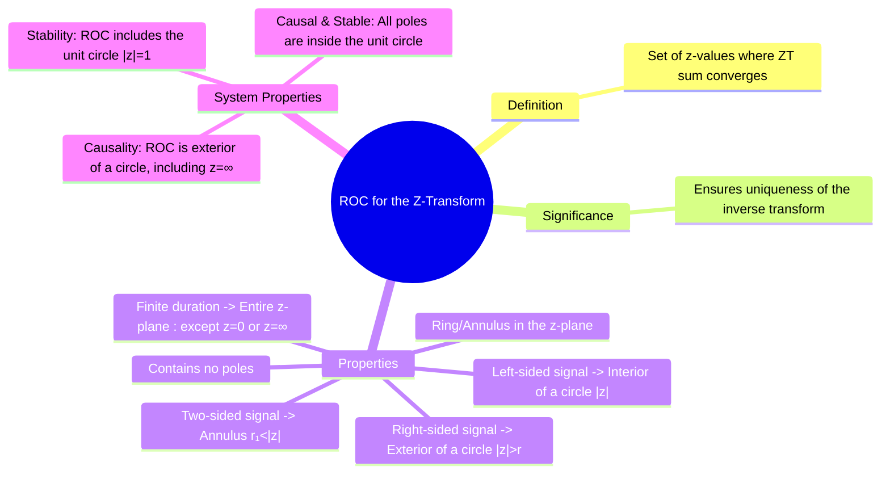

---
tags:
  - roc
  - z-transform
  - z-plane
  - discrete-time
  - stability
  - causality
created: 2025-09-24
aliases:
  - ROC for Z-Transform
  - Z-Transform ROC
  - "Example : Region of Convergence (ROC) for the Z-Transform"
subject: "[[Signals & Systems]]"
parent: "[[The Z-Transform]]"
modified: 2026-07-23T16:48:19
---
### Region of Convergence (ROC) for the Z-Transform
#roc #z-transform #z-plane

> ==The Region of Convergence (ROC) for the [[The Z-Transform|Z-Transform]] is the set of all values of the complex variable $z$ for which the Z-transform summation converges.== The ROC is a critical component of the Z-transform, as it determines the uniqueness of the time-domain signal corresponding to a given $X(z)$ and provides direct insight into crucial system properties like [[causality]] and stability.

---
#### Definition of ROC
#roc/definition #z-transform

The ROC is the set of points in the complex z-plane where the magnitude of the Z-transform is finite. This is the condition that the sequence $x[n]z^{-n}$ is absolutely summable.
$$\boxed{\quad \text{ROC} = \left\{ z \quad \Big| \quad \sum_{n=-\infty}^{\infty} |x[n] z^{-n}| < \infty \right\} \quad}$$

#### Significance of the ROC
#roc/uniqueness

The ROC is what distinguishes different signals that might share the same algebraic expression for $X(z)$. Without the ROC, the inverse Z-transform is ambiguous.

> **Example**: Consider $X(z) = \frac{1}{1 - az^{-1}}$.
> 1.  If the signal is right-sided (causal), $x_1[n] = a^n u[n]$, the ROC is $|z| > |a|$.
> 2.  If the signal is left-sided (anti-causal), $x_2[n] = -a^n u[-n-1]$, the ROC is $|z| < |a|$.
>
> $$\boxed{\begin{align}
 \mathcal{Z}\{a^n u[n]\} &= \frac{1}{1 - az^{-1}}, \quad \text{ROC: } |z| > |a| \\
 \mathcal{Z}\{-a^n u[-n-1]\} &= \frac{1}{1 - az^{-1}}, \quad \text{ROC: } |z| < |a|
\end{align}}$$

#### Properties of the ROC
#roc/properties #z-transform

![[z-transform left right.png]]

1.  **Shape**: The ROC is a ring ([[annulus]]) in the z-plane, centered at the origin.
2.  **Poles**: The ROC **never** contains any poles.
3.  **Right-Sided Sequences**: For a right-sided sequence ($x[n]=0$ for $n < N_1$), the ROC is the **exterior of a circle**.
    $$\boxed{\quad \text{ROC is of the form } |z| > r_{max} \quad}$$
    where $r_{max}$ is the magnitude of the largest-magnitude pole.
4.  **Left-Sided Sequences**: For a left-sided sequence ($x[n]=0$ for $n > N_2$), the ROC is the **interior of a circle**.
    $$\boxed{\quad \text{ROC is of the form } |z| < r_{min} \quad}$$
    where $r_{min}$ is the magnitude of the smallest-magnitude pole.
5.  **Two-Sided Sequences**: For a two-sided sequence, the ROC, if it exists, is an **[[annulus]]** bounded by poles.
    $$\boxed{\quad \text{ROC is of the form } r_1 < |z| < r_2 \quad}$$
6.  **Finite-Duration Sequences**: For a finite-duration sequence, the ROC is the **entire z-plane**, except possibly at $z=0$ or $z=\infty$.

#### ROC for LTI System Analysis
#roc/system-properties

###### Causality
#causality

> An LTI system is **causal** if and only if the ROC of its transfer function $H(z)$ is the **exterior of a circle, including the point $z=\infty$**.

###### Stability (BIBO)
#stability

> An LTI system is **BIBO stable** if and only if the ROC of its transfer function $H(z)$ **includes the unit circle ($|z|=1$)**.

###### Causality and Stability Combined
> Combining these two conditions gives the most important result for practical digital systems:
> $$\boxed{\quad \text{A causal discrete-time LTI system is stable if and only if all of its poles lie inside the unit circle.} \quad}$$
> This is because for causality, the ROC must be $|z|>|p_{max}|$, and for this region to include the unit circle, we must have $|p_{max}| < 1$.

---
### Related Concepts
#roc/related-concepts

> [[The Z-Transform]]

[[Z-Transform Table]]
[[Causality and Stability in the z-domain]]
[[Poles and Zeros in the z-domain]]
[[Properties of the Z-Transform]]
[[Region of Convergence (ROC)]] (for Laplace Transform)