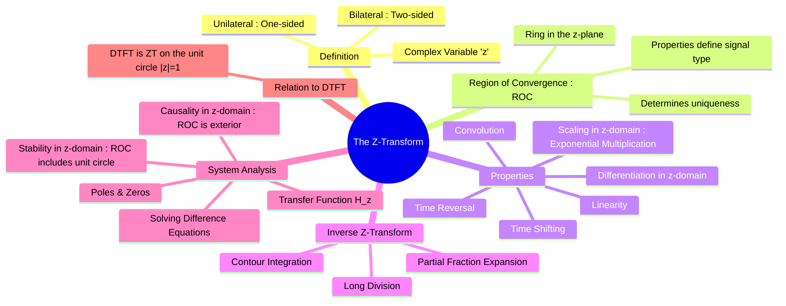

---
tags:
  - z-transform
  - discrete-time
  - z-domain
  - signals-and-systems
  - dsp
created: 2025-09-24
aliases:
  - Z-Transforms
  - z-domain analysis
  - Relationship between Z-Transform and Discrete-Time Fourier Transform (DTFT)
subject: "[[Signals & Systems]]"
parent: "[[Signals & Systems]]"
formula:
  - "Relationship between Z-Transform and Discrete-Time Fourier Transform (DTFT) : $$X(e^{j\\omega}) = X(z)|_{z=e^{j\\omega}}$$"
  - "Z-Transform (Bilateral/Two-Sided) : $$X(z) = \\mathcal{Z}\\{x[n]\\} = \\sum_{n=-\\infty}^{\\infty} x[n] z^{-n}$$"
  - "Z-Transform (Unilateral/One-Sided) : $$X(z) = \\mathcal{Z}\\{x[n]\\} = \\sum_{n=0}^{\\infty} x[n] z^{-n}$$"
modified: 2026-07-23T16:48:23
---
### The Z-Transform
#z-transform #z-domain #discrete-time-systems

> ==The Z-Transform is the discrete-time counterpart to the [[The Laplace Transform|Laplace Transform]].== It is a fundamental tool in digital signal processing (DSP) and discrete-time control systems that ==converts a discrete-time signal $x[n]$ into a complex frequency-domain representation $X(z)$==. Much like the Laplace Transform simplifies differential equations into algebraic ones, the Z-Transform converts [[Linear Constant-Coefficient Difference Equations (DT)|linear constant-coefficient difference equations (LCCDEs)]] into algebraic equations, making them much easier to solve and analyze.

> [!concept]- Laplace vs Z-Transform (ROC Insight)
> ==[[The Laplace Transform|Laplace transform]] uses $s=\sigma+j\omega$, where convergence depends on $\sigma$, giving vertical ROC strips in the $s$-plane.==
> 
> ==Z-transform uses $z=re^{j\omega}$, where convergence depends on $r=|z|$, giving circular ROC regions in the $z$-plane.==
> 
> ==[[Fourier Transforms|Fourier]] / [[Representation of Aperiodic Discrete-Time Signals|DTFT]] correspond to the boundaries $\sigma=0$ and $|z|=1$ respectively.==

> [!important] Complex Variable in Z-Transform
> A complex number is written as
> $$z=\sigma+j\omega = re^{j\omega}$$
> In Z-transform analysis, convergence depends only on the magnitude
> $$r=|z|,$$
> hence ROC is defined in terms of $|z|$ and not the angle.

---
#### Definition of the Z-Transform
#z-transform/definition

The **Bilateral (or Two-Sided) Z-Transform** of a discrete-time signal $x[n]$ is defined as the power series:
$$\boxed{\quad X(z) = \mathcal{Z}\{x[n]\} = \sum_{n=-\infty}^{\infty} x[n] z^{-n} \quad}$$
where $z$ is a complex variable.

> [!Hint] Geometric Progression
> $$\text{If } |r|<1, \quad \sum_{n=0}^{\infty} r^n = \frac{1}{1-r}$$
> The GP converges **only if** $|r|<1$

> [!pyq]- PYQ : 2020
> ![[ee_2020#^q4]]

For [[Causality|causal]] signals and systems, the **Unilateral (or One-Sided) Z-Transform** is used, which is particularly useful for solving difference equations with initial conditions.
$$\boxed{\quad X(z) = \mathcal{Z}\{x[n]\} = \sum_{n=0}^{\infty} x[n] z^{-n} \quad}$$

---
#### Region of Convergence (ROC) for the Z-Transform
#z-transform/roc

> [!refer]
> [[Region of Convergence (ROC) for the Z-Transform]]

The **Region of Convergence (ROC)** is the set of all values of $z$ in the complex z-plane for which the Z-transform summation converges.
*   **Importance**: The ROC is essential for a unique definition of the signal $x[n]$, as different signals can have the same mathematical expression for $X(z)$.
*   **Shape**: The ROC for the Z-transform is an [[annulus]] (a ring) in the z-plane centered at the origin. It can be the interior of a circle, the exterior of a circle, or the ring between two circles. The ROC never contains any poles.

---
#### System Analysis using Z-Transform
#z-transform/system-analysis

###### The Transfer Function H(z)
#transfer-function-z

The **Transfer Function** (or System Function) $H(z)$ of a discrete-time LTI system is the ratio of the Z-transform of the output $Y(z)$ to the Z-transform of the input $X(z)$, assuming zero initial conditions.
$$\boxed{\quad H(z) = \frac{Y(z)}{X(z)} \quad}$$
It is also the Z-transform of the system's impulse response $h[n]$, i.e., $H(z) = \mathcal{Z}\{h[n]\}$.

###### Poles and Zeros in the z-domain
The locations of the poles (roots of the denominator) and zeros (roots of the numerator) of $H(z)$ determine the system's characteristics.

###### Causality and Stability in the z-domain
#causality-z #stability-z

1.  **Causality**: An LTI system is **causal** if and only if the ROC of its transfer function $H(z)$ is the **exterior of a circle**, including infinity.
2.  **Stability (BIBO)**: An LTI system is **BIBO stable** if and only if the ROC of its transfer function $H(z)$ **includes the unit circle** ($|z|=1$).
3.  **Causality and Stability Combined**: The most important case in practice.

> [!memory]
> ==A causal discrete-time LTI system is stable if and only if all of its poles lie inside the unit circle.==

---
#### Relationship to the Discrete-Time Fourier Transform (DTFT)
#z-transform-dtft-relationship

==The Discrete-Time Fourier Transform (DTFT) is a special case of the Z-Transform evaluated on the unit circle, $z = e^{j\omega}$.==
$$\boxed{\quad X(e^{j\omega}) = X(z)|_{z=e^{j\omega}} \quad}$$
==This relationship is only valid if the ROC of $X(z)$ includes the unit circle, which is the condition for the signal to be absolutely summable (i.e., stable).==

---
### Related Concepts
#z-transform/related-concepts

> [[Region of Convergence (ROC) for the Z-Transform]]

[[Properties of the Z-Transform]]
[[Inverse Z-Transform]]
[[The Transfer Function H(z)]]
[[Poles and Zeros in the z-domain]]
[[Causality and Stability in the z-domain]]
[[The Laplace Transform]]
[[Discrete-Time Fourier Transform (DTFT)]]
[[Digital Signal Processing]]
[[Geometric Series and its derivatives]]
