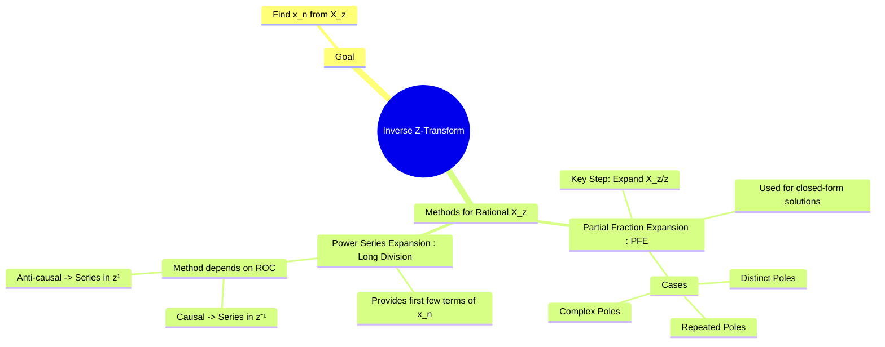

---
tags:
  - inverse-z-transform
  - partial-fraction-expansion
  - long-division
  - discrete-time
  - dsp
created: 2025-09-25
aliases:
  - Inverse ZT
  - Finding x[n] from X(z)
  - "Example : Inverse Z-Transform using Long Division"
  - Inverse Z-Transform (Partial Fraction Expansion, Long Division)
  - "Cover-up Method : Inverse Z-Transform"
subject: "[[Signals & Systems]]"
parent: "[[The Z-Transform]]"
modified: 2026-07-23T16:48:29
---
### Inverse Z-Transform (Partial Fraction Expansion, Long Division)
#inverse-z-transform #pfe #long-division

> Finding the inverse Z-transform, $\mathcal{Z}^{-1}\{X(z)\}$, is the process of converting a z-domain representation back into its corresponding discrete-time sequence $x[n]$. For rational functions of $z$, which are common in LTI system analysis, the two primary methods are Partial Fraction Expansion (for a closed-form solution) and Power Series Expansion via Long Division (for finding the first few terms of the sequence).

---
#### 1. Partial Fraction Expansion (PFE)
#partial-fraction-expansion #pfe

This method is used to find a closed-form expression for $x[n]$. It is very similar to the [[Inverse Laplace Transform using Partial Fraction Expansion|PFE for the Laplace transform]], but with one crucial difference.

**Key Step**: The standard Z-transform pairs are of the form $\mathcal{Z}\{a^n u[n]\} = \frac{z}{z-a}$. To match this form, we perform the partial fraction expansion on $\frac{X(z)}{z}$ instead of $X(z)$.

**Procedure**:
1.  Form the function $G(z) = \frac{X(z)}{z}$.
2.  Perform a partial fraction expansion on $G(z)$ based on its poles.
3.  Multiply the resulting expansion by $z$ to recover $X(z)$.
4.  Find the inverse transform of each term using standard transform tables.

###### Case 1: Distinct Real Poles
If $G(z) = \frac{N(z)}{(z-p_1)(z-p_2)\dots}$ has distinct poles, the expansion is:
$$\frac{X(z)}{z} = \frac{A_1}{z-p_1} + \frac{A_2}{z-p_2} + \dots$$
where the residues $A_k$ are found using the cover-up method: $A_k = [(z-p_k)\frac{X(z)}{z}]_{z=p_k}$.
Then, $X(z) = A_1 \frac{z}{z-p_1} + A_2 \frac{z}{z-p_2} + \dots$
Assuming a causal signal (ROC is $|z|>|p_k|$), the inverse is:
$$\boxed{\quad x[n] = (A_1 p_1^n + A_2 p_2^n + \dots)u[n] \quad}$$

###### Case 2: Repeated Real Poles
If a pole $p_1$ is repeated $r$ times, the expansion for $X(z)/z$ will include terms:
$$\frac{X(z)}{z} = \frac{A_r}{(z-p_1)^r} + \frac{A_{r-1}}{(z-p_1)^{r-1}} + \dots + \frac{A_1}{z-p_1} + \dots$$
After multiplying by $z$ and using standard tables, these terms correspond to sequences like $n p_1^n u[n]$, $n^2 p_1^n u[n]$, etc.

#### 2. Power Series Expansion (Long Division)
#long-division

This method directly implements the definition of the Z-transform, $X(z) = \sum x[n]z^{-n}$, by performing polynomial long division to obtain a power series. It is most useful for finding the first few terms of a sequence, not its closed-form expression.

The arrangement of the polynomials for division depends on the ROC.

###### For a Causal Sequence (ROC is $|z|>r$, right-sided)
We need a power series in terms of $z^{-1}$.
$$X(z) = x + xz^{-1} + xz^{-2} + \dots$$
**Procedure**: Arrange both the numerator and denominator in **descending powers of $z$** (or ascending powers of $z^{-1}$) and perform long division. The coefficients of the resulting quotient are the sequence values $x, x, x, \dots$.

> **Example**: $X(z) = \frac{z}{z-0.5} = \frac{1}{1-0.5z^{-1}}$, for $|z|>0.5$
>
> Performing long division of $1$ by $1-0.5z^{-1}$ yields:
> $$\frac{1}{1-0.5z^{-1}} = 1 + 0.5z^{-1} + 0.25z^{-2} + \dots$$
> By inspection, $x=1$, $x=0.5$, $x=0.25$, so $x[n] = (0.5)^n u[n]$.

###### For an Anti-Causal Sequence (ROC is $|z|<r$, left-sided)
We need a power series in terms of positive powers of $z$.
$$X(z) = x[-1]z + x[-2]z^2 + x[-3]z^3 + \dots$$
**Procedure**: Arrange both the numerator and denominator in **ascending powers of $z$** and perform long division. The coefficients of the resulting quotient are the sequence values $x[-1], x[-2], \dots$.

---
### Related Concepts
#inverse-z-transform/related-concepts

> [[The Z-Transform]]

[[Properties of the Z-Transform]]
[[Region of Convergence (ROC) for the Z-Transform]]
[[Poles and Zeros in the z-domain]]
[[Solving Difference Equations using Z-Transform]]