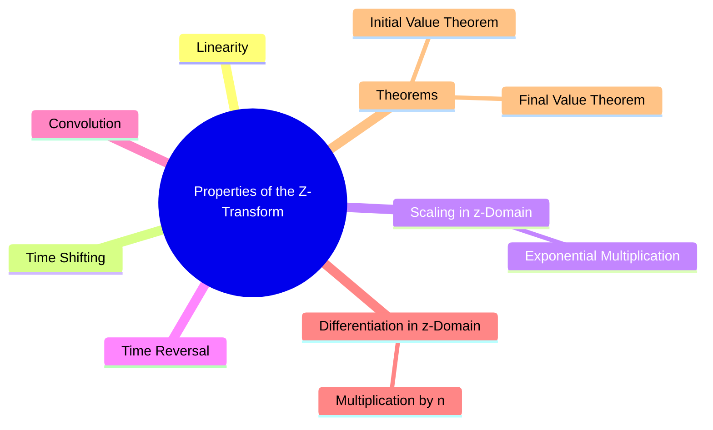

---
tags:
  - z-transform
  - z-transform-properties
  - discrete-time
  - dsp
  - signals-and-systems
created: 2025-09-25
aliases:
  - Z-Transform Properties
  - "Properties : Z-Transform (ZT)"
  - "Final Value Theorem (FVT) : Z-Transform"
  - "Initial Value Theorem (IVT) : Z-Transform"
subject: "[[Signals & Systems]]"
parent: "[[The Z-Transform]]"
modified: 2026-07-23T16:48:46
---
### Properties of the Z-Transform
#z-transform #z-transform-properties

> The properties of the Z-transform are a set of fundamental rules that relate operations on a signal in the time domain to corresponding operations in the z-domain. These properties are essential for manipulating and simplifying the analysis of discrete-time signals and systems. They are particularly powerful for solving linear constant-coefficient difference equations and analyzing LTI systems using transfer functions.

*In the following properties, assume $x[n] \leftrightarrow X(z)$ with ROC $R_x$ and $y[n] \leftrightarrow Y(z)$ with ROC $R_y$.*

---
###### 1. Linearity
#linearity

For any constants $a$ and $b$:
$$\boxed{\quad a x[n] + b y[n] \leftrightarrow a X(z) + b Y(z) \quad}$$
The ROC of the combined transform is at least the intersection of the individual ROCs: $\text{ROC} \supseteq R_x \cap R_y$.

---
###### 2. Time Shifting
#time-shifting

For an integer shift $n_0$:
$$\boxed{\quad x[n-n_0] \leftrightarrow z^{-n_0} X(z) \quad}$$
The ROC remains $R_x$, except for the possible addition or removal of poles at $z=0$ (for $n_0>0$) or $z=\infty$ (for $n_0<0$).

---
###### 3. Scaling in the z-Domain (Multiplication by an Exponential)
#z-domain-scaling

For a complex constant $a$:
$$\boxed{\quad a^n x[n] \leftrightarrow X\left(\frac{z}{a}\right) \quad}$$
The ROC is scaled by $|a|$. If the original ROC is $r_1 < |z| < r_2$, the new ROC is $|a|r_1 < |z| < |a|r_2$.

---
###### 4. Time Reversal
#time-reversal

$$\boxed{\quad x[-n] \leftrightarrow X\left(\frac{1}{z}\right) \quad}$$
The ROC is inverted. If the original ROC is $r_1 < |z| < r_2$, the new ROC is $1/r_2 < |z| < 1/r_1$.

---
###### 5. Convolution
#convolution

The Z-transform of the convolution of two signals is the product of their individual Z-transforms. This is the cornerstone property for LTI system analysis.
$$\boxed{\quad x[n] * y[n] \leftrightarrow X(z)Y(z) \quad}$$
The ROC of the result is at least the intersection of the individual ROCs: $\text{ROC} \supseteq R_x \cap R_y$.

---
###### 6. Differentiation in the z-Domain (Multiplication by n)
#z-domain-differentiation

$$\boxed{\quad n x[n] \leftrightarrow -z \frac{dX(z)}{dz} \quad}$$
The ROC remains the same as the original ROC, $R_x$.

---
###### 7. Initial Value Theorem (IVT)
#initial-value-theorem

For a **causal** sequence $x[n]$ (i.e., $x[n]=0$ for $n<0$):
$$\boxed{\quad x = \lim_{z \to \infty} X(z) \quad}$$
This allows finding the first value of the sequence directly from its transform.

---
###### 8. Final Value Theorem (FVT)
#final-value-theorem

For a **causal** sequence $x[n]$:
$$\boxed{\quad \lim_{n \to \infty} x[n] = \lim_{z \to 1} (z-1)X(z) \quad}$$

> [!warning] Crucial Condition
> This theorem is only valid if the system is stable, meaning the poles of $(z-1)X(z)$ must all lie **strictly inside the unit circle**. This is a common trap in GATE questions. If a pole lies on or outside the unit circle (other than a single pole at $z=1$ that gets cancelled), the final value does not exist or the theorem gives an incorrect result.

---
### Related Concepts
#z-transform/related-concepts

> [[The Z-Transform]]

[[Decimation]]
[[Region of Convergence (ROC) for the Z-Transform]]
[[Inverse Z-Transform]]
[[The Transfer Function H(z)]]
[[Properties of the Laplace Transform]]