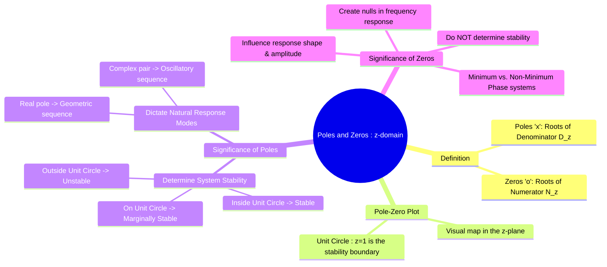

---
tags:
  - poles-and-zeros-z
  - z-domain
  - transfer-function-z
  - stability
  - discrete-time
  - dsp
created: 2025-09-25
aliases:
  - Poles and Zeros (z-domain)
  - z-plane analysis
subject: "[[Signals & Systems]]"
parent: "[[The Transfer Function H(z)]]"
modified: 2026-07-23T16:49:43
---
### Poles and Zeros in the z-domain
#poles-and-zeros-z #z-plane #system-dynamics

> The poles and zeros of a discrete-time system's transfer function $H(z)$ are the critical points in the complex z-plane that entirely define the system's dynamic behavior. A graphical **pole-zero plot**, with the **unit circle** as a reference, provides immediate insight into a system's stability and its frequency response characteristics.

For a rational transfer function $H(z) = \frac{N(z)}{D(z)}$:

*   **Poles**: The **poles** are the roots of the denominator polynomial $D(z)$. They are the values of $z$ where the system's response can be infinite, $|H(z)| \to \infty$.
    $$\boxed{\quad \text{Poles are the roots of the characteristic equation } D(z) = 0. \quad}$$
*   **Zeros**: The **zeros** are the roots of the numerator polynomial $N(z)$. They are the values of $z$ for which the system's response is zero, $H(z) = 0$.

---
#### The Pole-Zero Plot in the z-plane
#pole-zero-plot-z

The locations of poles and zeros are plotted on the complex z-plane.
*   Poles are marked with a cross (`x`).
*   Zeros are marked with a circle (`o`).
*   The **Unit Circle** ($|z|=1$) is always drawn on the plot, as it serves as the boundary for stability.

---
#### Significance of Pole Locations
#poles-z #stability-z #natural-response-z

The locations of the poles are the single most important factor determining a system's stability and the nature of its natural response.

###### Poles and Stability
For a **causal** LTI system:
$$\boxed{\quad \text{The system is BIBO stable if and only if all of its poles lie strictly inside the unit circle.} \quad}$$
*   **Poles inside the unit circle** ($|p| < 1$): **Stable**. The natural response decays to zero.
*   **Poles outside the unit circle** ($|p| > 1$): **Unstable**. The natural response grows exponentially.
*   **Poles on the unit circle** ($|p| = 1$): **Marginally stable**. Simple, non-repeated poles lead to a sustained (oscillatory or constant) response. A repeated pole on the unit circle makes the system unstable.

###### Poles and Natural Response Modes
The location of a pole dictates the form of a corresponding term in the impulse response $h[n]$:
1.  **Real Pole at $z=p$**: Corresponds to a geometric sequence term $Ap^n$.
2.  **Complex Conjugate Pair at $z = re^{\pm j\omega}$**: Corresponds to a damped or growing sinusoidal sequence $Ar^n \cos(\omega n + \phi)$.

---
#### Significance of Zero Locations
#zeros-z #frequency-response-dtft

Zeros do not affect the stability of a system, but they are crucial in shaping the system's overall response.

1.  **Response Shaping**: Zeros affect the amplitude and phase of the system's response by influencing the coefficients (residues) in the partial fraction expansion of $H(z)$.
2.  **Frequency Response Nulling**: A zero located directly on the unit circle will create a null in the system's frequency response.
    $$\boxed{\quad \text{If a zero is at } z=e^{j\omega_0}, \text{ then } H(e^{j\omega_0}) = 0. \quad}$$
    This means the system will completely block an input signal component at the frequency $\omega_0$. This is the basis of notch filter design.
3.  **Minimum vs. Non-Minimum Phase**:
    *   A system with all its zeros **inside** the unit circle is called **minimum phase**.
    *   A system with one or more zeros **outside** the unit circle is called **non-minimum phase**.

---
### Related Concepts
#poles-and-zeros-z/related-concepts

> [[The Transfer Function H(z)]]

[[Causality and Stability in the z-domain]]
[[Region of Convergence (ROC) for the Z-Transform]]
[[Inverse Z-Transform]]
[[Poles and Zeros of a Transfer Function]] (s-domain)