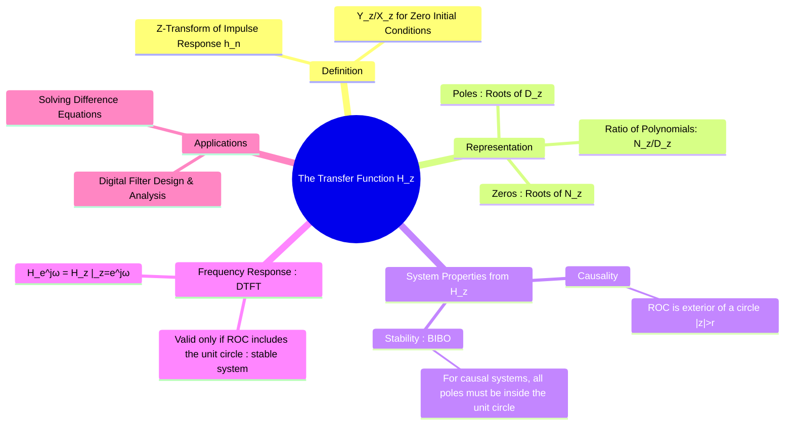

---
tags:
  - transfer-function-z
  - z-domain
  - discrete-time
  - lti-systems
  - dsp
created: 2025-09-25
aliases:
  - Transfer Function H(z)
  - System Function (Discrete)
  - H(z)
subject: "[[Signals & Systems]]"
parent: "[[The Z-Transform]]"
modified: 2026-07-20
---
### The Transfer Function H(z)
#transfer-function-z #z-domain #lti-systems

> The **Transfer Function** (or System Function) $H(z)$ is the z-domain representation of a discrete-time LTI system. It provides a complete description of the system's input-output behavior in the complex frequency domain. By analyzing $H(z)$, its poles, and its zeros, we can determine critical system properties like stability and causality, and design systems like digital filters.

---
#### Definition of the Transfer Function H(z)
#transfer-function-z/definition

The transfer function $H(z)$ of a discrete-time LTI system is defined in two equivalent ways:

1.  **As the ratio of output to input Z-transforms**: It is the ratio of the Z-transform of the output, $Y(z)$, to the Z-transform of the input, $X(z)$, under the assumption of zero initial conditions.
    $$\boxed{\quad H(z) = \frac{Y(z)}{X(z)} \bigg|_{\text{zero initial conditions}} \quad}$$
2.  **As the Z-transform of the impulse response**: It is the Z-transform of the system's discrete-time impulse response, $h[n]$.
    $$\boxed{\quad H(z) = \mathcal{Z}\{h[n]\} = \sum_{n=-\infty}^{\infty} h[n]z^{-n} \quad}$$
These definitions are connected by the convolution property in the z-domain: $Y(z) = H(z)X(z)$.

#### Poles and Zeros in the z-domain
#poles-and-zeros-z
For systems described by LCCDEs, the transfer function is a rational function of $z$:
$$H(z) = \frac{N(z)}{D(z)} = K \frac{(z-z_1)(z-z_2)\dots}{(z-p_1)(z-p_2)\dots}$$
*   **Poles**: The roots of the denominator polynomial $D(z)$ are the **poles** of the system. Their locations determine the system's stability and natural response modes.
*   **Zeros**: The roots of the numerator polynomial $N(z)$ are the **zeros** of the system. They influence the shape and frequency response of the system.

#### System Properties from H(z)
#system-properties #causality-z #stability-z

The transfer function and its [[Region of Convergence (ROC) for the Z-Transform]] directly determine the system's properties.

###### Causality
An LTI system is **causal** if and only if the ROC of its transfer function $H(z)$ is the **exterior of a circle, including the point $z=\infty$**.

###### Stability (BIBO)
An LTI system is **BIBO stable** if and only if the ROC of $H(z)$ **includes the unit circle ($|z|=1$)**.
> For a **causal** discrete-time LTI system, the stability condition simplifies to a critical rule:
> $$\boxed{\quad \text{A causal discrete-time LTI system is stable if and only if all of its poles lie inside the unit circle.} \quad}$$

#### Connection to Frequency Response (DTFT)
#frequency-response-dtft
The **frequency response** $H(e^{j\omega})$ of a discrete-time system describes its steady-state response to a complex sinusoidal input $e^{j\omega n}$. It is found by evaluating the transfer function $H(z)$ on the unit circle.
$$\boxed{\quad H(e^{j\omega}) = H(z)|_{z=e^{j\omega}} \quad}$$
This is only valid if the system is **stable**, as this is the condition for the ROC to include the unit circle.
*   **Magnitude Response**: $|H(e^{j\omega})|$ determines the gain at each frequency.
*   **Phase Response**: $\angle H(e^{j\omega})$ determines the phase shift at each frequency.

---
### Related Concepts
#transfer-function-z/related-concepts

> [[The Z-Transform]]

[[Poles and Zeros in the z-domain]]
[[Causality and Stability in the z-domain]]
[[Region of Convergence (ROC) for the Z-Transform]]
[[Solving Difference Equations using Z-Transform]]
[[The Transfer Function H(s)]]
[[Discrete-Time Fourier Transform (DTFT)]]