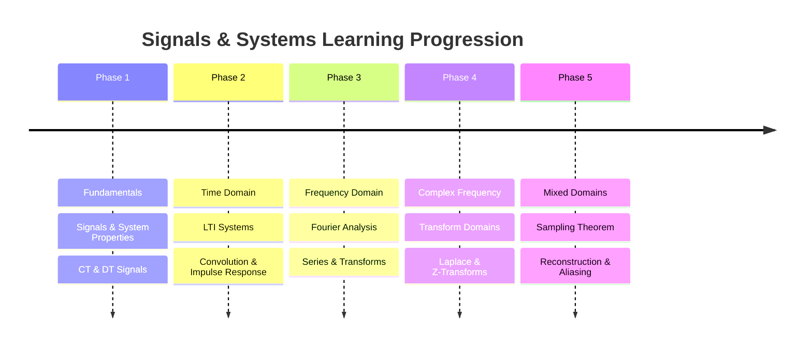

---
tags:
  - syllabus
  - signals-systems
  - gate
  - moc
created: 2026-07-23T22:34:41
syllabus: signals & systems
modified: 2026-07-23T22:34:41
---
### Signals & Systems

> [!info]
> This Map of Content (MOC) follows the recommended learning progression for GATE Electrical Engineering - Signals & Systems.
> 
> Learn each section sequentially. Every topic links to its detailed note.

---

### 1. Signals and Systems Fundamentals

> Foundation of signal processing and system classification.

#### 1. Continuous-Time (CT) and Discrete-Time (DT) Signals
- [[Energy and Power Signals]]
- [[Signal Definition and Classification (CT vs DT)]]
- [[Signal Properties (Periodic & Aperiodic, Even & Odd)]]
- [[Transformations of the Independent Variable]]

#### 2. Standard Signals
- [[Continuous-Time Unit Impulse and Unit Step Functions]]
- [[Discrete-Time Unit Impulse and Unit Step Sequences]]
- [[Exponential and Sinusoidal Signals]]
- [[Ramp, Signum, Rectangular Pulse, and Sinc Functions]]

#### 3. System Properties
- [[Causality]]
- [[Invertibility and Inverse Systems]]
- [[Linearity]]
- [[Memory and Memoryless Systems]]
- [[Stability (BIBO Stability)]]
- [[System Definition and Classification]]
- [[Time-Invariance]]

---

### 2. [[LTI|Linear Time-Invariant (LTI) Systems]]

> Time-domain analysis using convolution and impulse response.

#### 1. Impulse Response and Convolution
- [[Continuous-Time Convolution Integral]]
- [[Discrete-Time Convolution Sum]]
- [[Graphical and Analytical Convolution]]
- [[Impulse Response of an LTI System]]
- [[Properties of Convolution]]

#### 2. Properties of LTI Systems
- [[Causality of LTI Systems in terms of Impulse Response]]
- [[Invertibility of LTI Systems]]
- [[LTI Systems with and without Memory]]
- [[Stability of LTI Systems in terms of Impulse Response]]

#### 3. LTI Systems Described by Equations
- [[Linear Constant-Coefficient Difference Equations (DT)]]
- [[Linear Constant-Coefficient Differential Equations (CT)]]

---

### 3. Fourier Series Representation of Periodic Signals

> Frequency domain analysis of periodic signals.

#### 1. Continuous-Time Fourier Series (CTFS)
- [[Concept of Frequency Spectrum]]
- [[Exponential Fourier Series]]
- [[Properties of Continuous-Time Fourier Series]]
- [[Response of LTI Systems to Complex Exponentials]]
- [[Trigonometric Fourier Series]]

#### 2. Discrete-Time Fourier Series (DTFS)
- [[Representation of Periodic Discrete-Time Signals]]

---

### 4. Continuous-Time Fourier Transform

> Extending Fourier analysis to aperiodic continuous-time signals.

#### 1. The Transform and its Properties
- [[Convolution and Multiplication Properties of CTFT]]
- [[Correlation]]
- [[Development of the Fourier Transform from Fourier Series]]
- [[Differentiation and Integration Properties of CTFT]]
- [[Fourier Transform of Aperiodic Signals]]
- [[Fourier Transform of Periodic Signals]]
- [[Properties of the CTFT]]

#### 2. Frequency Response
- [[Bandwidth in Signals & Systems]]
- [[Filtering Concepts]]
- [[Frequency Response of LTI Systems]]

---

### 5. Discrete-Time Fourier Transform

> Frequency domain analysis of discrete-time aperiodic signals.

#### 1. The Transform and its Properties
- [[Convolution and Multiplication Properties of DTFT]]
- [[Frequency Response of Discrete-Time LTI Systems]]
- [[Properties of the DTFT]]
- [[Representation of Aperiodic Discrete-Time Signals]]

---

### 6. Laplace Transform

> Generalization of the CTFT for system analysis using complex frequency.

#### 1. Definition and Region of Convergence (ROC)
- [[Properties of the ROC]]
- [[Region of Convergence (ROC)]]
- [[The Laplace Transform]]

#### 2. Properties and Inverse Transform
- [[Inverse Laplace Transform using Partial Fraction Expansion]]
- [[Properties of the Laplace Transform]]

#### 3. System Analysis using Laplace Transform
- [[Causality and Stability in the s-domain]]
- [[Poles and Zeros of a Transfer Function]]
- [[Solving Differential Equations using Laplace Transform]]
- [[The Transfer Function H(s)]]
- [[Unilateral Laplace Transform]]
- [[Zero-Input Response (ZIR)]]
- [[Zero-State Response (ZSR)]]

---

### 7. Z-Transform

> Discrete-time counterpart of the Laplace transform.

#### 1. Definition and Region of Convergence (ROC)
- [[Properties of the ROC for Z-Transform]]
- [[Region of Convergence (ROC) for the Z-Transform]]
- [[The Z-Transform]]

#### 2. Properties and Inverse Transform
- [[Inverse Z-Transform]]
- [[Properties of the Z-Transform]]

#### 3. System Analysis using Z-Transform
- [[Causality and Stability in the z-domain]]
- [[Poles and Zeros in the z-domain]]
- [[Solving Difference Equations using Z-Transform]]
- [[The Transfer Function H(z)]]
- [[Unilateral Z-Transform]]

---

### 8. Sampling

> Bridging continuous-time and discrete-time signals.

#### 1. Sampling and Reconstruction
- [[Effect of Undersampling (Aliasing)]]
- [[Reconstruction from Samples using Interpolation]]
- [[Representation of a CT signal by its Samples]]
- [[The Sampling Theorem (Nyquist-Shannon Theorem)]]
- [[Zero-Order Hold (ZOH)]]

---

### 9. Archive

#### 1. Deprecated
- [[Complex Sinusoid]]
- [[Frequency Domain Transfer Function]]
- [[Frequency Response]]
- [[System Analysis]]

#### 2. Extra Topics
- [[All-Pass Filter]]
- [[All-Pass Systems]]
- [[Decimation]]
- [[Eigen-signals of LTI Systems]]
- [[Relation between DTFT and DFS]]
- [[Signals visualization]]

#### 3. Reference Tables
- [[Z-Transform Table]]

#### 4. Subject Overview

- Signals and Systems Fundamentals
- [[LTI|Linear Time-Invariant (LTI) Systems]]
- Fourier Series Representation of Periodic Signals
- Continuous-Time Fourier Transform
- Discrete-Time Fourier Transform
- [[The Laplace Transform|Laplace Transform]]
- Z-Transform
- [[Concept of Sampling|Sampling]]
