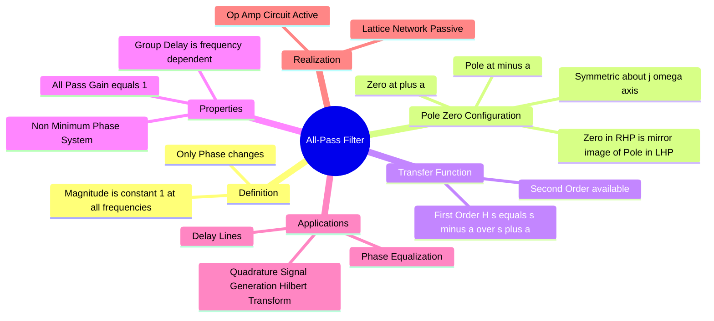

---
tags:
  - analog-electronics
  - control-system
  - filters
  - signals-and-systems
  - gate
created: 2025-12-28
aliases:
  - APF
  - Phase Shifter
  - Delay Equalizer
subject:
  - "[[Analog & Digital Electronics]]"
  - "[[Signals & Systems]]"
parent:
  - Filters (Active and Passive)
modified: 2026-07-19
---
### All-Pass Filter (APF)
#filters #control-system #phase-shifter

> An **All-Pass Filter** is a signal processing filter that passes all frequencies with equal gain (magnitude is constant, typically unity), but changes the **phase relationship** between various frequencies. ==It is primarily used for phase shifting or time-delay applications.==

---
#### Transfer Function and Pole-Zero Plot
#filters/transfer-function #pole-zero

The defining characteristic of an all-pass filter is the symmetry of its poles and zeros in the $s$-plane.
**Pole-Zero Property:**
For every pole at $s = -p$ (Left Half Plane), there is a zero at $s = +p$ (Right Half Plane). They are mirror images across the imaginary ($j\omega$) axis.

**First-Order Transfer Function:**
$$\boxed{\quad H(s) = K \frac{s - a}{s + a} \quad}$$
Where $a > 0$ determines the pole-zero location.

* **Pole:** $s = -a$ (Stable)
* **Zero:** $s = +a$ (Right Half Plane)
* **System Type:** Because it has a zero in the Right Half Plane (RHP), it is a **[[Non-Minimum Phase Systems|Non-Minimum Phase System]]**.

> [!pyq]- PYQ : GATE EE 2020
> ![[ee_2020#^q38]]

---
#### Frequency Response
#filters/frequency-response

Substituting $s = j\omega$:
$$H(j\omega) = \frac{j\omega - a}{j\omega + a}$$

**Magnitude Response:**
$$|H(j\omega)| = \frac{|j\omega - a|}{|j\omega + a|} = \frac{\sqrt{\omega^2 + (-a)^2}}{\sqrt{\omega^2 + a^2}} = \frac{\sqrt{\omega^2 + a^2}}{\sqrt{\omega^2 + a^2}}$$
$$\boxed{\quad |H(j\omega)| = 1 \quad}$$
The magnitude is unity (0 dB) for all frequencies $0 \le \omega < \infty$.

**Phase Response:**
The phase angle $\phi(\omega)$ is the angle of the numerator minus the angle of the denominator.
$$\phi(\omega) = \angle(j\omega - a) - \angle(j\omega + a)$$
Since $j\omega - a$ is in the second quadrant (negative real, positive imag):
$$\angle(j\omega - a) = 180^\circ - \tan^{-1}\left(\frac{\omega}{a}\right)$$
$$\angle(j\omega + a) = \tan^{-1}\left(\frac{\omega}{a}\right)$$
Total Phase:
$$\boxed{\quad \phi(\omega) = 180^\circ - 2\tan^{-1}\left(\frac{\omega}{a}\right) \quad}$$

**Phase Range:**
* At DC ($\omega = 0$): $\phi = 180^\circ$
* At Pole freq ($\omega = a$): $\phi = 180^\circ - 2(45^\circ) = 90^\circ$
* At $\omega \to \infty$: $\phi = 180^\circ - 2(90^\circ) = 0^\circ$
*(Note: Depending on the specific circuit configuration, the range might be $0$ to $-180^\circ$ or similar, but the sweep is always $180^\circ$ for a 1st order filter).*

---
#### Active Circuit Realization
#filters/active-circuit

A common first-order active all-pass filter uses an Operational Amplifier.
* Input signal goes to the non-inverting terminal (+) via a resistor $R$ and capacitor $C$ network.
* Input signal goes to the inverting terminal (-) via a resistor $R_f$, with feedback $R_f$.

If the circuit is configured such that:
$$H(s) = \frac{V_{out}}{V_{in}} = \frac{1 - sRC}{1 + sRC}$$
This matches the form $\frac{-(s - 1/RC)}{s + 1/RC}$.
* Pole/Zero location: $a = \frac{1}{RC}$.

---
#### Applications
#filters/applications

1. **Phase Equalizers:** Used in communication lines to correct phase distortion (non-linear phase) caused by other components (like transmission lines or IIR filters) without altering the amplitude of the signal.
2. **Delay Lines:** By cascading multiple all-pass filters, a desired group delay can be achieved over a specific bandwidth.
3. **Quadrature Signal Generation:** A 90-degree phase shift can be generated at a specific frequency to create sine/cosine pairs (approximate Hilbert Transformer).
4. **Audio Processing:** Creating "phaser" effects.

---
### Related Concepts
#topic/related-concepts

> [[Non-Minimum Phase Systems]]

[[All-Pass Systems]]
[[Bode Plots]]
[[Group Delay and Phase Delay]]
[[Operational Amplifiers]]
[[Lattice Network]] (Classic passive topology for All-Pass)
[[Pade Approximation]] (Approximates a pure time delay $e^{-sT}$ using All-Pass structures)
