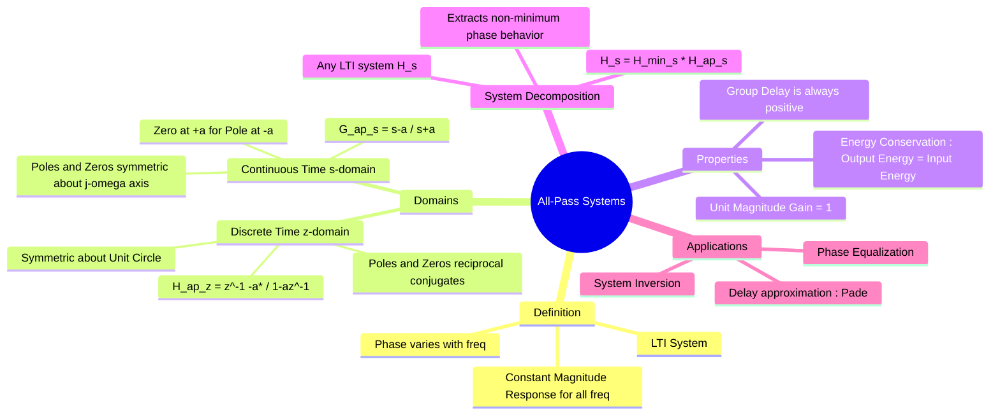

---
tags:
  - signals-and-systems
  - control-system
  - dsp
  - gate
  - frequency-domain
created: 2026-07-23T16:52:06
aliases:
  - All-Pass System
  - All-Pass Transfer Function
  - Phase Shifter System
  - "Example : System Decomposition (Minimum Phase and All-Pass)"
subject:
  - "[[Signals & Systems]]"
  - "[[Control Systems]]"
parent:
  - "[[LTI|Linear Time-Invariant (LTI) Systems]]"
modified: 2026-07-23T16:52:06
---
###### Mind Map

---
### All-Pass Systems
#signals-and-systems/lti #control-system #dsp

> An **All-Pass System** is a Linear Time-Invariant (LTI) system that passes all frequency components of an input signal with constant amplitude gain (typically unity), but modifies the phase relationship between frequency components. Mathematically, $|H(\omega)| = 1$ for all $\omega$.

#### Continuous-Time All-Pass Systems ($s$-Domain)
#signals-and-systems/s-domain

In the Laplace domain, an all-pass system is characterized by a specific pole-zero pattern.
For a system to have a constant magnitude response, **for every pole at $s = -p$ in the Left Half Plane (LHP), there must be a zero at $s = +p$ in the Right Half Plane (RHP)**.
*   The poles and zeros are symmetric with respect to the imaginary axis ($j\omega$-axis).

**Transfer Function (First Order):**
$$\boxed{\quad H_{ap}(s) = \frac{s - a}{s + a} \quad \text{where } a > 0 \quad}$$
*   Pole: $s = -a$ (Stable)
*   Zero: $s = +a$ ([[Non-Minimum Phase Systems|Non-Minimum Phase]])

**Magnitude Verification:**
$$|H_{ap}(j\omega)| = \left| \frac{j\omega - a}{j\omega + a} \right| = \frac{\sqrt{\omega^2 + (-a)^2}}{\sqrt{\omega^2 + a^2}} = 1$$

**General Form:**
$$H_{ap}(s) = \prod_{k=1}^{N} \frac{s - p_k^*}{s + p_k}$$

> [!warning] All-pass mirror rule (exam)
> - **Idea:** A system with perfectly flat magnitude $|H(j\omega)| = 1$ is an **all-pass** system.
> - **Pole–zero relation:** For every pole at $p$, there is a zero at $-p^{*}$ (mirror about the imaginary axis).
> - **Real system condition:** If coefficients are real, complex poles/zeros must occur in **conjugate pairs**.
>
> **Mapping rule (key):**
> $$p \longrightarrow \text{zero at } -p^{*}$$
>
> **2nd-order example (PYQ type):**
> - Given pole at $2 - j3$
> - Real system ⇒ poles at $2 \pm j3$
> - All-pass ⇒ zeros at $-2 \pm j3$
>
> $$H(s)=\frac{(s+2-j3)(s+2+j3)}{(s-2-j3)(s-2+j3)} =\frac{s^{2}+4s+13}{s^{2}-4s+13}$$
>
> > [!check] MCQ elimination checklist
> > 1. Missing conjugate pole → **NOT a real system**
> > 2. Zeros not equal to $-p^{*}$ → **NOT all-pass**
> > 3. Phrase *“perfectly flat magnitude (unity)”* → **think ALL-PASS immediately**

---
#### Discrete-Time All-Pass Systems ($z$-Domain)
#signals-and-systems/z-domain #dsp

In Digital Signal Processing, the symmetry requirement shifts from the imaginary axis to the **Unit Circle**.
For a real-valued stable system, if there is a pole at $z = \alpha$ (inside the unit circle, $|\alpha|<1$), there must be a zero at $z = \frac{1}{\alpha}$ (outside the unit circle).
*   The poles and zeros are **reciprocals** of each other.

**Transfer Function (First Order):**
$$\boxed{\quad H_{ap}(z) = \frac{z^{-1} - \alpha^*}{1 - \alpha z^{-1}} \quad \text{or} \quad \frac{z - 1/\alpha^*}{z - \alpha} \quad}$$
Where $|\alpha| < 1$ for stability.

**Magnitude Verification:**
Evaluated on the unit circle $z = e^{j\omega}$:
$$|H_{ap}(e^{j\omega})| = 1 \quad \text{for all } \omega$$

---
#### System Decomposition (Minimum Phase / All-Pass)
#control-system/decomposition

Any causal, stable LTI transfer function $H(s)$ (with no zeros on the $j\omega$ axis) can be factored into two parts:
$$\boxed{\quad H(s) = H_{min}(s) \cdot H_{ap}(s) \quad}$$

1. **[[Minimum Phase Systems|Minimum Phase Component]] $H_{min}(s)$**: Contains all the poles of $H(s)$ and the "stable version" of the zeros (any RHP zeros of $H(s)$ are reflected to the LHP).
    * $H_{min}(s)$ has the *minimum* possible phase lag and group delay for the given magnitude response.
2. **All-Pass Component $H_{ap}(s)$**: Contains the RHP zeros and reflects them back to LHP poles to cancel the extra poles introduced by $H_{min}$.
    * $|H_{ap}(j\omega)| = 1$.
    * It accounts for the "excess phase" or delay in the system.

##### Example

If $H(s) = \frac{s - 2}{s + 1}$:
* $H_{min}(s) = \frac{s + 2}{s + 1}$ (Replaced RHP zero with LHP zero).
* $H_{ap}(s) = \frac{s - 2}{s + 2}$.
* Check: $H_{min} \times H_{ap} = \frac{s + 2}{s + 1} \times \frac{s - 2}{s + 2} = \frac{s - 2}{s + 1}$.

---
#### Group Delay Properties
#signals-and-systems/group-delay

The **Group Delay** $\tau_g(\omega)$ is defined as the negative derivative of the phase with respect to frequency:
$$\tau_g(\omega) = - \frac{d\phi(\omega)}{d\omega}$$

* For a stable, causal all-pass system, the group delay is **always positive** for all frequencies.
    $$\tau_g(\omega) > 0$$
* This confirms that all-pass systems add delay to the signal.
* The phase response is monotonically decreasing.

---
#### Applications
#applications #all-pass-system/applications 

1. **Phase Equalizers**: To correct phase distortion in transmission channels (making the total phase linear) without affecting the magnitude spectrum.
2. **Delay Approximation**: The **Padé Approximation** of a time delay $e^{-sT}$ results in an all-pass structure.
3. **System Inversion**: When inverting a system $G(s)$ that has RHP zeros (non-minimum phase), the inverse $1/G(s)$ would be unstable. We decompose $G$ into $G_{min}G_{ap}$. We can invert $G_{min}$ stably. $G_{ap}$ cannot be inverted causally and stably, representing the fundamental limit of invertibility (unavoidable delay).

---
### Related Concepts
#topic/related-concepts

> [[All-Pass Filter]] (The circuit realization aspect)

[[Minimum Phase Systems]]
[[Non-Minimum Phase Systems]]
[[The Z-Transform]]
[[Group Delay and Phase Delay]]
[[Pade Approximation]]
[[Distortionless Transmission]]
