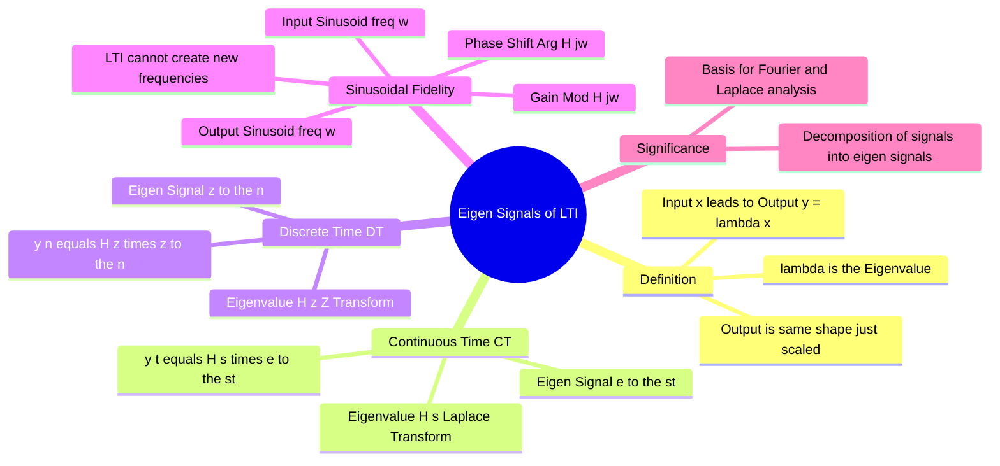

---
tags:
  - signals-and-systems
  - lti-systems
  - frequency-domain
  - gate
  - mathematics
aliases:
  - Eigenfunctions of LTI Systems
  - Response to Complex Exponential
  - LTI Response to Sinusoids
created: 2026-07-13
subject: "[[Signals & Systems]]"
parent:
  - "[[LTI|Linear Time-Invariant (LTI) Systems]]"
updated: 2026-07-13
---
### Eigen-signals of LTI Systems
#signals-and-systems/lti #eigenvalues

> ==An **Eigen-signal** (or [[Eigenfunctions|Eigenfunction]]) of a system is a signal which, when input to the system, produces an output that is merely a scalar multiple of the input.== The shape of the signal does not change. For **Linear Time-Invariant (LTI)** systems, **Complex Exponentials** are the eigen-signals. This property is the fundamental reason why Fourier, Laplace, and Z-transforms are used to analyze LTI systems.

---
#### Mathematical Definition
#linear-algebra/eigenvalues

[[Eigenvalues and Eigenvectors#Formal Definition|Analogy from Linear Algebra]]: For a matrix $A$ and vector $v$, if $Av = \lambda v$, then $v$ is an eigenvector and $\lambda$ is the eigenvalue.

For a system transformation $\mathcal{T}\{\cdot\}$:
$$\boxed{\quad \mathcal{T}\{x(t)\} = \lambda \cdot x(t) \quad}$$
*   $x(t)$ is the **Eigen-signal**.
*   $\lambda$ is the **Eigenvalue** (a complex constant).

> [!pyq]- PYQ : 2018
> ![[ee_2018#^q16]]

---
#### Continuous-Time Case: $e^{st}$
#signals-and-systems/continuous-time

Let the input to a CT-LTI system with impulse response $h(t)$ be a complex exponential:
$$x(t) = e^{st}$$
where $s$ is a complex variable ($s = \sigma + j\omega$).

Using the Convolution Integral:
$$y(t) = h(t) * x(t) = \int_{-\infty}^{\infty} h(\tau) x(t - \tau) d\tau$$
$$y(t) = \int_{-\infty}^{\infty} h(\tau) e^{s(t - \tau)} d\tau$$
$$y(t) = e^{st} \underbrace{\int_{-\infty}^{\infty} h(\tau) e^{-s\tau} d\tau}_{H(s)}$$

**The Result:**
$$\boxed{\quad y(t) = H(s) \cdot e^{st} \quad}$$

* **Eigen-signal:** $e^{st}$ (The Complex Exponential).
* **Eigenvalue:** $H(s)$ (The Transfer Function evaluated at $s$).
* **Significance:** If you input an exponential, the output is the *same* exponential scaled by the complex number $H(s)$.

---
#### Discrete-Time Case: $z^n$
#signals-and-systems/discrete-time

Let the input to a DT-LTI system with impulse response $h[n]$ be a complex exponential sequence:
$$x[n] = z^n$$
where $z$ is a complex variable ($z = r e^{j\Omega}$).

Using the Convolution Sum:
$$y[n] = h[n] * x[n] = \sum_{k=-\infty}^{\infty} h[k] x[n - k]$$
$$y[n] = \sum_{k=-\infty}^{\infty} h[k] z^{n - k} = z^n \underbrace{\sum_{k=-\infty}^{\infty} h[k] z^{-k}}_{H(z)}$$

**The Result:**
$$\boxed{\quad y[n] = H(z) \cdot z^n \quad}$$

* **Eigen-signal:** $z^n$.
* **Eigenvalue:** $H(z)$ (The Z-Transform evaluated at $z$).

---
#### The Sinusoidal Fidelity (Frequency Response)
#signals-and-systems/frequency-response

This is the most practical application for GATE problems.
Let the input be a complex sinusoid $x(t) = e^{j\omega_0 t}$ (i.e., $s = j\omega_0$).
The output is:
$$y(t) = H(j\omega_0) e^{j\omega_0 t}$$

Since real sinusoids can be written as sums of complex exponentials ([[Algebra of Complex Numbers|Euler's]]), for a real input:
$$x(t) = A \cos(\omega_0 t + \phi)$$

The output is:
$$\boxed{\quad y(t) = A |H(j\omega_0)| \cos\big(\omega_0 t + \phi + \angle H(j\omega_0)\big) \quad}$$

> [!memory] Key Takeaways for GATE
> 1. **LTI Systems do NOT create new frequencies.** If input is $50\text{ Hz}$, output is $50\text{ Hz}$. (Non-linear systems create harmonics).
> 2. The **Amplitude** is scaled by the Magnitude Response $|H(j\omega)|$.
> 3. The **Phase** is shifted by the Phase Response $\angle H(j\omega)$.

---
#### Why is this useful? (Basis Functions)

Since $e^{st}$ is an eigen-signal, we can decompose *arbitrary* signals into a linear combination (sum/integral) of complex exponentials using **Fourier** or **Laplace** transforms.
* Because the system is **Linear** (Superposition holds), we can find the response to each exponential component ($H(s)e^{st}$) and sum them up to get the total response.
* This converts complex calculus ([[Continuous-Time Convolution Integral|Convolution]]) into simple algebra (Multiplication in frequency domain).

---
### Related Concepts
#topic/related-concepts

> [[Continuous-Time Convolution Integral|Convolution]] (The time-domain operation corresponding to eigenvalue multiplication)

[[The Laplace Transform]] (Decomposition into $e^{st}$)
[[Representation of Aperiodic Discrete-Time Signals|Discrete-Time Fourier Transform (DTFT)]] (Decomposition into $e^{j\omega n}$)
[[The Z-Transform]] (Decomposition into $z^n$)
[[Distortionless Transmission]] (Requires constant magnitude and linear phase eigenvalue)
[[Frequency Response Analysis]]
