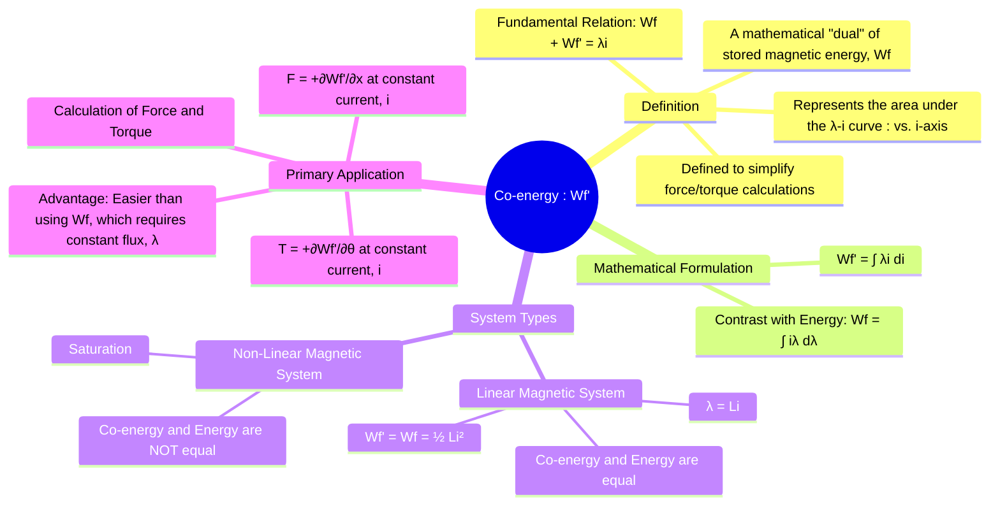

---
tags:
  - electrical-machines
  - electromechanics
  - co-energy
  - energy-conversion
  - virtual-work
created: 2025-09-15
aliases:
  - Coenergy
  - Magnetic Co-energy
subject: "[[Electrical Machines]]"
parent:
  - Fundamentals of Electromechanical Energy Conversion
modified: 2026-07-23T20:26:43
---
### Concept of Co-energy
#co-energy #energy-conversion #virtual-work

> **Co-energy ($W_f'$)** is a state function and a mathematical construct used in the analysis of electromechanical systems. It does not represent a physical energy that is stored or dissipated. Its primary purpose is to simplify the calculation of force and torque, especially in systems where current is treated as the independent variable.

---
#### Definition and Graphical Representation
#co-energy/definition

For a magnetic system, the stored magnetic field energy ($W_f$) is defined as the integral of current with respect to flux linkage.
$$W_f = \int_0^\lambda i(\lambda') d\lambda'$$
Co-energy ($W_f'$) is defined as the dual of this relationship:
$$W_f' = \int_0^i \lambda(i') di'$$

Graphically, on a flux linkage ($\lambda$) versus current ($i$) plot:
*   **Stored Energy ($W_f$)** is the area between the magnetization curve and the $\lambda$-axis.
*   **Co-energy ($W_f'$)** is the area between the magnetization curve and the $i$-axis.

The sum of the energy and co-energy is simply the area of the rectangle formed by the point $(\lambda, i)$ on the curve.
$$\boxed{\quad W_f(\lambda, i) + W_f'( \lambda, i) = \lambda i \quad}$$

---
#### Co-energy in Linear vs. Non-Linear Systems
#linear-systems #magnetic-saturation

1.  **Magnetically Linear Systems**:
    In a linear system, the relationship between flux linkage and current is a straight line: $\lambda = L(\theta)i$, where $L(\theta)$ is the inductance (which may vary with position $\theta$).
    In this case, the areas for energy and co-energy are identical triangles.
    $$\begin{align}
    W_f' &= \int_0^i L(\theta)i' di' = \frac{1}{2}L(\theta)i^2 \\
    W_f &= \int_0^\lambda \frac{\lambda'}{L(\theta)} d\lambda' = \frac{\lambda^2}{2L(\theta)}
    \end{align}$$
    Since $\lambda = Li$, we can see that:
    $$\boxed{\quad W_f = W_f' = \frac{1}{2}L(\theta)i^2 \quad \text{(For Linear Systems)}}$$

2.  **Non-Linear Systems (with Saturation)**:
    When the magnetic core material saturates, the $\lambda-i$ curve is no longer a straight line. In this case, the stored energy and co-energy are **not equal** ($W_f \neq W_f'$). The full integral definitions must be used.

---
#### Application: Force and Torque from Co-energy
#co-energy/application #force-torque

The primary advantage of co-energy becomes apparent when calculating force and torque. The expressions for force and torque can be derived from the principle of virtual work.

Using **Stored Energy ($W_f$)**, the force is:
$$F_f = -\left( \frac{\partial W_f(\lambda, x)}{\partial x} \right)_{\lambda=\text{const}}$$
This requires keeping the **flux linkage constant** during the virtual displacement, which is often physically and mathematically inconvenient.

Using **Co-energy ($W_f'$)**, the force is:
$$\boxed{\quad F_f = +\left( \frac{\partial W_f'(i, x)}{\partial x} \right)_{i=\text{const}} \quad}$$
And for rotational systems, the torque is:
$$\boxed{\quad T_f = +\left( \frac{\partial W_f'(i, \theta)}{\partial \theta} \right)_{i=\text{const}} \quad}$$

**Key Advantage**: These expressions are evaluated while keeping the **current constant**. In most practical systems, current is the independent variable that is directly controlled by the source, making this approach far more straightforward. The positive sign also indicates that the force/torque acts in the direction that *increases* the co-energy, which typically corresponds to an increase in inductance (i.e., movement towards a position of minimum reluctance).

---
### Related Concepts
#co-energy/related

> [[Force and Torque in Magnetic Field Systems]] (The direct application of this concept)

[[Energy Balance in Electromechanical Systems]] (The underlying principle)
[[Singly and Doubly Excited Systems]] (Where co-energy is used to find torque)
[[Electromagnetic Fields - Magnetic Circuits]] (Describes the $\lambda-i$ or B-H relationship)