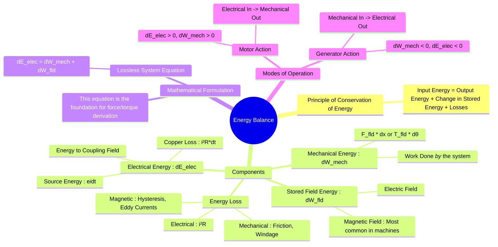

---
tags:
  - electrical-machines
  - electromechanics
  - energy-conversion
  - energy-balance
  - thermodynamics
created: 2025-09-15
aliases:
  - Electromechanical Energy Balance
  - Energy Conservation in EM Systems
subject: "[[Electrical Machines]]"
parent:
  - Fundamentals of Electromechanical Energy Conversion
modified: 2026-07-23T20:27:24
---
### Energy Balance in Electromechanical Systems
#electrical-machines #energy-conversion #energy-balance

> The process of converting energy between electrical and mechanical forms is governed by the principle of conservation of energy. An electromechanical system acts as a link that facilitates this conversion through a coupling medium, which is typically a magnetic field (or, less commonly, an electric field).

The overall energy balance for any system can be stated as:
`Total Energy Input = Total Energy Output + Increase in Stored Energy + Energy Dissipated (Losses)`

For an electromechanical system, this translates into a fundamental equation that accounts for electrical, mechanical, and stored field energy.

---
#### The General Energy Balance Equation
#energy-conservation #electromechanics

Considering an infinitesimal time interval $dt$, the energy balance can be represented as:

`[Electrical Energy Input]` = `[Mechanical Energy Output]` + `[Increase in Stored Field Energy]` + `[Energy Losses]`
 
For the purpose of deriving the fundamental force and torque relationships, it's common to analyze an ideal **lossless system**, where electrical resistance and mechanical friction are neglected. The energy balance for the coupling field then simplifies significantly.

**For a lossless magnetic system, the energy balance is:**
$$\boxed{\quad dE_{elec} = dW_{mech} + dW_{field} \quad}$$
Where:
- $dE_{elec}$ = Differential electrical energy transferred *to* the coupling field.
- $dW_{mech}$ = Differential mechanical work done *by* the coupling field on the mechanical system.
- $dW_{field}$ = Differential change in the energy stored in the magnetic field.

This equation is universally true for both motor and generator action.

---
#### Breakdown of Energy Components
#energy-components

1.  **Electrical Energy ($dE_{elec}$)**:
    This is the energy that crosses the electrical terminals and enters the coupling field. If the source voltage is $e$ and the winding has resistance $R$, the total energy from the source is $e \cdot i \cdot dt$. However, a portion, $i^2R \cdot dt$, is immediately lost as heat (copper loss).
    Therefore, the energy entering the field is $dE_{elec} = (e \cdot i - i^2R) dt$. For a lossless model, $R=0$, so $dE_{elec} = e \cdot i \cdot dt = i \cdot d\lambda$ (from Faraday's law, $e = d\lambda/dt$).

2.  **Mechanical Energy ($dW_{mech}$)**:
    This is the useful mechanical work performed by the system.
    -   For linear motion: $dW_{mech} = F_{fld} \cdot dx$
    -   For rotational motion: $dW_{mech} = T_{fld} \cdot d\theta$
    Here, $F_{fld}$ and $T_{fld}$ are the force and torque produced by the magnetic field.

3.  **Stored Field Energy ($dW_{field}$)**:
    This is the change in energy stored within the magnetic coupling field. The total stored energy, $W_{field}$, is a function of the system's state, defined by the flux linkage $\lambda$ and the mechanical position ($x$ or $\theta$).
    $$W_{field} = \int_{0}^{\lambda} i(\lambda', x) d\lambda'$$

---
#### Motoring vs. Generating Action
#motor-action #generator-action

The universal energy balance equation $dE_{elec} = dW_{mech} + dW_{field}$ describes both modes of operation, determined by the direction of power flow.

*   **Motoring Action**: The system converts electrical energy into mechanical energy.
    *   Electrical power flows *into* the system ($dE_{elec} > 0$).
    *   Mechanical work is done *by* the system ($dW_{mech} > 0$).
    *   The electrical input provides for both the mechanical output and any change in stored field energy.

*   **Generating Action**: The system converts mechanical energy into electrical energy.
    *   Mechanical power flows *into* the system (work is done *on* it, so $dW_{mech} < 0$).
    *   Electrical power flows *out of* the system ($dE_{elec} < 0$).
    *   The mechanical input provides for both the electrical output and any change in stored field energy.

---
#### Foundation for Force & Torque Calculation
#virtual-work

The energy balance equation is the theoretical foundation for deriving expressions for electromechanical force and torque. By rearranging the equation, we can express the mechanical work done:

$$dW_{mech} = dE_{elec} - dW_{field}$$

Since $dW_{mech} = F_{fld} \cdot dx$, it follows that:
$$F_{fld} = \frac{dE_{elec} - dW_{field}}{dx}$$

This relationship is evaluated using the **principle of virtual work**, where a small hypothetical displacement ($dx$ or $d\theta$) is assumed. This leads directly to the force expressions in terms of the partial derivatives of stored energy or co-energy.

---
### Related Concepts
#energy-balance/related

> [[Force and Torque in Magnetic Field Systems]] (Directly derived from this principle)

[[Concept of Co-energy]]
[[Singly and Doubly Excited Systems]]
[[Losses and Efficiency in a Transformer]]
[[Losses, Efficiency, and Testing of DC Machines]]
[[Thermodynamics - First Law]]