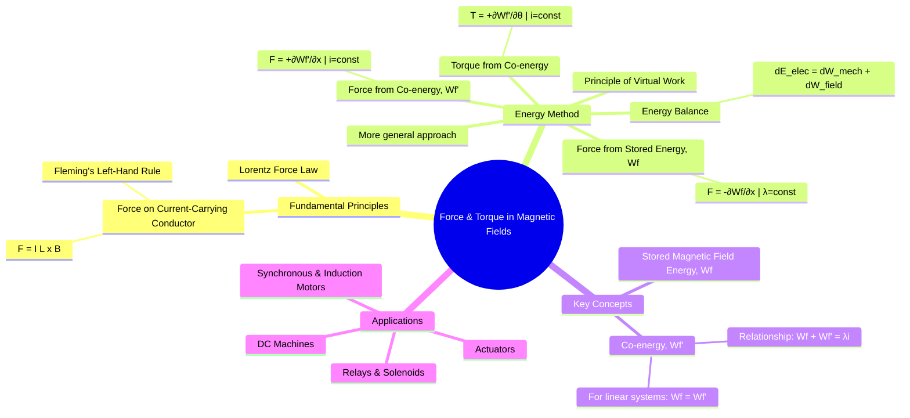

---
tags:
  - electrical-machines
  - electromechanics
  - magnetic-fields
  - force-torque
created: 2025-09-15
aliases:
  - Magnetic Force
  - Magnetic Torque
  - Electromechanical Force
  - "Example : Force in a Linear Actuator"
subject: "[[Electrical Machines]]"
parent:
  - Fundamentals of Electromechanical Energy Conversion
modified: 2026-07-23T20:28:33
---
### Force and Torque in Magnetic Field Systems
#electrical-machines #electromechanics #force-torque

> The fundamental principle of electromechanical energy conversion is the production of force or torque through the medium of a magnetic field. This interaction allows for the conversion of electrical energy into mechanical work in motors, and vice-versa in generators. Understanding how this force is generated is crucial for analyzing all types of electrical machines.

---
#### Force on a Current-Carrying Conductor
#magnetic-force #lorentz-force

The most direct way to understand force production is through the interaction between a current-carrying conductor and a magnetic field. This is a specific case of the Lorentz Force. For a straight conductor of length $l$ carrying a current $I$ placed in a uniform magnetic field of flux density $B$, the force $F$ on the conductor is given by:

$$\boxed{\quad \vec{F} = I (\vec{l} \times \vec{B}) \quad}$$

The magnitude of the force is $F = BIL\sin\theta$, where $\theta$ is the angle between the conductor and the magnetic field lines.
*   **Direction**: The direction of the force is perpendicular to the plane containing both $\vec{l}$ and $\vec{B}$, and can be found using **Fleming's Left-Hand Rule**.
*   **Application**: This principle is directly visible in the operation of [[DC Motors]], where conductors on the armature experience force, creating the rotational torque.

---
#### Energy Method for Force and Torque Calculation
#energy-method #virtual-work #co-energy

While the $F = BIL$ formula is intuitive, a more powerful and general method for calculating forces in electromechanical systems is the **energy method**, based on the principle of conservation of energy. This method is particularly useful for systems with complex geometries or non-linear magnetic materials.

The energy balance for a lossless magnetic system is:
$$dE_{elec} = dW_{mech} + dW_{field}$$
Where:
- $dE_{elec}$ = Differential electrical energy input.
- $dW_{mech}$ = Differential mechanical work done *by* the system ($F_f dx$).
- $dW_{field}$ = Differential change in stored magnetic field energy.

##### Force from Stored Magnetic Field Energy ($W_f$)
#stored-energy

If we consider a virtual displacement $dx$ while keeping the **flux linkage $\lambda$ constant**, the mechanical force $F_f$ developed by the field is given by the negative partial derivative of the stored magnetic field energy $W_f$ with respect to the displacement $x$.

$$\boxed{\quad F_f = -\left( \frac{\partial W_f(\lambda, x)}{\partial x} \right)_{\lambda=\text{const}} \quad}$$

The negative sign implies that the force acts in a direction to *decrease* the stored magnetic energy. A system at constant flux tends to move to a configuration of minimum energy.

##### Force and Torque from Co-energy ($W_f'$)
#co-energy

In most electrical systems, current $i$ is the independent variable, making calculations using co-energy more convenient. The co-energy $W_f'$ is defined as $W_f' = i\lambda - W_f$. For a magnetically **linear** system, the energy and co-energy are equal: $W_f = W_f' = \frac{1}{2}Li^2$.

When keeping the **current $i$ constant** during a virtual displacement, the force is given by the positive partial derivative of the co-energy.

**For translational systems (e.g., solenoids, relays):**
$$\boxed{\quad F_f = +\left( \frac{\partial W_f'(i, x)}{\partial x} \right)_{i=\text{const}} \quad}$$

**For rotational systems (e.g., motors):**
The principle is identical, with force $F_f$ replaced by torque $T_f$ and linear displacement $x$ replaced by angular displacement $\theta$.

$$\boxed{\quad T_f = +\left( \frac{\partial W_f'(i, \theta)}{\partial \theta} \right)_{i=\text{const}} \quad}$$

The positive sign indicates that the force/torque acts in a direction to *increase* the co-energy. Since inductance $L$ is a measure of the system's ability to store magnetic energy, the force/torque acts to **increase the inductance** (i.e., move towards a position of minimum reluctance).

---
#### Example: Force in a Linear Actuator
#solenoid-force

Consider a simple actuator with inductance $L(x)$ that varies with the position $x$ of a plunger.
- The co-energy for this linear system is $W_f'(i, x) = \frac{1}{2} L(x) i^2$.
- The force produced by the magnetic field is:
$$\begin{align}
F_f &= \frac{\partial}{\partial x} \left( \frac{1}{2} L(x) i^2 \right) \\
 &= \frac{1}{2} i^2 \frac{dL(x)}{dx}
\end{align}$$
This shows that the magnitude of the force is proportional to the square of the current and the rate of change of inductance with position. This is the principle behind relays, solenoids, and reluctance motors.

---
### Related Concepts
#force-torque/related

> [[Energy Balance in Electromechanical Systems]]

[[Singly and Doubly Excited Systems]]
[[Concept of Co-energy]]
[[Electromagnetic Fields - Magnetic Circuits]]
[[EMF and Torque Equations of a DC Machine]]
[[Torque-Slip Characteristics of Induction Motor]] (of Induction Motors)
[[Power-Angle Characteristics for Synchronous Machines]] (of Synchronous Machines)
