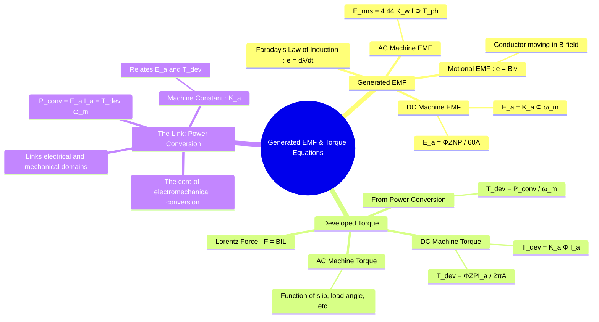

---
tags:
  - electrical-machines
  - electromechanics
  - emf
  - torque
  - energy-conversion
created: 2025-09-15
aliases:
  - EMF Equation
  - Torque Equation
  - Electromechanical Equations
subject: "[[Electrical Machines]]"
parent:
  - Fundamentals of Electromechanical Energy Conversion
modified: 2026-07-23T20:29:00
---
### Generated EMF and Torque Equations
#electrical-machines #energy-conversion #emf #torque

> The generated electromotive force (EMF) and the developed electromagnetic torque are the two cornerstone quantities in the study of electrical machines. The EMF equation describes the machine's ability to convert mechanical power to electrical power (generator action), while the torque equation describes the conversion of electrical power to mechanical power (motor action). These two are intrinsically linked through the principle of power conservation.

---
#### Generated EMF (Electromotive Force)
#generated-emf #faradays-law

The generation of EMF in a conductor or a coil is governed by **Faraday's Law of Induction**, which states that the induced EMF is equal to the rate of change of magnetic flux linkage.
$$e = \frac{d\lambda}{dt}$$
In electrical machines, this is primarily **motional EMF**, generated by conductors moving through a magnetic field. For a single conductor of length $l$ moving at a velocity $v$ perpendicular to a magnetic field $B$, the induced EMF is:
$$e = Blv$$

##### DC Machine EMF Equation
#dc-machine-emf
For a DC machine, the total generated EMF across the armature terminals ($E_a$) is the sum of the EMFs in all the conductors connected in series in one parallel path.
$$\boxed{\quad E_a = \frac{\Phi Z N P}{60 A} \quad}$$
Where:
- $\Phi$ = Flux per pole (in Webers, Wb)
- $Z$ = Total number of armature conductors
- $N$ = Speed of the rotor (in revolutions per minute, RPM)
- $P$ = Number of poles
- $A$ = Number of parallel paths in the armature winding ($A=P$ for lap winding, $A=2$ for wave winding)

---
#### Developed Torque (Electromagnetic Torque)
#developed-torque #electromagnetic-torque

The torque produced by an electrical machine is a result of the Lorentz force ($F = BIL$) on the current-carrying conductors in its magnetic field. A more general and powerful way to determine the torque is through the power conversion relationship.

The fundamental principle is that the electrical power converted into mechanical power ($P_{conv}$) is the product of the generated EMF ($E_a$, also called back-EMF in motors) and the armature current ($I_a$). This same power is also the product of the developed torque ($T_{dev}$) and the angular speed ($\omega_m$).

$$\boxed{\quad P_{conv} = E_a I_a = T_{dev} \omega_m \quad}$$
From this universal relationship, we can express the developed torque as:
$$\boxed{\quad T_{dev} = \frac{E_a I_a}{\omega_m} \quad}$$
where $\omega_m$ is the angular speed in radians per second ($\omega_m = 2\pi N / 60$).

##### DC Machine Torque Equation
#dc-machine-torque
By substituting the DC machine EMF equation into the power relationship, we can derive the specific torque equation.
$$\begin{align}
T_{dev} &= \frac{(\frac{\Phi Z N P}{60 A}) I_a}{(2\pi N / 60)} \\
 &= \frac{\Phi Z P}{2\pi A} I_a
\end{align}$$
$$\boxed{\quad T_{dev} = \frac{\Phi Z P}{2\pi A} I_a \quad}$$

---
#### The Inherent Link: The Machine Constant ($K_a$)
#machine-constant

The EMF and Torque equations for a specific machine are not independent; they are two sides of the same coin. This is evident by defining a single **machine constant** ($K_a$) that depends only on the physical construction of the machine (number of conductors, poles, and parallel paths).

Let's define the machine constant $K_a$ as:
$$K_a = \frac{Z P}{2\pi A}$$
Now, we can rewrite the torque and EMF equations in a simpler, more elegant form:

1.  **Torque Equation**:
    $$\boxed{\quad T_{dev} = K_a \Phi I_a \quad}$$
    This shows that torque is directly proportional to the field flux and the armature current.

2.  **EMF Equation**:
    We can rewrite the standard EMF equation in terms of angular speed $\omega_m$:
    $E_a = \frac{\Phi Z P}{60 A} N = \frac{\Phi Z P}{60 A} \left(\frac{60 \omega_m}{2\pi}\right) = \left(\frac{Z P}{2\pi A}\right) \Phi \omega_m$
    $$\boxed{\quad E_a = K_a \Phi \omega_m \quad}$$
    This shows that EMF is directly proportional to the field flux and the speed of rotation.

These two final, boxed equations are fundamental to the analysis of DC machines, clearly showing the relationship between speed, flux, voltage, current, and torque through a single constant, $K_a$.

---
### Related Concepts
#emf-torque/related

> [[Force and Torque in Magnetic Field Systems]]

[[Energy Balance in Electromechanical Systems]]
[[EMF and Torque Equations of a DC Machine]] (Specific application of these principles)
[[Principle of Operation of DC Generators]]
[[Principle of Operation of DC Motors]]