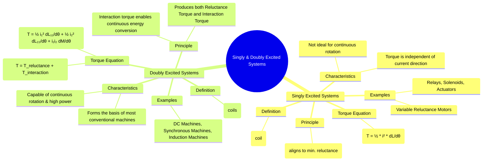

---
tags:
  - electrical-machines
  - electromechanics
  - excited-systems
  - energy-conversion
created: 2025-09-15
aliases:
  - Singly Excited Systems
  - Doubly Excited Systems
  - Multi-Excited Systems
subject: "[[Electrical Machines]]"
parent:
  - Fundamentals of Electromechanical Energy Conversion
modified: 2026-07-23T20:29:40
---
### Singly and Doubly Excited Systems
#electrical-machines #energy-conversion #electromechanics

> ==Electromechanical systems are classified based on the number of independent electrical sources (excitations) used to establish the magnetic field.== This classification is fundamental because it determines the mechanism of torque production and the system's suitability for different applications, from simple actuators to high-power rotating machines.

---
#### Singly Excited Systems
#singly-excited

A **singly excited system** has only one electrical input (i.e., a single coil or a group of coils connected in series/parallel to form one input).

*   **Principle of Operation**: The force or torque in these systems is produced by the tendency of the magnetic circuit to change its geometry to minimize **reluctance**. The movable part (rotor or plunger) moves to a position that maximizes the magnetic flux, which corresponds to the position of maximum inductance. This is known as **reluctance torque**.
*   **Examples**: Relays, solenoids, electromagnets, moving-iron instruments, and variable reluctance motors.
*   **Torque Equation**: The torque is derived from the co-energy of the system. For a magnetically linear system with inductance $L(\theta)$ that varies with angular position $\theta$, the co-energy is $W_f' = \frac{1}{2}L(\theta)i^2$. The torque is:
    $$\boxed{\quad T_f = \left( \frac{\partial W_f'(i, \theta)}{\partial \theta} \right)_{i=\text{const}} = \frac{1}{2}i^2 \frac{dL(\theta)}{d\theta} \quad}$$
*   **Key Characteristics**:
    *   The torque is proportional to the square of the current ($i^2$), meaning it is always in the same direction, regardless of the direction of the current.
    *   For continuous rotation, the current must be switched off as the rotor approaches the minimum reluctance position.
    *   Primarily used for producing forces over a limited displacement (actuators) or in specific types of stepping motors.

---
#### Doubly Excited Systems
#doubly-excited

A **doubly excited system** has two or more independent electrical inputs. In rotating machines, these typically correspond to windings on the stationary member (stator) and the rotating member (rotor).

*   **Principle of Operation**: Torque is produced through two mechanisms:
    1.  **Reluctance Torque**: Similar to singly excited systems, arising from any variation in self-inductance with position (salient poles).
    2.  **Interaction Torque**: The primary torque component, which arises from the interaction of the magnetic fields created by the two windings. This torque is a result of the tendency of the two magnetic fields to align with each other. It depends on the change in **mutual inductance** with position.
*   **Examples**: DC machines (armature and field windings), synchronous machines (stator and rotor field windings), and induction machines (stator and rotor windings). These are the basis for most conventional motors and generators.
*   **Torque Equation**: For a linear system with two windings having currents $i_1$ and $i_2$, self-inductances $L_{11}(\theta)$ and $L_{22}(\theta)$, and mutual inductance $M_{12}(\theta)$:
    The co-energy is $W_f' = \frac{1}{2}L_{11}i_1^2 + \frac{1}{2}L_{22}i_2^2 + M_{12}i_1i_2$.
    The total torque is the sum of the reluctance and interaction components:
    $$\boxed{\quad T_f = \underbrace{\frac{1}{2}i_1^2 \frac{dL_{11}(\theta)}{d\theta} + \frac{1}{2}i_2^2 \frac{dL_{22}(\theta)}{d\theta}}_{\text{Reluctance Torque}} + \underbrace{i_1 i_2 \frac{dM_{12}(\theta)}{d\theta}}_{\text{Interaction Torque}} \quad}$$
*   **Key Characteristics**:
    *   The presence of the interaction torque term ($i_1 i_2 \frac{dM_{12}}{d\theta}$) is what makes continuous, steady energy conversion possible.
    *   By controlling the currents $i_1$ and $i_2$ (magnitude, frequency, and phase), a constant, non-zero average torque can be maintained throughout rotation, which is essential for motor operation.
    *   If the machine structure has no saliency (e.g., a cylindrical rotor), the self-inductances are constant ($dL/d\theta=0$), and the reluctance torque terms are zero. The machine produces torque solely by the interaction of the two fields.

---
### Related Concepts
#excited-systems/related

> [[Force and Torque in Magnetic Field Systems]]

[[Concept of Co-energy]]
[[Energy Balance in Electromechanical Systems]]
[[Reluctance Motor]] (An application of singly-excited principles)
[[Synchronous Machines]] (A key example of doubly-excited systems)
[[Induction Machines|Induction Motor]]