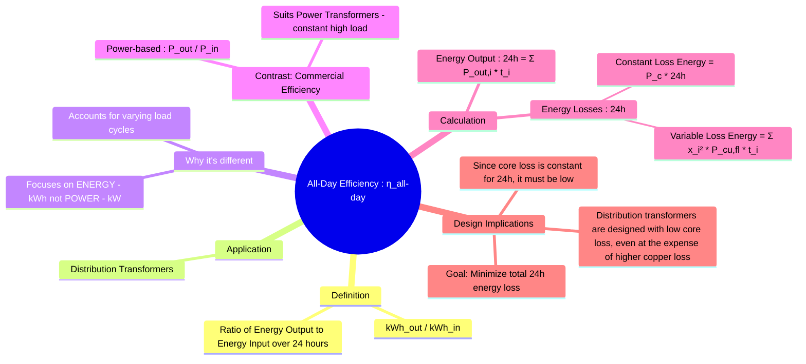

---
tags:
  - electrical-machines
  - transformers
  - efficiency
  - all-day-efficiency
  - distribution-transformer
created: 2025-09-16
aliases:
  - Energy Efficiency
  - All-Day Energy Efficiency
subject: "[[Electrical Machines]]"
parent:
  - Single-phase Transformers
formula:
  - "All-Day Efficiency (Transformer) : $$\\eta_{\\text{all-day}} = \\frac{\\text{Energy Output in 24 hours (kWh)}}{\\text{Energy Input in 24 hours (kWh)}} \\times 100 = \\frac{\\text{Energy Output (kWh)}}{\\text{Energy Output (kWh)} + (P_c \\times 24) + \\sum_{i} (x_i^2 P_{cu,fl} \\times t_i)}$$"
modified: 2026-07-23T20:30:13
---
### All-Day Efficiency
#transformers #efficiency #all-day-efficiency #distribution-transformer

> **All-Day Efficiency** (also called energy efficiency) is a metric used to evaluate the performance of transformers that are energized 24 hours a day but operate under a load that varies over this period. Unlike conventional efficiency, which is a ratio of output power to input power at a specific load, all-day efficiency is a ratio of total energy output to total energy input over a 24-hour cycle.

---
#### Why All-Day Efficiency is Necessary
#distribution-transformer

This metric is particularly important for **distribution transformers**. These transformers are continuously connected to the supply line, but the load they serve fluctuates significantly throughout the day (e.g., low residential load overnight, peak in the evening).

-   **Conventional Efficiency**: Suitable for power transformers (e.g., at generating stations) which operate at or near full load continuously.
-   **All-Day Efficiency**: Provides a more realistic measure for distribution transformers because their total energy loss over 24 hours is heavily influenced by the constant core losses, which are present even at no load.

---
#### Definition and Formula
#all-day-efficiency/formula

The all-day efficiency is defined as the total energy output in kilowatt-hours (kWh) over a 24-hour period divided by the total energy input in kWh over the same period.

$$\eta_{\text{all-day}} = \frac{\text{Energy Output in 24 hours (kWh)}}{\text{Energy Input in 24 hours (kWh)}} \times 100$$

The total energy input is the sum of the energy output and the energy losses over the 24-hour period.
-   **Constant Energy Loss**: The core loss ($P_c$) is constant as long as the transformer is energized.
    Energy Loss (Core) = $P_c \times 24$ hours
-   **Variable Energy Loss**: The copper loss ($P_{cu}$) depends on the load, which varies. We must sum the energy loss for each load interval.
    Energy Loss (Copper) = $\sum_{i=1}^{n} (x_i^2 P_{cu,fl} \times t_i)$

The final formula is:
$$\boxed{\quad \eta_{\text{all-day}} = \frac{\text{Energy Output (kWh)}}{\text{Energy Output (kWh)} + (P_c \times 24) + \sum_{i} (x_i^2 P_{cu,fl} \times t_i)} \quad}$$
Where:
-   Energy Output = $\sum_i (\text{Load}_i \text{ in kW} \times t_i)$
-   $P_c$ = Core loss (in kW)
-   $P_{cu,fl}$ = Full-load copper loss (in kW)
-   $x_i$ = Fraction of full-load during interval $i$
-   $t_i$ = Duration of interval $i$ (in hours), where $\sum t_i = 24$.

---
#### Design Implications
#transformer-design

To maximize the all-day efficiency of a distribution transformer, the design must focus on minimizing the total energy loss over a typical 24-hour cycle.
-   The core loss contributes to the total energy loss for the full 24 hours, regardless of the load.
-   The copper loss contributes significantly only during periods of high load, which may only be for a few hours.
-   Therefore, **distribution transformers are designed to have very low core losses**, often by using high-quality, high-permeability steel for the core. This is prioritized even if it results in slightly higher full-load copper losses compared to a power transformer of the same rating.

---
### Related Concepts
#all-day-efficiency/related

> [[Losses and Efficiency in a Transformer]] (The basis for conventional power efficiency)

[[Transformer Tests]] (How $P_c$ and $P_{cu,fl}$ are determined)