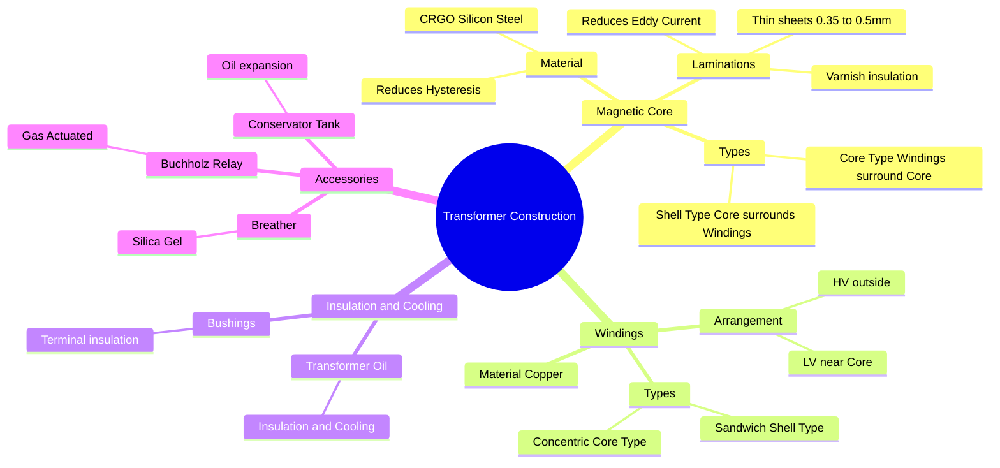

---
tags:
  - electrical-machines
  - transformers
  - construction
  - gate
  - materials
created: 2026-07-23T20:30:41
aliases:
  - Transformer Core Construction
  - Core vs Shell Type
  - CRGO Steel
  - Transformer Accessories
subject: "[[Electrical Machines]]"
parent:
  - Single-Phase Transformers
modified: 2026-07-23T20:30:41
---
### Constructional Features of Transformers
#electrical-machines/construction #transformers

> The construction of a transformer is designed to maximize magnetic coupling (efficiency), minimize losses (Core and Copper), and provide adequate insulation and cooling. The two primary active parts are the **Magnetic Core** and the **Windings**.

---

#### 1. The Magnetic Core
#transformer/core

The core provides a low reluctance path for the magnetic flux.

**A. Material:**
*   **Silicon Steel:** High silicon content (approx 3-4%) is added to steel to increase resistivity and reduce **Hysteresis Loss**.
*   **CRGO (Cold Rolled Grain Oriented):** The steel is cold-rolled to align the magnetic domains in the direction of rolling. This creates high permeability and low loss in the direction of flux.
    *   **Flux Density:** Allows higher $B_{max}$ (approx 1.6 to 1.7 Tesla).

**B. Laminations:**
*   To reduce **Eddy Current Loss** ($P_e$), the core is not solid but made of thin laminations ($0.35$ mm to $0.5$ mm thick).
*   Laminations are insulated from each other by a thin coat of varnish.
    $$\boxed{\quad P_e \propto t^2 \quad}$$
    (Where $t$ is thickness. Halving thickness reduces eddy loss by 4 times). ![[Transformer Magnetic Core Laminations.png|250]]

**C. Stacking Factor ($K_s$):**
Due to the varnish insulation, the effective iron area ($A_{net}$) is less than the physical gross area ($A_g$).
$$\boxed{\quad A_{net} = K_s \times A_g \quad}$$
*   Typical $K_s \approx 0.9$.

**D. Stepped Core:**
To maximize the use of the space inside the circular coil, the core cross-section is stepped (cruciform) rather than square. This reduces the mean length of turn of the copper winding, thereby reducing **Copper Loss**.

---
#### 2. Core Type vs. Shell Type Construction
#transformer/types

| Feature                 | **Core Type**                   | **Shell Type**                                     |
| :---------------------- | :------------------------------ | :------------------------------------------------- |
| **Geometry**            | **Windings surround the Core**. | **Core surrounds the Windings**.                   |
|                         | ![[Transformer Core Type.jpg]]  | ![[Transformer Shell Type.jpg]]                    |
| **Magnetic Circuit**    | Single path for flux (Series).  | Double path for flux (Parallel).                   |
| **Limbs**               | 2 Limbs (Flux $\phi$ in each).  | 3 Limbs (Flux $\phi$ in center, $\phi/2$ in side). |
| **Winding Type**        | **Concentric** (Cylindrical).   | **Sandwich** (Interleaved).                        |
| **Mechanical Strength** | Lower (Coils are exposed).      | High (Coils braced by core).                       |
| **Repairability**       | Easy to dismantle/repair.       | Difficult.                                         |
| **Application**         | High Voltage, High Power.       | Low Voltage, High Current.                         |

---
#### 3. Windings
#transformer/windings

*   **Material:** Electrolytic Copper (Stranded to reduce skin effect).
*   **Placement Logic:**
    The **Low Voltage (LV)** winding is placed **next to the core**, and the **High Voltage (HV)** winding is placed outside it.
    *   *Reason:* Reduces the amount of insulation required between the winding and the grounded core.
*   **Arrangement:**
    *   **Concentric:** LV and HV cylinders on the same limb (Core Type).
    *   **Interleaved/Sandwich:** High and Low voltage coils are stacked alternately (Shell Type) to reduce [[Ideal and Practical Transformers#^leakage-flux|leakage flux]]. 

|                  | Cut view through transformer windings                        |
| ---------------- | ------------------------------------------------------------ |
|                  | ![[Cut View through Transformer Windings.png\|350]] |
| **White**        | Air, liquid or other insulating medium                       |
| **Green spiral** | Grain oriented silicon steel                                 |
| **Black**        | Primary winding                                              |
| **Red**          | Secondary winding                                            |

---
#### 4. Insulation and Cooling System
#transformer/cooling

**A. Transformer Oil:**
*   Functions:
    1.  **Insulation:** Higher dielectric strength than air.
    2.  **Cooling:** Circulates to transfer heat from windings to the tank walls/radiators.
*   Properties: High flash point, low moisture content, free from sludge.

**B. Bushings:**
*   Porcelain insulators used to bring terminals out of the tank without shorting to the metal body.
*   Oil-filled or Capacitor bushings are used for high voltages.

---
#### 5. Auxiliary Components (Protection & Maintenance)
#transformer/accessories

**A. Conservator Tank:**
*   A small drum on top of the main tank.
*   **Function:** Accommodates the expansion and contraction of oil due to temperature changes. Keeps the main tank completely filled.

**B. Breather:**
*   Connected to the conservator.
*   **Function:** Extracts moisture from the air entering the transformer during "breathing" (oil contraction).
*   **Material:** **Silica Gel**.
    *   Dry: **Blue**.
    *   Saturated (Wet): **Pink**.

**C. Buchholz Relay:**
*   Located in the pipe connecting the main tank and conservator.
*   **Function:** **Gas-actuated relay** for detecting **incipient (slow internal) faults** (like inter-turn shorts).
*   It creates an alarm for minor gas accumulation and trips the breaker for major surges.

---
### Related Concepts
#topic/related-concepts

> [[Losses and Efficiency in a Transformer]] (Directly linked to Core material)

[[Exhaustive Formulas - Single-Phase Transformer]]
[[Exhaustive Formulas - Three-Phase Transformer]]
[[Cooling Methods of Transformers]]
[[Testing of Transformers]]
