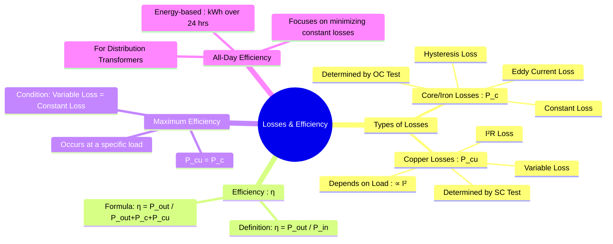

---
tags:
  - electrical-machines
  - transformers
  - transformer-losses
  - efficiency
  - performance-analysis
created: 2025-09-16
aliases:
  - Transformer Losses
  - Transformer Efficiency
  - Condition for Maximum Efficiency for a Single-phase Transformer
  - Constant Losses
subject: "[[Electrical Machines]]"
parent:
  - Single-Phase Transformers
formula:
  - "Transformer Core/Iron (Constant) Losses : $$\\text{Core loss or Iron loss} \\implies \\hspace{1em} W_c = W_i = W_h + W_e$$"
  - "Transformer Core/Iron (Constant) Losses : $$W_i = Af + Bf^2 \\quad \\text{(keeping V/f ratio constant)}$$"
  - "Transformer Hysteresis Loss : $$\\text{Hysteresis loss} \\hspace{2em} W_h \\propto B_m^{1.6}f \\ \\text{watts}$$"
  - "Transformer Eddy Current Loss : $$\\text{Eddy Current loss} \\hspace{2em} W_e \\propto B_m^{2}t^2f^2 \\ \\text{watts}$$"
define:
  - "Transformer Core/Iron (Constant) Losses : Determined by Open-Circuit (OC) Test"
  - "Transformer Copper (Variable) Losses : Determined by Short-Circuit (SC) Test"
trends:
  - "[[trends - Transformers]]"
error:
  - "[[error - Transformers]]"
modified: 2026-07-21T11:07:08
---
### Losses and Efficiency in a Transformer
#transformers #transformer-losses #efficiency

> The efficiency of a transformer is a measure of how effectively it transfers power from the primary to the secondary winding. ==While transformers are among the most efficient electrical devices (often >98%), some energy is inevitably lost as heat within the device.== These losses are categorized into ==two main types: **core losses** and **copper losses**==.

---
#### Types of Losses in a Transformer
#transformer-losses

##### 1. **Core Losses (or Iron Losses, $P_c$)**
#core-loss

These losses occur in the transformer's magnetic core and are a result of the alternating flux. They are considered **constant losses** because they depend on the supply voltage and frequency, which are typically constant, and are independent of the load. They are determined from the **[[Transformer Tests|Open Circuit (OC) Test]]**.

* **Hysteresis Loss ($P_h$)**: Energy lost due to the repeated reversal of magnetic domains in the core material. It is proportional to $f \cdot B_{max}^n$.
* **Eddy Current Loss ($P_e$)**: $I^2R$ loss caused by circulating currents (eddy currents) induced in the core material by the changing flux. It is proportional to $f^2 \cdot B_{max}^2 \cdot t^2$ (where $t$ is the thickness of laminations). Using thin, insulated laminations for the core construction significantly reduces this loss.

Hysteresis and eddy current losses vary with **flux density**, **frequency**, and **applied voltage** as 

$$\text{Hysteresis loss} \hspace{2em} W_h \propto B_m^{1.6}f \ \text{watts}$$
$$\text{Eddy Current loss} \hspace{2em} W_e \propto B_m^{2}t^2f^2 \ \text{watts}$$
^hysteresis-eddy-losses

> [!memory] Core Loss Proportionality Shortcuts
> 
> > [!pyq]- PYQ : 2026
> > ![[ee_2026#^q31]]
> 
> When analyzing a transformer operating at different voltages and frequencies, [[Principle of Operation of a Transformer#^v-f-ratio|substitute]] $B_m \propto \frac{V}{f}$ into the standard loss equations to save time:
> 
> **Eddy Current Loss:**
> $$W_e \propto B_m^2 f^2 \implies W_e \propto \left(\frac{V}{f}\right)^2 f^2 \implies W_e \propto V^2$$
> *Note: Eddy current loss is independent of frequency and depends ONLY on the applied voltage.*
> 
> **Hysteresis Loss:**
> $$W_h \propto B_m^{1.6} f \implies W_h \propto \left(\frac{V}{f}\right)^{1.6} f \implies W_h \propto V^{1.6} f^{-0.6}$$

- $B_m$ - maximum flux density of the core
- $t$ - thickness of laminations used to make the core
- $f$ - frequency of transformer primary supply voltage

$$\boxed{\quad \text{Core loss or Iron loss} \implies \hspace{1em} W_c = W_i = W_h + W_e\quad}$$

> [!important] Constant $V/f$ ratio
> 
> > [!pyq]- PYQ : 2020
> > ![[ee_2020#^q21]]
> 
> Keeping the ration of $V/f$ constant, then $W_i$ can be expressed as 
> $$\boxed{\quad W_i = Af + Bf^2 \quad}$$
> $A$ and $B$ are constants
> 
> The core loss or iron loss can be found out by performing the no-load test on the transformer. The value of $W_i$ can be calculated from the no-load wattmeter reading $W_0$ as
> $$W_i = W_0 - I^2R_1$$

> [!pyq]- PYQ : 2018
> (this question is more based on [[Star and Delta Connections#Power in Balanced 3-Phase Systems|Δ-Y power interpretation]])
> 
> ---
> ![[ee_2018#^q51]]

---
##### 2. Copper Losses (or $I^2R$ Losses, $P_{cu}$)
#copper-loss

These losses are due to the heating effect of current flowing through the resistance of the primary and secondary windings. They are **variable losses** as they are proportional to the square of the load current ($P_{cu} \propto I^2$). The full-load copper loss is determined from the **[[Transformer Tests|Short Circuit (SC) Test]]**.

At any load, the copper loss is given by:

$$P_{cu} = I_1^2 R_1 + I_2^2 R_2 = I_2^2 R_{eq,2}$$

If $x$ is the fraction of the full load (i.e., $x = \frac{\text{Load kVA}}{\text{Full Load kVA}}$), then the copper loss at this load is:
$$\boxed{\quad P_{cu} = x^2 P_{cu,fl} \quad}$$
where $P_{cu,fl}$ is the copper loss at full load.

---
#### Efficiency of a Transformer ($\eta$)
#transformer-efficiency

The efficiency is the ratio of the output power to the input power.
$$\eta = \frac{\text{Output Power}}{\text{Input Power}} = \frac{\text{Output Power}}{\text{Output Power} + \text{Losses}} = \frac{\text{Output Power}}{\text{Output Power} + P_c + P_{cu}}$$
For a load of $x$ times the full-load rating ($S_{rated}$) at a power factor of $\cos\phi$:
$$\boxed{\quad \eta = \frac{x S_{rated} \cos\phi}{x S_{rated} \cos\phi + P_c + x^2 P_{cu,fl}} \quad}$$

---
#### Condition for Maximum Efficiency
#maximum-efficiency

For a given load power factor, the efficiency of a transformer varies with the load. The efficiency is maximum when the variable losses (copper losses) become equal to the constant losses (core losses).

To find this, we can differentiate the efficiency equation with respect to the load current (or fraction $x$) and set the derivative to zero. This yields the condition:
$$\boxed{\quad P_c = P_{cu} \quad \text{or} \quad P_c = x^2 P_{cu,fl} \quad}$$
The load at which maximum efficiency occurs is:
$$\boxed{\quad x = \sqrt{\frac{P_c}{P_{cu,fl}}} \quad}$$
The kVA supplied at maximum efficiency is:
$$\boxed{\quad S_{\text{at max } \eta} = S_{rated} \times \sqrt{\frac{P_c}{P_{cu,fl}}} \quad}$$

---
### Related Concepts
#efficiency/related

> [[Transformer Tests]]

[[All-Day Efficiency]]
[[Equivalent Circuit of a Transformer]]
[[Ideal and Practical Transformers]]