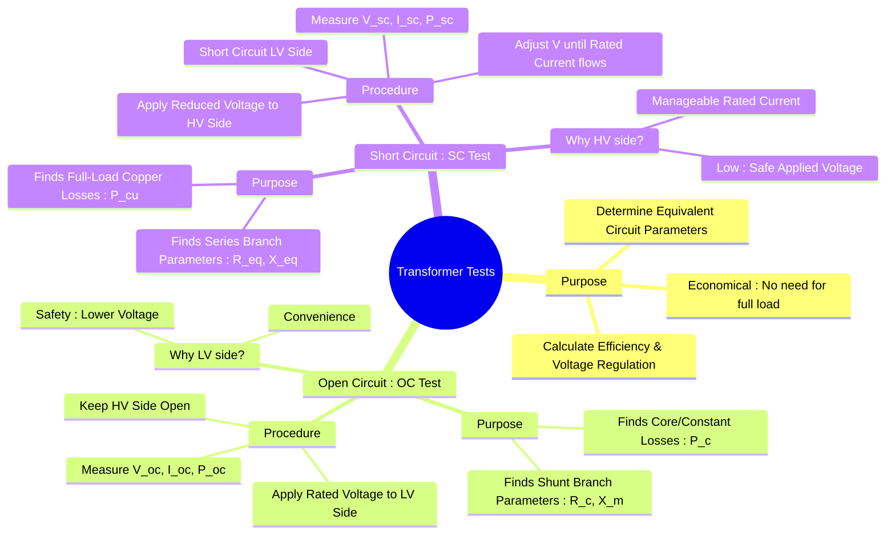

---
tags:
  - electrical-machines
  - transformers
  - transformer-tests
  - oc-test
  - sc-test
  - equivalent-circuit
created: 2025-09-16
aliases:
  - OC and SC Test
  - Open Circuit Test
  - Short Circuit Test
  - Transformer Parameter Determination
  - Open Circuit and Short Circuit Test on Transformer
subject: "[[Electrical Machines]]"
parent:
  - Single-phase Transformers
modified: 2026-07-23T20:31:51
---
### Transformer Tests (Open Circuit and Short Circuit)
#transformers #transformer-tests #oc-sc-test

> Two essential tests, the **Open-Circuit (OC) Test** and the **Short-Circuit (SC) Test**, are performed on a transformer to determine the parameters of its equivalent circuit ($R_c, X_m, R_{eq}, X_{eq}$) and to find its core ($P_c$) and copper losses ($P_{cu}$). These tests are economical and convenient as they provide the necessary data without having to connect the transformer to a full load.

---
#### Open Circuit (OC) Test
#open-circuit-test #core-loss

The purpose of the OC test is to determine the **shunt branch parameters** ($R_c$ and $X_m$) and the **constant core losses** ($P_c$ : hysteresis and eddy current losses) of the transformer.

> [!important]- Secondary Open-Circuit (OC) Transformer Insight
> **Condition:** Secondary load $Z_L \to \infty$ (open-circuit)
>
> **Secondary current**
> $$I_s = \frac{V_s}{Z_L} \xrightarrow{Z_L \to \infty} 0$$
>
> **Reflected effect on primary**
> - Reflected *admittance* is the correct loading indicator:
> $$Y_{\text{ref}} = \left(\frac{N_s}{N_p}\right)^2 Y_L \xrightarrow{Z_L \to \infty} 0$$
> - Hence, no load current is reflected from secondary to primary.
>
> **Primary current**
> $$I_p \approx I_m \quad (\text{only magnetizing + leakage components})$$
> Secondary OC does **not** alter primary current via loading.
>
> **Secondary voltage (open-circuit)**
> - Induced purely by mutual coupling:
> $$V_s = j\omega M I_p$$
> - Exists even when $I_s = 0$; voltage does **not** imply power transfer.
>
> **Power transfer**
> $$P_s = V_s I_s = 0$$
>
> **Revision takeaway**
> > Open secondary $\Rightarrow$ zero $I_s$, zero reflected loading, but finite induced $V_s$ due to mutual inductance.

##### Procedure
1. The High Voltage (HV) winding is kept open-circuited.
2. Instruments (voltmeter, ammeter, wattmeter) are connected to the Low Voltage (LV) winding.
3. A rated voltage at rated frequency is applied to the LV winding.
4. Readings for voltage ($V_{oc}$), current ($I_{oc}$), and power ($P_{oc}$) are recorded.

> [!attention] Important
> This test is performed on the LV side for safety and convenience, as the rated voltage is lower and easier to supply.

##### Calculations
The current drawn ($I_{oc}$) is the no-load current, which is very small (2-5% of full load current). Therefore, the copper loss in the primary winding ($I_{oc}^2 R_1$) is negligible. The wattmeter reading almost entirely represents the core losses.

-   **Core Loss**: $P_c = P_{oc}$
-   **No-load Power Factor**: $\cos\phi_0 = \frac{P_{oc}}{V_{oc} I_{oc}}$
-   **Core Loss Current**: $I_c = I_{oc} \cos\phi_0$
-   **Magnetizing Current**: $I_m = I_{oc} \sin\phi_0$

The shunt branch parameters referred to the side of the test (LV side) are:
$$\boxed{\quad R_c = \frac{V_{oc}}{I_c} = \frac{V_{oc}^2}{P_{oc}} \quad}$$
$$\boxed{\quad X_m = \frac{V_{oc}}{I_m} \quad}$$

---
#### Short Circuit (SC) Test
#short-circuit-test #copper-loss

The purpose of the SC test is to determine the **series branch parameters** (equivalent resistance $R_{eq}$ and leakage reactance $X_{eq}$) and the **full-load copper losses** ($P_{cu,fl}$).

##### Procedure
1. The Low Voltage (LV) winding is short-circuited by a thick conductor.
2. Instruments (voltmeter, ammeter, wattmeter) are connected to the High Voltage (HV) winding.
3. A low, variable AC voltage is applied to the HV winding and gradually increased until the rated full-load current flows through the winding.
4. Readings for voltage ($V_{sc}$), current ($I_{sc}$), and power ($P_{sc}$) are recorded.

> [!attention] Important
> This test is performed on the HV side because the rated current is lower and more manageable, and the required applied voltage is very low (5-10% of rated voltage), making it safe.

##### Calculations
Since the applied voltage is very small, the magnetic flux in the core is also very small. Consequently, the core losses are negligible. The wattmeter reading therefore represents the full-load copper losses.

-   **Full-Load Copper Loss**: $P_{cu,fl} = P_{sc}$
-   **Equivalent Impedance**: $Z_{eq} = \frac{V_{sc}}{I_{sc}}$
-   **Equivalent Resistance**: $R_{eq} = \frac{P_{sc}}{I_{sc}^2}$
-   **Equivalent Reactance**: $X_{eq} = \sqrt{Z_{eq}^2 - R_{eq}^2}$

**Note**: The parameters $R_{eq}$, $X_{eq}$, and $Z_{eq}$ are referred to the side where the test is conducted (in this case, the HV side).

---
### Related Concepts
#transformer-tests/related

> [[Equivalent Circuit of a Transformer]] (The parameters determined from these tests populate this circuit model)

[[Losses and Efficiency in a Transformer]] (The losses found are used to calculate efficiency)
[[Voltage Regulation of a Transformer]] (The series impedance found from the SC test is critical for this calculation)
[[Ideal Transformer]]
[[Linear Transformer|Reflected Impedance]]
[[Open and Short Circuit Characteristics of an Alternator]]