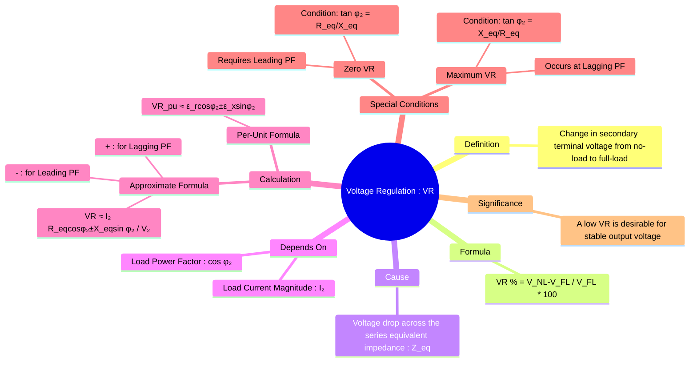

---
tags:
  - electrical-machines
  - transformers
  - voltage-regulation
  - performance-analysis
created: 2025-09-16
aliases:
  - Transformer Voltage Regulation
subject: "[[Electrical Machines]]"
parent:
  - Single-phase Transformers
  - "[[Voltage Regulation]]"
formula:
  - "Voltage Regulation of a Transformer : $$\\text{VR} \\% = \\frac{|V_{NL}| - |V_{FL}|}{|V_{FL}|} \\times 100$$"
  - "Voltage Regulation of a Transformer (in per-unit and percentage voltage regulation) : $$\\text{VR (pu)} = \\frac{I_2 R_{eq,2} \\cos\\phi_2 \\pm I_2 X_{eq,2} \\sin\\phi_2}{V_2}$$"
  - "Voltage Regulation of a Transformer (in per-unit resistance and reactance) : $$\\text{VR (pu)} \\approx \\epsilon_r \\cos\\phi_2 \\pm \\epsilon_x \\sin\\phi_2$$"
  - "Condition for Zero Voltage Regulation (Transformer) : $$\\tan\\phi_2 = \\frac{R_{eq}}{X_{eq}} \\quad \\text{(Leading PF)}$$"
  - "Condition for Maximum Voltage Regulation (Transformer) : $$\\tan\\phi_2 = \\frac{X_{eq}}{R_{eq}} \\quad \\text{(Lagging PF)}$$"
modified: 2026-07-23T20:32:10
---
### Voltage Regulation of a Transformer
#transformers #voltage-regulation #performance-metric

> Voltage Regulation (VR) is a key performance metric of a transformer that measures the change in its secondary terminal voltage from a no-load condition to a full-load condition at a specified power factor, with the primary applied voltage held constant. A smaller VR value is desirable, as it indicates that the transformer provides a more stable output voltage under varying loads.

---

#### Definition and Formula
#voltage-regulation/definition

The voltage regulation is defined as the ==percentage change in the secondary terminal voltage with respect to the full-load voltage==.

$$\boxed{\quad \text{VR} \% = \frac{|V_{NL}| - |V_{FL}|}{|V_{FL}|} \times 100 \quad}$$
Where:
- ==$|V_{NL}|$ is the magnitude of the secondary terminal voltage at no load (which is equal to the induced EMF, $E_2$).==
- ==$|V_{FL}|$ is the magnitude of the secondary terminal voltage at full load ($V_2$).==

The cause of this voltage change is the voltage drop across the transformer's internal series impedance ($Z_{eq} = R_{eq} + jX_{eq}$) as the load current flows.

> [!pyq]- PYQ : 2019
> ![[ee_2019#^q8]]

---
#### Approximate Expression for Voltage Regulation
#voltage-regulation/formula

From the approximate equivalent circuit and its phasor diagram, we can derive a highly accurate formula for voltage regulation. For small voltage drops, the difference $|E_2| - |V_2|$ can be approximated by the projection of the impedance drop phasor ($I_2 Z_{eq,2}$) onto the $V_2$ phasor.

The approximate voltage drop is given by:
$\Delta V \approx I_2 R_{eq,2} \cos\phi_2 \pm I_2 X_{eq,2} \sin\phi_2$

This gives the per-unit (pu) and percentage voltage regulation as:
$$\boxed{\quad \text{VR (pu)} = \frac{I_2 R_{eq,2} \cos\phi_2 \pm I_2 X_{eq,2} \sin\phi_2}{V_2} \quad}$$
Where:
-   $+$ sign is used for **lagging** power factor loads (inductive).
-   $-$ sign is used for **leading** power factor loads (capacitive).
-   $\phi_2$ is the power factor angle of the load.

This can also be expressed in terms of per-unit resistance ($\epsilon_r$) and reactance ($\epsilon_x$):
$$\boxed{\quad \text{VR (pu)} \approx \epsilon_r \cos\phi_2 \pm \epsilon_x \sin\phi_2 \quad}$$
where $\epsilon_r = \frac{I_{rated}R_{eq}}{V_{rated}}$ and $\epsilon_x = \frac{I_{rated}X_{eq}}{V_{rated}}$.

---
#### Effect of Power Factor
#power-factor

The voltage regulation of a transformer is highly dependent on the power factor of the load.
-   **Lagging Power Factor**: Both the resistive and reactive voltage drops contribute to a reduction in the terminal voltage, resulting in a positive and often significant VR.
-   **Unity Power Factor**: The reactive drop is nearly perpendicular to the terminal voltage, so it has less effect. The VR is positive but smaller than for a lagging PF.
-   **Leading Power Factor**: The reactive drop opposes the resistive drop's effect. The terminal voltage can decrease slightly, stay the same, or even increase. This can lead to a small positive, zero, or even **negative** voltage regulation.

**Negative Voltage Regulation**: This occurs when $|V_{\text{full-load}}| > |V_{\text{no-load}}|$. The terminal voltage rises as the load is applied. This happens for sufficiently leading (capacitive) power factors. In transmission lines, this phenomenon is known as the [[Ferranti Effect]].

---
#### Conditions for Zero and Maximum Regulation
#zero-voltage-regulation #maximum-voltage-regulation

1.  **Condition for Zero Voltage Regulation (ZVR)**:
    For VR to be zero, the internal voltage drop must be zero. This can only occur for a **leading** power factor load.
    $$\text{VR} = 0 \implies I_2 R_{eq} \cos\phi_2 - I_2 X_{eq} \sin\phi_2 = 0$$
    This simplifies to the condition for the load power factor angle:
    $$\boxed{\quad \tan\phi_2 = \frac{R_{eq}}{X_{eq}} \quad \text{(Leading PF)}}$$

2.  **Condition for Maximum Voltage Regulation**:
    To find the condition for maximum VR, we differentiate the VR expression with respect to $\phi_2$ and set the derivative to zero. This occurs at a **lagging** power factor when the load power factor angle is equal to the transformer's equivalent impedance angle ($\theta_{eq}$).
    $$\boxed{\quad \tan\phi_2 = \frac{X_{eq}}{R_{eq}} \quad \text{(Lagging PF)}}$$

---
### Related Concepts
#voltage-regulation/related

> [[Equivalent Circuit of a Transformer]] (The source of the internal impedance parameters)

[[Phasor Diagram of a Transformer]] (The graphical basis for understanding and deriving VR)
[[Transformer Tests]] (How the impedance parameters are experimentally determined)