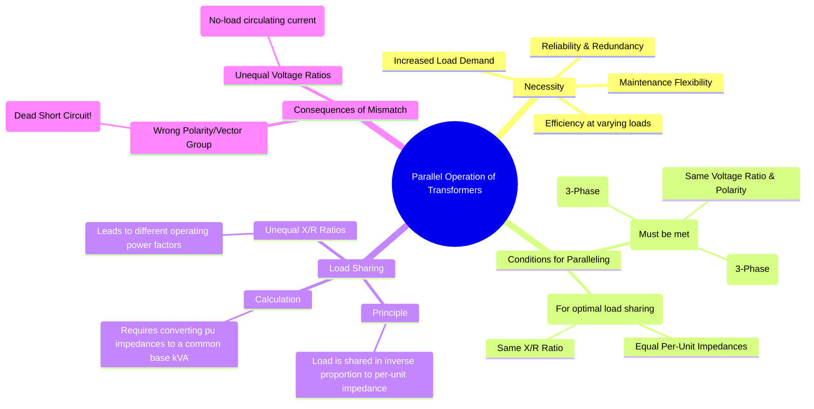

---
tags:
  - electrical-machines
  - transformers
  - parallel-operation
  - power-systems
created: 2025-09-16
aliases:
  - Parallel Transformers
  - Transformer Paralleling
subject: "[[Electrical Machines]]"
parent:
  - Three-Phase Transformers
modified: 2026-07-23T20:33:46
---
### Parallel Operation of Transformers
#transformers #parallel-operation #power-systems

> Parallel operation of transformers involves connecting two or more transformers to the same supply and common busbars to jointly supply a load. This is a common practice in power systems for several reasons, including meeting increased load demand, ensuring reliability (redundancy), allowing for maintenance on one unit, and improving overall efficiency by operating units closer to their peak efficiency.

![[Parallel Operation of Single-Phase Transformers.png]]

For successful parallel operation, certain conditions must be met to avoid damaging the equipment and to ensure proper load sharing. These are categorized as either essential or desirable.

---
#### Conditions for Parallel Operation
#transformer-paralleling/conditions

The conditions apply to both single-phase and three-phase transformers.

##### Essential (Mandatory) Conditions
These conditions **must** be satisfied to prevent large circulating currents and short circuits.

1.  **Same Voltage Rating and Turns Ratio**: The transformers must have the same primary and secondary voltage ratings. A slight difference in voltage ratios will create a potential difference between the secondaries, causing a **circulating current** to flow even at no load, leading to unnecessary $I^2R$ losses.
2.  **Same Polarity**: For single-phase transformers, the terminals of similar polarity must be connected together. An incorrect polarity connection results in the secondary voltages adding up instead of opposing, creating a **dead short circuit** across the busbars.
3.  **Same Phase Sequence**: For three-phase transformers, the phase sequence (e.g., RYB) of the line voltages must be identical. An incorrect sequence will lead to a short circuit.
4.  **Same Vector Group**: For three-phase transformers, the phase displacement between the primary and secondary line voltages must be the same. Connecting transformers with different vector groups (e.g., a Yd1 and a Yd11) in parallel will result in a large phase difference between their secondary voltages, causing damaging circulating currents.

##### Desirable Conditions
These conditions ensure that the transformers share the common load optimally and operate efficiently.

1.  **Equal Per-Unit (pu) Impedances**: Transformers share the total load in **inverse proportion to their per-unit impedances**. If the pu impedances are equal (on a common base kVA), they will share the load in proportion to their kVA ratings. If they are unequal, the transformer with the lower pu impedance will take a larger share of the load and may become overloaded.
2.  **Same X/R Ratio**: The ratio of the equivalent leakage reactance to the equivalent resistance ($X_{eq}/R_{eq}$) should be the same for all transformers. If the X/R ratios are different, the transformers will not share the active (kW) and reactive (kVAR) power proportionally. The transformers will operate at different power factors, and a circulating current will exist that does not contribute to the load.

---
#### Load Sharing Between Transformers
#load-sharing

The principle of load sharing is based on the fact that the transformers are connected in parallel, so the voltage drop across each must be the same.

Let two transformers, A and B, have per-unit impedances $Z_{pu,A}$ and $Z_{pu,B}$ on their own respective kVA ratings, $S_A$ and $S_B$. To analyze load sharing, we must first convert their pu impedances to a **common base kVA ($S_{base}$)**.

$$Z_{pu, A (new)} = Z_{pu, A (own)} \times \frac{S_{base}}{S_{A, rated}}$$
$$Z_{pu, B (new)} = Z_{pu, B (own)} \times \frac{S_{base}}{S_{B, rated}}$$

The total load, $S_L$, is then shared between the transformers in inverse proportion to their new (common base) pu impedances:
$$\boxed{\quad S_A = S_L \left( \frac{Z_{pu, B (new)}}{Z_{pu, A (new)} + Z_{pu, B (new)}} \right) \quad}$$
$$\boxed{\quad S_B = S_L \left( \frac{Z_{pu, A (new)}}{Z_{pu, A (new)} + Z_{pu, B (new)}} \right) \quad}$$
**Note**: These are phasor calculations. If only magnitudes are considered (i.e., if X/R ratios are equal), $|Z_{pu}|$ can be used.

---
### Related Concepts
#parallel-operation/related

> [[Vector Groups of Three-phase Transformers]]

[[Equivalent Circuit of a Transformer]]
[[Three-phase Transformer Connections]]
[[Power System]]