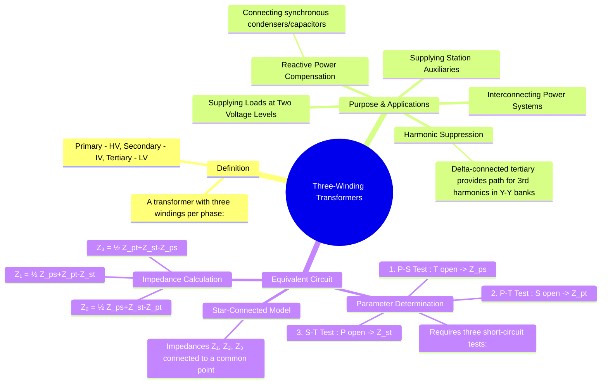

---
tags:
  - electrical-machines
  - transformers
  - three-phase
  - power-systems
  - tertiary-winding
created: 2025-09-16
aliases:
  - Tertiary Winding Transformer
  - 3-Winding Transformer
subject: "[[Electrical Machines]]"
parent:
  - Three-Phase Transformers
modified: 2026-07-23T20:34:18
---
### Three-Winding Transformers
#transformers #three-phase #tertiary-winding

> A three-winding transformer has three electrically isolated but magnetically coupled windings per phase, typically designated as Primary, Secondary, and Tertiary. These transformers are used in power systems to interconnect systems at three different voltage levels or to serve specific functions like harmonic suppression and reactive power compensation.

![[Tertiary Winding.png]]
#### Purpose and Applications of the Tertiary Winding
#tertiary-winding/applications

The third winding, known as the tertiary winding, is added for several key reasons:

1.  **Harmonic Suppression**: This is a primary function. In Star-Star (Y-Y) connected transformers, third-harmonic currents have no path to flow, leading to severe distortion of the phase voltages. A **delta-connected tertiary winding** provides a closed path for these third-harmonic currents to circulate within the winding, effectively trapping them and preventing voltage distortion on the lines.
2.  **Supplying Loads at a Third Voltage Level**: A single three-winding transformer (e.g., 220kV/66kV/11kV) can supply two different load levels from a single source, which is more economical than using two separate transformers.
3.  **Reactive Power Compensation**: The tertiary winding can be used to connect reactive power sources like capacitor banks or [[synchronous condenser|synchronous condensers]] to the power system for voltage regulation and power factor correction.
4.  **Supplying Station Auxiliaries**: In a substation, the tertiary winding can provide power for the station's own needs (lighting, cooling pumps, circuit breaker motors, etc.) at a convenient low voltage.

---
#### Equivalent Circuit of a Three-Winding Transformer
#equivalent-circuit #transformer-modeling

A three-winding transformer cannot be represented by a simple series impedance like a two-winding transformer. Instead, it is modeled by a **star-connected equivalent circuit** with three impedances ($Z_1, Z_2, Z_3$), one for each winding, connected to a common fictitious neutral point.

*(Diagram showing the star-connected equivalent circuit with impedances Z₁, Z₂, Z₃)*
![[Three-Winding-Transformers2.jpg]]

The parameters of this equivalent circuit are determined by performing three separate short-circuit tests. The measured leakage impedances are:
- $Z_{ps}$ = Impedance measured from the primary side with the secondary shorted and tertiary open.
- $Z_{pt}$ = Impedance measured from the primary side with the tertiary shorted and secondary open.
- $Z_{st}$ = Impedance measured from the secondary side with the tertiary shorted and primary open.

**Important**: All measured impedance values must be referred to a **common kVA base** before calculations.

The individual impedances of the star-equivalent circuit are calculated from these test results:
$$\boxed{\quad Z_1 = \frac{1}{2} (Z_{ps} + Z_{pt} - Z_{st}) \quad}$$
$$\boxed{\quad Z_2 = \frac{1}{2} (Z_{ps} + Z_{st} - Z_{pt}) \quad}$$
$$\boxed{\quad Z_3 = \frac{1}{2} (Z_{pt} + Z_{st} - Z_{ps}) \quad}$$
Where $Z_1, Z_2, Z_3$ are the equivalent impedances of the primary, secondary, and tertiary windings, respectively. It is mathematically possible for one of these impedances to have a negative resistance, which is a non-physical result but is correct for circuit calculations.

---
### Related Concepts
#three-winding-transformer/related

> [[Harmonics in Transformers]]

[[Three-phase Transformer Connections]]
[[Equivalent Circuit of a Transformer]]
[[Transformer Tests]]