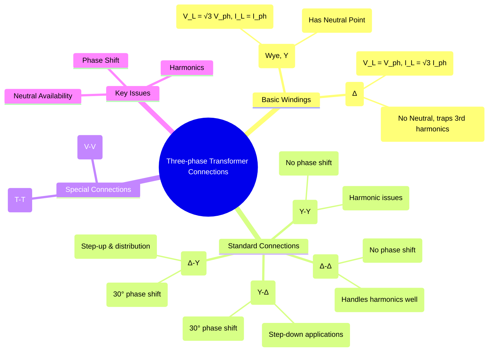

---
tags:
  - electrical-machines
  - transformers
  - three-phase
  - power-systems
  - transformer-connections
created: 2025-09-16
aliases:
  - 3-Phase Transformer Connections
  - Y-Δ Connections
subject: "[[Electrical Machines]]"
parent:
  - Three-Phase Transformers
modified: 2026-07-21T14:55:59
---
### Three-phase Transformer Connections
#transformers #three-phase #power-systems

> Three-phase power is the standard for generation, transmission, and heavy industrial use. Three-phase transformers are used to step voltage levels up or down within these systems. This is achieved by connecting the primary and secondary windings of three single-phase transformers (or the windings of a single three-phase unit) in specific configurations, primarily **Star (Y)** or **Delta (Δ)**.

---
#### Basic Winding Connections
#star-connection #delta-connection

1.  **Star (Y) Connection**: The starting (or finishing) ends of the three windings are connected together to form a common neutral point.
    *   **Line Voltage & Phase Voltage**: $V_L = \sqrt{3} V_{ph}$
    *   **Line Current & Phase Current**: $I_L = I_{ph}$
    *   **Advantages**: Provides a neutral point for grounding or for supplying single-phase loads. The phase windings only need to be insulated for the phase voltage ($V_L/\sqrt{3}$), reducing insulation cost.

2.  **Delta (Δ) Connection**: The three windings are connected in series to form a closed loop or mesh.
    *   **Line Voltage & Phase Voltage**: $V_L = V_{ph}$
    *   **Line Current & Phase Current**: $I_L = \sqrt{3} I_{ph}$
    *   **Advantages**: Creates a closed path for third-harmonic currents to circulate within the delta winding, preventing them from distorting the line voltages. It remains operational (at reduced capacity) if one winding fails (Open Delta).

---
#### Standard Four-Wire Connections
#transformer-connections

Let the phase turns ratio be $a = N_1 / N_2$. The relationship between line voltages depends on the connection type.

1.  **Star-Star (Y-Y)**
    *   **Use**: Rarely used due to issues with harmonics.
    *   **Line Voltage Ratio**: $\frac{V_{L1}}{V_{L2}} = \frac{\sqrt{3} V_{ph1}}{\sqrt{3} V_{ph2}} = \frac{V_{ph1}}{V_{ph2}} = a$
    *   **Phase Shift**: 0° (or 180°).
    *   **Problems**: No path for 3rd harmonic currents, leading to voltage distortion. Can be mitigated with a tertiary delta winding or solid grounding of the neutral.

2.  **Delta-Delta (Δ-Δ)**
    *   **Use**: Common in industrial applications with medium voltage.
    *   **Line Voltage Ratio**: $\frac{V_{L1}}{V_{L2}} = \frac{V_{ph1}}{V_{ph2}} = a$
    *   **Phase Shift**: 0° (or 180°).
    *   **Advantages**: Circulating path for 3rd harmonics. Can operate in V-V (Open Delta) configuration if one phase is damaged.

3.  **Star-Delta (Y-Δ)**
    *   **Use**: Very common for **stepping down** voltage at distribution substations (e.g., HV to MV/LV).
    *   **Line Voltage Ratio**:
        $V_{L1} = \sqrt{3} V_{ph1}$ and $V_{L2} = V_{ph2}$.
        $$\boxed{\quad \frac{V_{L1}}{V_{L2}} = \frac{\sqrt{3} V_{ph1}}{V_{ph2}} = \sqrt{3} a \quad}$$
    *   **Phase Shift**: The secondary line voltages lag or lead the primary line voltages by **30°**. This is a crucial feature for parallel operation.

4.  **Delta-Star (Δ-Y)**
    *   **Use**: The most common connection. Used for **stepping up** voltage at generating stations and for **stepping down** at the consumer end for three-phase four-wire distribution.
    *   **Line Voltage Ratio**:
        $V_{L1} = V_{ph1}$ and $V_{L2} = \sqrt{3} V_{ph2}$.
        $$\boxed{\quad \frac{V_{L1}}{V_{L2}} = \frac{V_{ph1}}{\sqrt{3} V_{ph2}} = \frac{a}{\sqrt{3}} \quad}$$
    *   **Phase Shift**: The secondary line voltages lag or lead the primary line voltages by **30°**.

---
### Related Concepts
#transformer-connections/related

> [[Vector Groups of Three-phase Transformers]] (Defines the specific phase shift and winding configuration)

[[Harmonics in Transformers]]
[[Parallel Operation of Transformers]] (Requires matching voltage ratio, polarity, and vector group)
[[Star and Delta Connections]]
[[Star-Delta Transformation]]
[[Power System]]