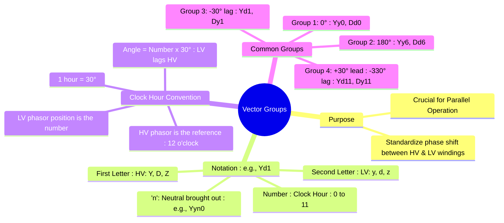

---
tags:
  - electrical-machines
  - transformers
  - three-phase
  - power-systems
  - vector-group
created: 2025-09-16
aliases:
  - Transformer Vector Groups
  - Vector Group
  - Yd1
subject: "[[Electrical Machines]]"
parent:
  - Three-Phase Transformers
modified: 2026-07-23T20:34:55
---
### Vector Groups of Three-phase Transformers
#transformers #vector-group #phase-shift

> The vector group of a three-phase transformer is an alphanumeric code that describes the winding configuration (Star, Delta, or Zigzag) and the phase angle difference between the primary (HV) and secondary (LV) windings. This designation is critical for ensuring the safe parallel operation of transformers and for system integration.

---

#### The Clock Hour Notation
#vector-group/notation

The vector group is represented by a code that contains letters and a number.
-   **First Letter (Capital)**: HV winding connection type (Y, D, or Z).
-   **Second Letter (Lowercase)**: LV winding connection type (y, d, or z).
-   **'n' (optional)**: Indicates that the neutral point of a star winding is brought out to a terminal (e.g., Yyn0).
-   **Number (0-11)**: Represents the phase shift in a "clock hour" format.

The convention is to use the **HV side line-to-neutral voltage phasor as a reference, pointing to 12 o'clock**. The number in the vector group then indicates the position of the **LV side line-to-neutral voltage phasor** on the clock face. Since a clock has 12 hours and a full circle is 360°, each hour represents a phase shift of 30°.

The angle of the LV winding with respect to the HV winding is calculated as:
$$\boxed{\quad \text{Phase Shift Angle} = \text{Number} \times 30^\circ \quad (\text{LV lags HV})}$$

---
#### Determining the Vector Group (Example: Yd1)
#vector-group/example

Let's determine the vector group for a Star-connected primary (HV) and a Delta-connected secondary (LV).
1.  **HV Side (Y)**: Draw the primary phase voltage phasors ($V_{AN}, V_{BN}, V_{CN}$). By convention, we place the HV phasor for phase 'A' ($V_{AN}$) at the 12 o'clock position (0° reference).
2.  **LV Side (d)**: The phase windings of the LV side are in phase with the corresponding HV windings. So, the LV phase voltage $v_{an}$ is parallel to $V_{AN}$, $v_{bn}$ is parallel to $V_{BN}$, etc.
3.  **LV Line Voltage**: In a delta connection, the line voltage is the phasor difference between two phase voltages. For example, the line voltage $v_{ab}$ is given by $\vec{v_{ab}} = \vec{v_{an}} - \vec{v_{bn}}$.
4.  **Phasor Diagram**: Drawing this phasor subtraction shows that the resulting line voltage phasor $\vec{v_{ab}}$ points towards the **1 o'clock position**.
5.  **Conclusion**: A 1 o'clock position corresponds to a phase lag of $1 \times 30^\circ = 30^\circ$. Therefore, the vector group is **Yd1**.

---
#### Common Vector Groups
#vector-group/common-groups

Transformers are typically classified into four main groups based on their phase shift:
-   **Group 1: Zero Phase Shift (0°)**
    -   **Examples**: Yy0, Dd0, Dz0
    -   Used when no phase shift is required.
-   **Group 2: 180° Phase Shift**
    -   **Examples**: Yy6, Dd6, Dz6
    -   Achieved by reversing the polarity of the windings.
-   **Group 3: -30° Lag**
    -   **Examples**: Yd1, Dy1, Yz1
    -   The LV side lags the HV side by 30°.
-   **Group 4: +30° Lead (-330° Lag)**
    -   **Examples**: Yd11, Dy11, Yz11
    -   The LV side leads the HV side by 30° (or lags by 330°). The **Dy11** connection is extremely common in distribution networks worldwide.

---
#### Importance of Vector Groups
#parallel-operation

The primary significance of the vector group is in the **parallel operation of transformers**. For two or more transformers to operate in parallel, they must satisfy several conditions, with the vector group being critical:
1.  **Same Voltage Ratio and Polarity**.
2.  **Same Phase Sequence**.
3.  **Same Vector Group**.

If transformers with different vector groups are connected in parallel, there will be a phase difference between their secondary voltages. This phase difference will drive a large circulating current between the transformers, even at no load, leading to overheating and potential damage.

---
### Related Concepts
#vector-group/related

> [[Three-phase Transformer Connections]]

[[Parallel Operation of Transformers]]
[[Power System]]
[[Phasor Diagram of a Transformer]]