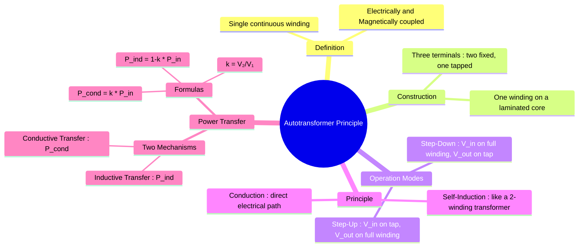

---
tags:
  - electrical-machines
  - transformers
  - autotransformer
created: 2025-09-16
aliases:
  - Autotransformer
  - Auto Transformer
subject: "[[Electrical Machines]]"
parent:
  - "[[Transformers]]"
formula:
  - "Inductively Transferred Power (Autotransformer) : $$S_{ind} = (1 - k) S_{transformed}$$"
  - "Conductively Transferred Power (Autotransformer) : $$S_{cond} = k \\cdot S_{transformed}$$"
  - "Transformation Ratio (Autotransformer) : $$\\frac{V_2}{V_1} = \\frac{N_2}{N_1} = k$$"
modified: 2026-07-23T20:35:19
---
### Principle and Operation of Autotransformers
#autotransformer #single-winding-transformer #power-transfer

> An **autotransformer** is a type of electrical transformer that uses a single, continuous winding with at least one tap point. Unlike a conventional two-winding transformer which transfers energy purely by magnetic induction, ==an autotransformer transfers energy both **inductively** (through transformer action) and **conductively** (through a direct electrical connection)==. This dual mode of power transfer is the key to its main advantage: significant savings in copper.

---

#### Construction and Connection
#autotransformer/construction

An autotransformer consists of a single copper winding wound on a laminated magnetic core. Part of this winding is common to both the primary and secondary circuits.

-   **Step-down Autotransformer**: The input voltage $V_1$ is applied across the entire winding (terminals A and C), and the output voltage $V_2$ is taken from a tapped portion of the winding (terminals B and C). Here, winding AC is the primary ($N_1$ turns) and winding BC is the secondary ($N_2$ turns).
-   **Step-up Autotransformer**: The input voltage $V_1$ is applied across the tapped portion (BC), and the output voltage $V_2$ is taken across the entire winding (AC).

| ![[Autotransformer.jpg]] | ![[Autotransformer Winding.png]] |
| ------------------------ | ------------------------- |

| ![[Transformer - Autotransformer.png]]   | ![[Transformer - Autotransformer2.png]]      |
| ---------------------------------------- | -------------------------------------------- |
| Connection Diagram of an Autotransformer | An Autotransformer supplying a specific load |

---
#### Principle of Operation
#autotransformer/operation

The autotransformer works on the principle of **self-induction**. When an AC voltage $V_1$ is applied, it drives an alternating current through the winding, creating a time-varying magnetic flux in the core. This changing flux induces an EMF across the entire winding. The voltage at any tap point is proportional to the number of turns up to that point.

For an ideal step-down autotransformer:
- Voltage across AC is $V_1$.
- Voltage across BC is $V_2$.

The voltage/turns relationship is: $$\boxed{\quad \frac{V_2}{V_1} = \frac{N_2}{N_1} = k \quad}$$ 
where $k$ is the transformation ratio.
The current in the common section of the winding (BC) is the phasor difference between the secondary current ($I_2$) and the primary current ($I_1$), which is $I_{BC} = I_2 - I_1$.

> [!danger] Important
> In the context of [[Starting Methods for Induction Motors#3. Autotransformer Starter|induction motor starters]], this transformation ratio $k$ is widely denoted as the tapping fraction $x$.

---
#### Power Transfer in an Autotransformer
#power-transfer

The total apparent power ($S$) transferred from the primary to the secondary side is done through two distinct mechanisms:

1. **Inductive Transfer ($S_{ind}$)**: Power transferred magnetically, as in a conventional two-winding transformer. This power is associated with the non-common part of the winding (section AB).
2. **Conductive Transfer ($S_{cond}$)**: Power transferred directly through the electrical connection, as the primary and secondary circuits are physically connected. This power is associated with the common part of the winding (section BC).

The total input apparent power is $S_{in} = V_1 I_1$.
The total output apparent power is $S_{out} = V_2 I_2$.
For an ideal transformer, $S_{in} = S_{out} = S_{transformed}$.

- **Inductively Transferred Power**:
    The power transformed via magnetic induction is equivalent to the power handled by a two-winding transformer with windings AB (primary) and BC (secondary).
    The voltage across winding AB is $V_{AB} = V_1 - V_2$.
    The current through winding AB is $I_{AB} = I_1$.
    $$\begin{align}
    S_{ind} &= (V_1 - V_2) I_1 \\
     &= V_1 I_1 \left(1 - \frac{V_2}{V_1}\right) \\
     &= S_{in} (1 - k)
    \end{align}$$

- **Conductively Transferred Power**:
    The rest of the power is transferred conductively.
    $$S_{cond} = S_{in} - S_{ind} = S_{in} - S_{in}(1-k) = k S_{in}$$

The power relationships are:
$$\boxed{\quad S_{ind} = (1 - k) S_{transformed} \quad}$$
$$\boxed{\quad S_{cond} = k \cdot S_{transformed} \quad}$$
This shows that as the transformation ratio $k$ approaches 1, the majority of the power is transferred conductively, and only a small fraction is transferred inductively. This is the reason for the significant copper savings in autotransformers.

---
#### Per-Unit Impedance and Short-Circuit Current
#autotransformer/impedance #short-circuit

While an autotransformer saves copper and reduces ohmic losses, it also inherently possesses a lower per-unit (pu) impedance compared to a two-winding transformer of the same physical size.

If $Z_{two, pu}$ is the per-unit impedance of the transformer when connected as a two-winding transformer, the per-unit impedance when connected as an autotransformer ($Z_{auto, pu}$) is reduced by the same factor as the copper weight:
$$\boxed{\quad Z_{auto, pu} = (1 - k) Z_{two, pu} \quad}$$
where $k$ is the transformation ratio ($V_2/V_1$ or $N_2/N_1$).

**Impact on Short-Circuit Current:**
Because the per-unit impedance restricts the fault current, a lower impedance results in a proportionally higher short-circuit current ($I_{sc}$) during a fault.
$$\boxed{\quad I_{sc, auto} = \frac{I_{sc, two}}{1 - k} \quad}$$

> [!warning] Design Trade-off
> As $k$ approaches 1, the copper savings are maximized, but the per-unit impedance drops significantly. This makes the autotransformer extremely vulnerable to catastrophic mechanical and thermal stresses during a short circuit, often requiring external series reactors to limit fault currents.

---
#### Application
#autotransformer/application

1. Variac used in laboratories uses autotransformer.
2. Sigle-phase autotransformers are also used for supplying improved voltage to domestic appliances.
3. Three-phase auto-transformers are used in the interconnection of grids, say a 132kV grid with a 220kV grid.
4. Three-phase **induction motors** are often started with three-phase autotransformers where a reduced voltage is applied across the motor-terminals at starting.
	> See [[Starting Methods for Induction Motors#3. Autotransformer Starter]]

---
### Related Concepts
#autotransformer/related

> [[Copper Saving in Autotransformers]]

[[Conversion to Autotransformer]]
[[Principle of Operation of a Transformer]]
[[Three-phase Autotransformer Connections]]
[[Starting Methods for Induction Motors#3. Autotransformer Starter|Starting Methods for Induction Motors]]