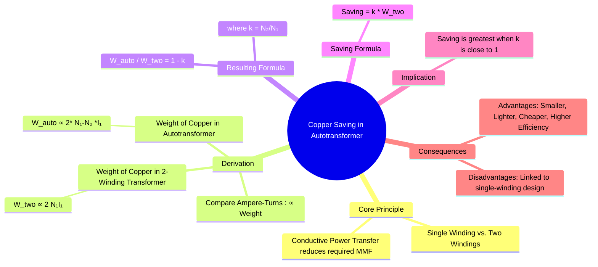

---
tags:
  - electrical-machines
  - transformers
  - autotransformer
  - copper-saving
  - transformer-design
created: 2025-09-16
aliases:
  - Autotransformer Copper Saving
  - Saving of Copper in Autotransformer
subject: "[[Electrical Machines]]"
parent:
  - "[[Autotransformers]]"
formula:
  - "Weight of Copper Ratio (Autotransformer) : $$\\frac{W_{auto}}{W_{two}} = 1-k$$"
  - "Copper Saving (Autotransformer) : $$\\text{Saving} = k \\times W_{two}$$"
modified: 2026-07-23T20:36:26
---
### Copper Saving in Autotransformers
#autotransformer #copper-saving #transformer-design

> The most significant advantage of an [[Autotransformers|autotransformer]] over a conventional two-winding transformer is the substantial saving in the amount of copper required for its winding. This saving leads to a smaller, lighter, cheaper, and more efficient transformer. The saving is most pronounced when the transformation ratio is close to unity.

---
#### Derivation of Copper Saving
#copper-saving/derivation

The weight of copper in a winding is proportional to its length and cross-sectional area. Assuming the same conductor current density, the weight is proportional to the product of the number of turns and the current, which is the ampere-turns (MMF).

Let's compare the copper required for a two-winding transformer and a step-down autotransformer with the same rating. Let the transformation ratio be $k = V_2/V_1 = N_2/N_1$.

1.  **Weight of Copper in a Two-Winding Transformer ($W_{two}$)**
    -   Weight of primary winding $\propto N_1 I_1$
    -   Weight of secondary winding $\propto N_2 I_2$
    -   Total Weight, $W_{two} \propto N_1 I_1 + N_2 I_2$
    -   For an [[Ideal and Practical Transformers|ideal transformer]], the ampere-turns are equal: $N_1 I_1 = N_2 I_2$.
    -   Therefore, $W_{two} \propto 2 N_1 I_1$.

2.  **Weight of Copper in an Autotransformer ($W_{auto}$)**
    The autotransformer has two sections:
    -   **Section AB**: Turns = $N_1 - N_2$. Current = $I_1$.
    -   **Section BC**: Turns = $N_2$. Current = $I_2 - I_1$.
    -   Total Weight, $W_{auto} \propto (N_1 - N_2)I_1 + N_2(I_2 - I_1)$
    -   Expanding the expression:
        $$\begin{align}
        W_{auto} &\propto N_1 I_1 - N_2 I_1 + N_2 I_2 - N_2 I_1 \\
         &= N_1 I_1 + N_2 I_2 - 2 N_2 I_1
        \end{align}$$
    -   Substituting $N_2 I_2 = N_1 I_1$:
        $$\begin{align}
        W_{auto} &\propto N_1 I_1 + N_1 I_1 - 2 N_2 I_1 \\
         &= 2 N_1 I_1 - 2 N_2 I_1 = 2 I_1 (N_1 - N_2)
        \end{align}$$

3.  **Ratio and Saving**
    The ratio of the weight of copper in an autotransformer to that in a two-winding transformer is:
    $$\frac{W_{auto}}{W_{two}} = \frac{2 I_1 (N_1 - N_2)}{2 N_1 I_1} = \frac{N_1 - N_2}{N_1} = 1 - \frac{N_2}{N_1}$$
    $$\boxed{\quad W_{auto} = (1 - k) W_{two} \quad}$$
    The saving in copper is the difference in weights:
    Saving = $W_{two} - W_{auto} = W_{two} - (1-k)W_{two} = W_{two} - W_{two} + k W_{two}$
    $$\boxed{\quad \text{Saving} = k \times W_{two} \quad}$$

---
#### Conclusion and Implications
#transformer-economics

The saving in copper is equal to the transformation ratio ($k$) times the weight of copper that would be required for a conventional two-winding transformer of the same rating.

-   If the ratio $k$ is very close to 1 (e.g., $k=0.9$), the saving is 90%. This makes autotransformers highly economical for applications like interconnecting power systems with similar voltage levels.
-   If the ratio $k$ is small (e.g., $k=0.2$), the saving is only 20%, and the other disadvantages may outweigh the benefits.

#### Advantages Resulting from Copper Saving
-   **Lower Cost**: Less copper means lower material cost.
-   **Smaller Size and Lighter Weight**: A more compact design for the same kVA rating.
-   **Higher Efficiency**: Less copper means lower winding resistance ($R_{eq}$), resulting in lower full-load $I^2R$ losses.
-   **Better Voltage Regulation**: Lower winding resistance and significantly lower leakage reactance lead to a smaller voltage drop under load.

#### Disadvantages
-   **No Electrical Isolation**: The primary and secondary circuits are not electrically isolated, which can be a safety hazard.
-   **Higher Short-Circuit Current**: The equivalent impedance of an autotransformer is lower than that of a two-winding transformer of the same rating, leading to a much larger short-circuit current.

---
### Related Concepts
#copper-saving/related

> [[Autotransformers]]

[[Losses and Efficiency in a Transformer]]
[[Voltage Regulation of a Transformer]]
[[Three-phase Autotransformer Connections]]