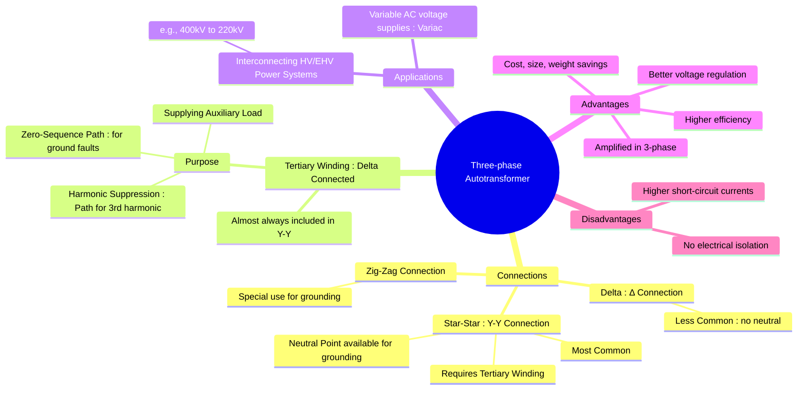

---
tags:
  - electrical-machines
  - transformers
  - autotransformer
  - three-phase
  - power-systems
created: 2025-09-16
aliases:
  - 3-Phase Autotransformer
  - Star-Connected Autotransformer
  - Grounding Transformer - Zig-Zag Connection
subject: "[[Electrical Machines]]"
parent:
  - "[[Autotransformers]]"
modified: 2026-07-23T20:36:48
---
### Three-phase Autotransformer Connections
#autotransformer #three-phase #power-systems

> Three-phase autotransformers are the backbone of high-voltage power system interconnections, where voltage levels need to be changed by a relatively small amount (e.g., from 400 kV to 220 kV). They can be constructed as a bank of three individual single-phase autotransformers or as a single three-phase unit. Their significant advantages in cost, size, and efficiency make them the preferred choice for such applications.

---
#### Star-Connected Autotransformer (Y-Y)
#star-connection #autotransformer

The most common configuration for three-phase autotransformers is the **Star-Star (Y-Y) connection**.
- **Construction**: Three single-phase autotransformers are connected in a star configuration, with their neutral points tied together to form a common neutral for the system.
- **Operation**: The HV input is connected to the start of the windings (A, B, C) and the HV neutral. The LV output is taken from the tap points (a, b, c) and the LV neutral. The common neutral is typically solidly grounded.
- **Key Advantage**: This connection provides a neutral point, which is essential for grounding in HV/EHV systems. Grounding the neutral provides system stability, helps in protecting against ground faults, and reduces the insulation requirements for the windings.

	![[3-Phase Autotransformer.png]]

#### The Role of the Delta-Connected Tertiary Winding
#tertiary-winding #harmonic-suppression

Large star-connected autotransformers are almost always built with a third, buried, **delta-connected tertiary winding**. This winding is not typically used to supply a load but is crucial for the proper operation of the transformer for two main reasons:

1. **Harmonic Suppression**: A Y-Y connected system without a delta winding has no path for third-harmonic currents, which are generated due to core saturation. This leads to severe distortion of the flux and phase voltage waveforms. The delta tertiary winding provides a closed path for these 3rd harmonic currents to circulate, "trapping" them and ensuring that the line voltages remain sinusoidal.
2. **Zero-Sequence Path for Fault Currents**: During a line-to-ground fault, zero-sequence currents flow. The delta winding provides a low-impedance path for these currents on the side of the fault, which is necessary for the proper operation of protective relays and for maintaining system stability.

The tertiary winding can also be used to supply station auxiliary loads or for connecting reactive power compensation equipment (e.g., capacitor banks).

---
#### Other Connections
#delta-connection

- **Delta-Delta (Δ-Δ) Connection**: Autotransformers can be connected in delta, but this is far less common in high-power systems because it does not provide a neutral point for grounding.
- **Zig-Zag Connection**: This is a special-purpose autotransformer connection used to create an artificial neutral in a three-phase system that does not have one, primarily for grounding purposes. It is often called a "grounding transformer."

#### Advantages in Three-Phase Systems
The inherent advantages of autotransformers are magnified in high-power, three-phase applications:
- **Significant Cost and Size Reduction**: For a 400kV/220kV interconnection, the transformation ratio $k \approx 0.55$. The saving in copper is 55% compared to a two-winding transformer. This results in massive savings in cost, weight, and physical size.
- **Higher Efficiency**: Reduced copper leads to lower $I^2R$ losses, making the transformer more efficient.
- **Improved Voltage Regulation**: The per-unit impedance of an autotransformer is much lower, resulting in better voltage regulation.

---
### Related Concepts
#autotransformer-connections/related

> [[Copper Saving in Autotransformers]]

[[Autotransformers]]
[[Three-phase Transformer Connections]]
[[Harmonics in Transformers]]
[[Power System]]