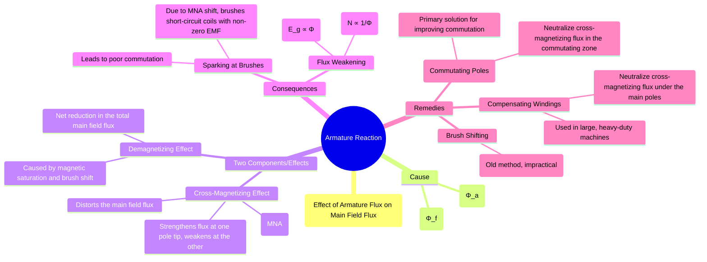

---
tags:
  - electrical-machines
  - dc-machines
  - armature-reaction
  - commutation
created: 2025-09-15
aliases:
  - Armature MMF Effect
  - Effects of Armature Reaction
  - Armature Reaction in DC Machines
  - Magnetic Neutral Axis (MNA)
  - Geometrical Neutral Axis (GNA)
  - Demagnetizing Effect (in Armature Reaction)
  - Cross-Magnetizing Effect (in Armature Reaction)
  - Consequences of Armature Reaction
  - Mitigating Armature Reaction
  - Armature Reaction Effect
subject: "[[Electrical Machines]]"
parent:
  - DC Machines
modified: 2026-07-16
---
###### Navigation

> [!Navigation]
> - [[Armature Reaction and Synchronous Reactance]] (for [[Synchronous Machines]])

---
### Armature Reaction and its Effects
#armature-reaction #dc-machines

> <u>**Armature reaction** is the effect of the magnetic field produced by the armature current on the magnetic field produced by the field winding (main field).</u> ==The interaction of these two fields—the armature flux ($\Phi_a$) and the main field flux ($\Phi_f$)—results in the distortion and weakening of the main field flux, which adversely affects the performance of a DC machine.==

---
#### The Phenomenon of Armature Reaction
#armature-reaction/phenomenon 

1. **No-Load Condition**: When the machine is at no-load, there is ==no armature current ($I_a = 0$). Only the main field flux ($\Phi_f$), produced by the field winding, exists in the air gap. The magnetic field is uniform, and the **Magnetic Neutral Axis (MNA)** coincides with the **Geometrical Neutral Axis (GNA)**.== <u>The MNA is the axis along which the induced EMF in the armature conductors is zero.</u>

2. **Loaded Condition**: When the machine is loaded, ==current flows through the armature conductors. This current produces its own magnetic field, known as the armature flux ($\Phi_a$). The direction of $\Phi_a$ is perpendicular to the main flux axis.==

3. **Interaction**: ==The armature flux $\Phi_a$ superimposes on the main flux $\Phi_f$. The resultant flux is distorted and shifted. This phenomenon is the armature reaction.==

---
#### The Two Effects of Armature Reaction
#armature-reaction/effects 

The armature reaction can be resolved into two distinct effects:

##### 1. Cross-Magnetizing Effect
#cross-magnetization

==This is the primary effect, causing the **distortion** of the main field flux.==
* At one side of the pole (the leading pole tip for a motor, trailing for a generator), the armature flux opposes the main flux, weakening the field.
* At the other side (trailing pole tip for a motor, leading for a generator), the armature flux assists the main flux, strengthening it.
* This distortion "drags" or "skews" the resultant flux in the direction of rotation for a generator and opposite to the direction of rotation for a motor.
* ==The most significant consequence is that the **MNA is shifted** from the GNA.==

---
##### 2. Demagnetizing Effect
#demagnetization

==This effect causes a **net reduction** in the total flux per pole.==
* The strengthening of flux at one pole tip is less than the weakening of flux at the other tip due to **magnetic saturation** in the pole shoe material. This results in an overall reduction in the average flux per pole.
* If the brushes are shifted from the GNA to the new MNA to achieve better commutation, the armature MMF gets a component that directly opposes the main field MMF, further increasing the demagnetizing effect.

---
#### Consequences of Armature Reaction
#armature-reaction/consequences #poor-commutation 

The distortion and weakening of the flux lead to serious operational problems:

1. **[[Commutation and Methods of Improvement#Problems with Commutation Reactance Voltage|Poor Commutation (Sparking at Brushes)]]**:
	- The MNA shifts, but the brushes are fixed at the GNA.
	- Coils short-circuited by the brushes are no longer at the zero-EMF position.
	- A significant EMF is induced in these coils, causing heavy short-circuit currents that lead to sparking at the commutator surface.

2. **Reduction in Machine Performance**:
	- The net reduction in flux $(\phi)$ affects the machine's primary function.
	- In a **Generator**: The generated EMF $(E_g \propto \phi N)$ decreases, reducing the terminal voltage.
	- In a **Motor**: The back EMF $(E_b \propto \phi N)$ decreases. To maintain the balance $V \approx E_b$, the motor's speed $(N \propto E_b/\phi)$ increases, which can be undesirable.

---
#### Methods to Mitigate Armature Reaction
#interpoles #compensating-windings

To ensure proper operation, especially in large machines and under heavy loads, the effects of armature reaction must be neutralized.

##### 1. Interpoles (or Commutating Poles)
#interpoles

* **Function**: Interpoles are the primary solution to improve commutation. They are small poles placed between the main poles.
* **Connection**: Their winding is connected in series with the armature winding, so their flux is proportional to the armature current.
* **Action**: They are wound to produce a flux that directly opposes and cancels the cross-magnetizing flux in the commutating zone (the region where coils are short-circuited by brushes). This helps the current in the coil to reverse direction smoothly without sparking.

---
##### 2. Compensating Windings
#compensating-windings

* **Function**: These windings are used in large DC machines that experience heavy overloads or rapid changes in load (e.g., steel mill motors). ==Their purpose is to completely neutralize the [[#1. Cross-Magnetizing Effect|cross-magnetizing effect]] of the armature reaction *across the entire pole face*.==
* **Construction**: They are embedded in slots cut into the faces of the main poles and are also connected in series with the armature winding.
* **Action**: The current in the compensating winding flows in the opposite direction to the current in the armature conductors directly below it. This produces a flux that is equal and opposite to the armature flux, effectively canceling it out. They are expensive and thus used only when necessary.

> [!pyq]- PYQ : 2021
> ![[ee_2021#^q8]]

---
### Related Concepts
#armature-reaction/related-concepts

> [[Commutation and Methods of Improvement]]

[[Constructional Features of DC Machines]]
[[EMF and Torque Equations of a DC Machine]]
[[Types of DC Generators]]
[[Mitigation Techniques in Machines]]