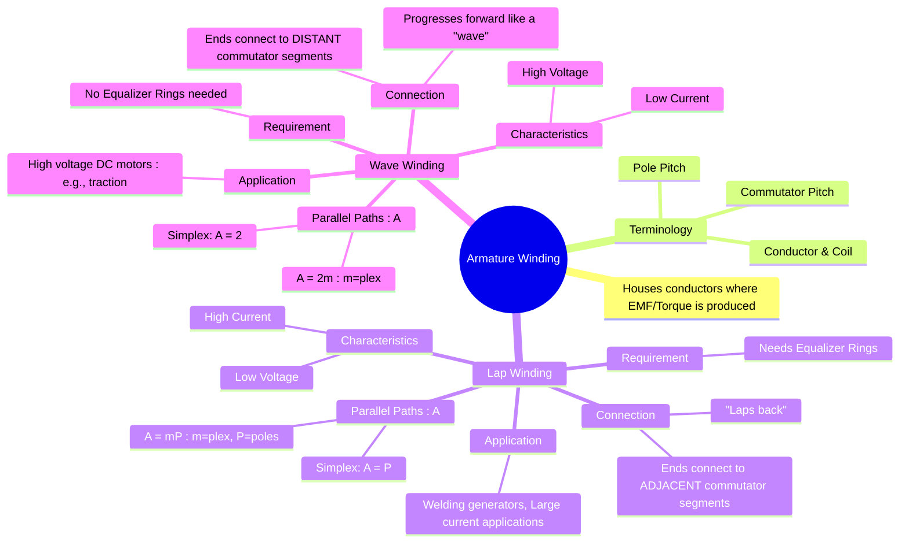

---
tags:
  - electrical-machines
  - dc-machines
  - armature-winding
  - lap-winding
  - wave-winding
created: 2025-09-15
aliases:
  - DC Machine Armature Winding
  - Lap Winding
  - Wave Winding
subject: "[[Electrical Machines]]"
parent:
  - DC Machines
modified: 2026-07-23T20:38:33
---
### Armature Winding (Lap and Wave)
#armature-winding #dc-machines

> ==The [[Constructional Features of DC Machines#2. Armature Winding|armature winding]] is the arrangement of insulated conductors in the slots of the [[Constructional Features of DC Machines#1. Armature Core|armature core]].== It is the heart of a DC machine, as this is where the conversion between electrical and mechanical energy occurs. ==The way these conductors are interconnected and connected to the [[Constructional Features of DC Machines#3. Commutator|commutator]] segments defines the machine's voltage and current characteristics.== The two primary types of armature windings are **Lap Winding** and **Wave Winding**.

---
#### Key Terminology
#winding-terminology

* **Conductor**: The active part of a wire lying in a slot.
* **Turn**: Two conductors connected together at one end.
* **Coil**: One or more turns wound together. A coil has two sides (coil sides), which are placed in different armature slots.
* **Pole Pitch**: The distance between the centers of two adjacent poles, measured in terms of armature slots or conductors.
* **Commutator Pitch ($Y_C$)**: The distance, measured in commutator segments, between the segments to which the two ends of a coil are connected.

---
#### Lap Winding
#lap-winding

In a lap winding, ==the *finishing end of one coil* is connected to a commutator segment adjacent to the segment where the *starting end of the same coil* is connected==. The coils are connected in such a way that they "lap" back on themselves.

![[Lap Winding.png]]

* **Connection**: ==The end of one coil is connected to the start of the next coil under the *same* pole.== The connections to the commutator are on adjacent segments.
* **Number of Parallel Paths ($A$)**: ==The number of parallel paths is equal to the number of poles.==
    $$\boxed{\quad A = P \quad}$$
    (For a simplex lap winding. ==For a multiplex winding, $A = m \times P$, where $m$ is the plex of the winding==).
* **Number of Brush Sets**: ==Equal to the number of poles ($P$).==
* **Characteristics**: ==Since the total armature current ($I_a$) is divided among $P$ parallel paths, each path carries a current of $I_a/P$. This makes lap winding suitable for **high-current, low-voltage** applications.==
* **Equalizer Rings**: In lap windings, slight magnetic imbalances between the poles can cause different EMFs in the parallel paths, leading to large, unwanted circulating currents. To mitigate this, **equalizer rings** are used to connect points in the winding that should be at the same electrical potential, providing a path for these currents to bypass the brushes.
* **Applications**: Typically used in high-current machines like welding generators and large DC motors for electroplating.

> [!example]
> For above example average pitch $Y_a$ , back pitch $Y_b$ and front pitch $Y_f$ are calculated as:
> $$\begin{align}
> Y_a &= \frac{16}{4} = 4 \\
>  Y_a &= \frac{Y_b + Y_f}{2} \\
>   Y_b - Y_f &= \pm2
>   \end{align}$$
>   For progressive lap winding
>   $$\begin{align}
>   Y_b - Y_f &= 2 \\
>    Y_b &= 5 , \ Y_f = 3
>    \end{align}$$

---
#### Wave Winding
#wave-winding

In a wave winding, the coils are connected in series and progress forward around the armature in a "wave-like" pattern. The end of one coil is connected to the start of another coil located approximately two pole pitches away.

*   **Connection**: The coils under all poles are connected in series, forming a single continuous path before closing on itself.
*   **Number of Parallel Paths ($A$)**: ==The number of parallel paths is always two, irrespective of the number of poles.==
    $$\boxed{\quad A = 2 \quad}$$
    (For a simplex wave winding. For a multiplex winding, $A = m \times 2$).
*   **Number of Brush Sets**: Only two brush sets are required, though more can be used to improve current collection.
*   **Characteristics**: The armature winding consists of two long series paths. Each path has $Z/2$ conductors in series. This arrangement is ideal for **high-voltage, low-current** applications.
*   **Equalizer Rings**: Not required. Since the conductors in each parallel path are distributed under all poles, any magnetic imbalance gets averaged out, and there is no significant potential difference between the paths.
*   **Applications**: Used in small generators and high-voltage DC motors, such as those used for electric traction.

---
#### Comparison of Lap and Wave Winding
#comparison/lap-winding-with-wave-winding 

| Feature                 | Lap Winding                                  | Wave Winding                                  |
| ----------------------- | -------------------------------------------- | --------------------------------------------- |
| **Parallel Paths ($A$)**    | $A = P$ (for simplex)                        | $A = 2$ (for simplex)                         |
| **Number of Brushes**   | Equal to the number of poles ($P$)           | Two (or more, but only two are necessary)     |
| **Voltage Rating**      | Low Voltage                                  | High Voltage                                  |
| **Current Rating**      | High Current                                 | Low Current                                   |
| **EMF Equation**        | $E_g = \frac{\phi Z N}{60}$ (since $A=P$)      | $E_g = \frac{\phi Z N P}{120}$ (since $A=2$)    |
| **Equalizer Rings**     | Required to handle circulating currents      | Not Required                                  |
| **Application**         | Welding generators, electroplating           | High-voltage motors (traction), small gensets |

---
### Related Concepts
#armature-winding/related-concepts

> [[Constructional Features of DC Machines]]

[[EMF and Torque Equations of a DC Machine]]
[[Commutation and Methods of Improvement]]
[[Armature Reaction]]