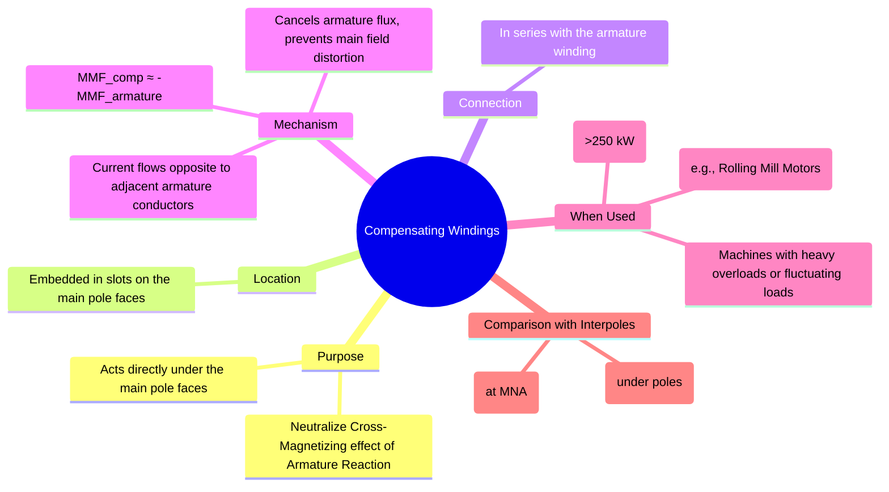

---
tags:
  - electrical-machines
  - dc-machines
  - armature-reaction
  - compensating-windings
created: 2025-09-15
aliases:
  - Compensating Winding
subject: "[[Electrical Machines]]"
parent:
  - DC Machines
modified: 2026-07-23T20:38:41
---
### Compensating Windings
#compensating-windings #armature-reaction #dc-machines

> **Compensating windings** are auxiliary windings embedded in slots on the main pole faces of a DC machine. Their primary purpose is to completely neutralize the **cross-magnetizing effect** of [[Armature Reaction|armature reaction]] directly under the poles. They are used in large machines that are subjected to heavy or rapidly changing loads.

---
#### Need for Compensating Windings

While [[Commutation and Methods of Improvement|interpoles]] are highly effective at neutralizing armature reaction in the commutating zone to ensure sparkless commutation, they do not address the flux distortion under the main poles. In large machines operating at high loads:
*   The armature reaction is very strong, causing severe distortion of the main field flux.
*   This leads to a very high flux density at one of the pole tips, causing magnetic saturation.
*   The sharp flux gradient can induce dangerously high voltages between adjacent commutator segments, potentially leading to a **flashover** (an arc that short-circuits the entire commutator).

Compensating windings are employed to counteract these severe effects, which interpoles alone cannot handle.

---
#### Construction and Working Principle
#compensating-windings/operation

* **Construction**: The windings consist of a series of conductors placed in axial slots machined into the faces of the main poles.
* **Connection**: The compensating winding is connected in **series with the armature winding**, so it carries the armature current $I_a$ (or a proportional current).
* **Working**: The winding is arranged such that the current in the compensating conductors flows in the **opposite direction** to the current in the armature conductors directly below them.
    * This creates a magnetic field (MMF) that is equal in magnitude and directly opposite to the armature's [[Armature Reaction#1. Cross-Magnetizing Effect|cross-magnetizing field]] under the pole faces.
    * As a result, the armature's cross-magnetizing flux is canceled out almost entirely.

> [!warning] Function of Compensating Winding
> To neutralize the cross-magnetizing armature reaction by producing an MMF that is equal and opposite to the armature MMF under the poles.

With the [[Armature Reaction|armature reaction]] neutralized, the main field flux distribution remains uniform and undistorted from no-load to full-load, preventing excessive voltage peaks between commutator segments.

---
#### Comparison: Compensating Windings vs. Interpoles
#comparison/compensating-winding-with-interpoles 

This is a crucial distinction for understanding DC machine design.

| Feature             | Interpoles (Commutating Poles)                                | Compensating Windings                                              |
| ------------------- | ------------------------------------------------------------- | ------------------------------------------------------------------ |
| **Location**        | In the interpolar gap (between main poles)                    | In slots on the main pole faces                                    |
| **Primary Function**| To improve **commutation** by neutralizing reactance voltage. | To neutralize **armature reaction** (cross-magnetization).         |
| **Scope of Action** | Acts **locally** in the commutating zone (at the MNA).        | Acts **globally** over the entire pole arc/face.                   |
| **Magnetic Effect** | Provides a reversing flux to aid current reversal in coils.   | Provides a canceling flux to prevent distortion of the main field. |
| **When Used**       | Used in almost all modern DC machines of medium size and up.  | Used only in very large machines or those with severe duty cycles. |

> **Note**: Machines with compensating windings *also* have interpoles. The compensating winding handles the cross-magnetization, while the interpoles handle the reactance voltage to perfect the commutation process.

---
#### Applications
#compensating-windings/applications 

Due to their high cost and complexity, compensating windings are only used where absolutely necessary:
1. Large DC machines (typically rated above 250 kW).
2. High-speed motors.
3. Motors subjected to heavy overloads or rapid reversals, such as steel rolling mill motors, traction motors, and elevators.

---
### Related Concepts
#compensating-windings/related-concepts

> [[Armature Reaction]]

[[Commutation and Methods of Improvement]]
[[Constructional Features of DC Machines]]
[[Types of DC Motors]]