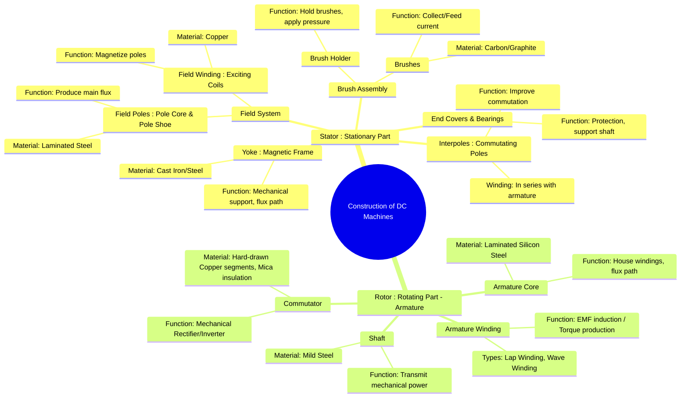

---
tags:
  - electrical-machines
  - dc-machines
  - machine-construction
created: 2025-09-15
aliases:
  - DC Machine Construction
  - Construction of DC Machines
subject: "[[Electrical Machines]]"
parent:
  - DC Machines
modified: 2026-07-23T20:39:01
---
### Constructional Features of DC Machines
#dc-machines #machine-construction

> A Direct Current (DC) machine is an electromechanical energy conversion device that can operate as either a [[Principle of Operation of DC Motors|motor]] (electrical to mechanical energy) or a [[Principle of Operation of DC Generators|generator]] (mechanical to electrical energy). Its construction consists of two main parts: a stationary part called the **stator** and a rotating part called the **rotor** (or **armature**).

---
#### Stator (Stationary Part)
#dc-machines/stator

The stator provides the main magnetic field and includes the following components:

|                                         |                                                                                 |
| --------------------------------------- | ------------------------------------------------------------------------------- |
| ![[DC-machine-parts-construction.webp]] | ![[Construction of DC Machine 2.png\|200]] ![[Construction of DC Machine.png\|200]] |

##### 1. Yoke
#yoke #magnetic-frame

* **Function**: The outer frame of the machine. It serves two purposes:
    1. Provides mechanical support for the poles and protects the entire machine.
    2. Acts as the return path for the magnetic flux produced by the field winding.
* **Material**: For small machines, it's made of **cast iron**. For larger machines, it's made of **cast steel or rolled steel** due to its higher magnetic [[permeability]].

---
##### 2. Field Poles and Pole Shoes
#field-poles #pole-shoe

* **Function**: The field poles are electromagnets that produce the main working flux. The pole shoes are the extended part of the poles which:
    1. Spread out the flux more uniformly in the air gap.
    2. Support the field coils ([[#Field Winding (Exciting Winding)|exciting windings]]).
* **Construction**: The pole core and shoe are built with **laminations of annealed steel** to reduce eddy current losses that may arise due to flux variations. They are bolted to the yoke.

---
##### 3. Field Winding (Exciting Winding)
#field-winding #exciting-winding

* **Function**: These are coils wound on the pole cores. When a DC current (excitation current) flows through them, they magnetize the poles, creating a stationary magnetic field.
* **Construction**: Made of insulated **copper** wire. The windings of all poles are connected in series to form the field circuit.

---
##### 4. Interpoles or Commutating Poles
#interpoles

* **Function**: These are small poles located midway between the main poles. Their primary function is to improve [[Commutation and Methods of Improvement|commutation]] by producing a reversing flux that neutralizes the reactance voltage in the commutated coil.
* **Construction**: Their winding is connected in series with the [[#armature winding]], so their flux is proportional to the armature current.

---
##### 5. Brush Assembly
#brushes #brush-holder

* **Function**: The brushes are stationary contacts that press against the rotating [[#3. Commutator|commutator]]. Their function is to collect current from the commutator (in a generator) or feed current to it (in a motor).
* **Material**: Typically made of **carbon or graphite** because they are good conductors and are self-lubricating, minimizing wear on the commutator.
* **Brush Holder**: A mechanical assembly that holds the brushes in position and applies appropriate pressure on the commutator using a spring.

---
#### Rotor (Rotating Part)
#dc-machines/rotor #armature

The rotor, also known as the armature, is the part of the machine where the main energy conversion takes place.

##### 1. Armature Core
#armature-core

* **Function**: It houses the armature conductors (winding) and provides a low-reluctance path for the magnetic flux to flow.
* **Construction**: It's a [[Armature Core Body.png|cylindrical core mounted on the shaft]]. It is built up of thin circular laminations (typically 0.4-0.6 mm thick) of **silicon steel**. Laminations are essential to minimize **eddy current loss**, as the armature rotates in a magnetic field, causing continuous flux reversals. Slots are punched on the outer periphery to place the armature winding.

---
##### 2. Armature Winding
#armature-winding

* **Function**: This is the main winding where EMF is induced (generator action) or torque is developed (motor action).
* **Construction**: It consists of [[Armature Winding.png|insulated copper coils placed inside the armature slots]]. The arrangement of these coils can be of two types: [[Armature Winding (Lap and Wave)|Lap Winding]] and [[Armature Winding (Lap and Wave)|Wave Winding]], which determine the voltage and current ratings of the machine.

---
##### 3. Commutator
#commutator

* **Function**: The commutator is the most critical component of a DC machine. It acts as a mechanical rectifier or inverter.
    * **In a Generator**: It converts the alternating EMF induced in the armature coils into a unidirectional (DC) EMF across the brushes.
    * **In a Motor**: It reverses the direction of current in the armature conductors as they pass from one pole to another, ensuring a continuous, unidirectional torque is produced.
* **Construction**: It's a [[Commutator Body.png|cylindrical structure made of wedge-shaped segments]] of **hard-drawn copper**, insulated from each other by thin layers of **mica**. It is mounted on the shaft along with the armature core.

---
##### 4. Shaft
#shaft

* **Function**: The shaft transmits mechanical power from the prime mover to the armature (in a [[Principle of Operation of DC Generators|generator]]) or from the armature to the load (in a [[Principle of Operation of DC Motors|motor]]).
* **Material**: Made of high-strength **mild steel**.

---
### Related Concepts
#dc-machines/related-concepts

> [[Principle of Operation of DC Generators]]

[[Principle of Operation of DC Motors]]
[[EMF and Torque Equations of a DC Machine]]
[[Armature Winding (Lap and Wave)]]
[[Armature Reaction]]
[[Commutation and Methods of Improvement]]