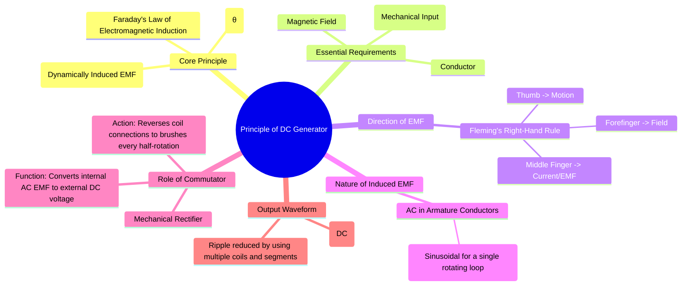

---
tags:
  - electrical-machines
  - dc-machines
  - dc-generators
  - energy-conversion
  - faradays-law
created: 2025-09-15
aliases:
  - DC Generator Principle
  - Working of DC Generator
  - Generated EMF Equation
subject: "[[Electrical Machines]]"
parent:
  - DC Machines
modified: 2026-07-23T20:39:33
---
### Principle of Operation of DC Generators
#dc-generators #faradays-law #energy-conversion

> A DC generator is an electromechanical energy conversion device that converts **mechanical energy** into **Direct Current (DC) electrical energy**. The fundamental principle behind its operation is **Faraday's Law of Electromagnetic Induction**.

---
#### Faraday's Law of Electromagnetic Induction
#faradays-law #induced-emf

Faraday's Law states that whenever a conductor cuts magnetic flux, a **dynamically induced Electromotive Force (EMF)** is produced in it. The magnitude of this induced EMF is directly proportional to the rate of change of flux linkage.

For a straight conductor moving in a uniform magnetic field, the induced EMF is given by:
$$ e = B l v \sin(\theta) $$
where:
- $e$ = Induced EMF (Volts)
- $B$ = Magnetic flux density (Tesla or Wb/m²)
- $l$ = Active length of the conductor inside the magnetic field (meters)
- $v$ = Velocity of the conductor (m/s)
- $\theta$ = Angle between the direction of the magnetic field and the direction of the conductor's motion.

The EMF is maximum ($e = Blv$) when the conductor moves perpendicular to the field ($\theta = 90^\circ$) and zero when it moves parallel to the field ($\theta = 0^\circ$).

The three essential requirements for generating an EMF are:
1.  **Magnetic Field**: Provided by the stator's field poles.
2.  **Conductor**: The armature winding on the rotor.
3.  **Relative Motion**: The armature is rotated by a mechanical prime mover (e.g., a turbine or engine).

#### Direction of Induced EMF: Fleming's Right-Hand Rule
#flemings-right-hand-rule

The direction of the induced EMF (and the resulting current if the circuit is closed) can be determined by **Fleming's Right-Hand Rule**.
*   **Thumb**: Points in the direction of the **Motion** of the conductor.
*   **Forefinger**: Points in the direction of the Magnetic **Field** (North to South).
*   **Middle Finger**: Indicates the direction of the induced **Current** (and EMF).

#### Nature of Induced EMF and the Role of the Commutator
#commutator #mechanical-rectifier

Consider a single rectangular loop rotating in a magnetic field.
1.  As the loop rotates, the conductors on each side cut the magnetic flux.
2.  The direction of induced current in one side of the loop is opposite to that in the other side (according to Fleming's rule).
3.  Over one complete rotation, the direction of motion of each conductor through the magnetic field reverses. For example, a conductor moving downwards under a North pole will later move upwards under a South pole.
4.  This reversal of motion causes the direction of the induced EMF in the conductors to reverse every half-rotation.

> Therefore, the EMF induced in the [[Constructional Features of DC Machines#Armature Winding|armature conductors]] of a DC machine is inherently **alternating (AC)** in nature.

To get a DC output, a **[[Constructional Features of DC Machines#Commutator|commutator]]** is used. The commutator is a split-ring device that acts as a **mechanical rectifier**.
*   It reverses the connection of the armature coil to the external circuit at the exact same instant that the EMF in the coil reverses.
*   This action ensures that the current flowing through the external load is always in the same direction.
*   The output voltage is therefore a **pulsating, unidirectional (DC)** waveform. By using a large number of coils and commutator segments, the output waveform is smoothed, approaching a nearly constant DC voltage.

#### Generated EMF Equation
#dc-generator-emf-equation

For a practical DC generator, the average generated EMF across the brushes is given by the equation:
$$\begin{align}
\boxed{E_g = \frac{\phi Z N P}{60 A}}
\end{align}$$
Where:
- $E_g$ = Generated EMF (Volts)
- $\phi$ = Flux per pole (Webers, Wb)
- $Z$ = Total number of armature conductors
- $N$ = Speed of armature rotation (Revolutions Per Minute, RPM)
- $P$ = Number of poles
- $A$ = Number of parallel paths in the armature winding
  - For a [[Armature Winding (Lap and Wave)|Lap Winding]], $A = P$
  - For a [[Armature Winding (Lap and Wave)|Wave Winding]], $A = 2$

For a given machine, $P$, $Z$, and $A$ are constant. Therefore, the generated EMF is directly proportional to the speed and the flux per pole.
$$ E_g \propto \phi N $$

---
### Related Concepts
#dc-generators/related-concepts

> [[Constructional Features of DC Machines]]

[[EMF and Torque Equations of a DC Machine]]
[[Commutation and Methods of Improvement]]
[[Armature Winding (Lap and Wave)]]
[[Principle of Operation of DC Motors]]
[[Types of DC Generators]]