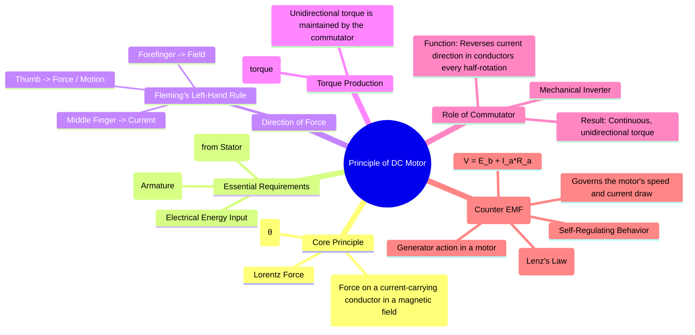

---
tags:
  - electrical-machines
  - dc-machines
  - dc-motors
  - energy-conversion
  - lorentz-force
created: 2025-09-15
aliases:
  - DC Motor Principle
  - Working of DC Motor
  - Torque Equation of a DC Motor
subject: "[[Electrical Machines]]"
parent: "[[DC Motors]]"
modified: 2026-07-23T20:39:59
---
### Principle of Operation of DC Motors
#dc-motors #lorentz-force #energy-conversion

> A DC motor is an electromechanical energy conversion device that converts **DC electrical energy** into **mechanical energy**. The working principle is based on the fact that a current-carrying conductor placed in a magnetic field experiences a mechanical force, known as the **Lorentz Force**.

---
#### Lorentz Force Principle
#lorentz-force #motor-principle

When a conductor carrying a current $I$ is placed in a magnetic field of flux density $B$, it experiences a force $F$. The magnitude of this force is given by:
$$ F = B I L \sin(\theta) $$
where:
-   $F$ = Force on the conductor (Newtons)
-   $B$ = Magnetic flux density (Tesla)
-   $I$ = Current flowing through the conductor (Amperes)
-   $L$ = Length of the conductor within the magnetic field (meters)
-   $\theta$ = Angle between the direction of the magnetic field and the direction of the current.

The force is maximum when the conductor is perpendicular to the magnetic field ($\theta = 90^\circ$). The collective force on all the armature conductors produces the torque required to rotate the motor shaft.

---
#### Direction of Force: Fleming's Left-Hand Rule
#flemings-left-hand-rule

The direction of the mechanical force experienced by the conductor is determined by **Fleming's Left-Hand Rule**.
* **Thumb**: Points in the direction of the **Force** or **Motion**.
* **Forefinger**: Points in the direction of the Magnetic **Field** (North to South).
* **Middle Finger**: Points in the direction of the **Current**.

---
#### Torque Production and the Role of the Commutator
#motor-torque #commutator

1. The [[Constructional Features of DC Machines#2. Armature Winding|armature winding]] is supplied with DC current from a power source via the [[Constructional Features of DC Machines#5. Brush Assembly|brushes]]. and [[Constructional Features of DC Machines#3. Commutator|commutator]].
2. The conductors on one side of the armature (e.g., under the North pole) carry current in one direction, while those on the opposite side (under the South pole) carry current in the opposite direction.
3. According to Fleming's Left-Hand Rule, the conductors under the North pole experience an upward force, and those under the South pole experience a downward force.
4. These two forces form a couple, producing a turning moment or **torque**, which rotates the [[Constructional Features of DC Machines#1. Armature Core|armature]].

As the armature rotates, a conductor that was under a North pole moves to a position under a South pole. For the torque to remain unidirectional, the direction of current in that conductor *must be reversed*. This crucial function is performed by the **commutator**, which acts as a **mechanical inverter**. It reverses the current direction in the conductors every half-rotation, ensuring a continuous and unidirectional torque is produced.

---
#### Significance of Back EMF ($E_b$)
#back-emf #self-regulation

While the armature is rotating due to motor action, its conductors are also cutting the magnetic flux lines of the [[Constructional Features of DC Machines#2. Field Poles and Pole Shoes|field poles]]. This induces an EMF in the conductors, just as in a generator. According to **Lenz's Law**, this induced EMF opposes the supply voltage that causes the current flow. For this reason, it is called **Back EMF** or **Counter EMF** ($E_b$).

The back EMF is the cornerstone of the motor's self-regulating behavior. The net voltage across the armature circuit is $(V - E_b)$, where $V$ is the supply voltage. The armature current is therefore:
$$\boxed{\quad I_a = \frac{V - E_b}{R_a} \quad}$$
where $R_a$ is the armature resistance. From this, the main voltage equation of a DC motor is:
$$\boxed{\quad V = E_b + I_a R_a \quad}$$
The back EMF is given by the same expression as the [[Principle of Operation of DC Generators#Generated EMF Equation|generated EMF in a generator]]: $$E_b = \frac{\phi Z N P}{60 A}$$
Thus, $E_b \propto \phi N$.

##### Self-Regulation

* If the motor load increases, the motor slows down (N decreases).
* This causes the back EMF ($E_b$) to decrease.
* The voltage difference $(V - E_b)$ increases, leading to a larger armature current $I_a$.
* Since [[#Torque Equation of a DC Motor|motor torque]] $T \propto \phi I_a$, the increased current produces more torque to meet the higher load demand.
* The opposite happens if the load decreases.

---
#### Torque Equation of a DC Motor
#dc-motor-torque-equation

The mechanical power developed by the armature is $P_m = E_b I_a$ $(\text{since, } V = E_b + I_a R_a)$. This power can also be expressed in terms of torque ($T$) and angular speed ($\omega$): $$P_m = T \omega = T \left(\frac{2\pi N}{60}\right)$$
Equating the two expressions for power:
$$\begin{align}
T \left(\frac{2\pi N}{60}\right) &= E_b I_a \\
T &= \left(\frac{60}{2\pi N}\right) E_b I_a
\end{align}$$
Substituting $E_b = \frac{\phi Z N P}{60 A}$:
$$
T = \left(\frac{60}{2\pi N}\right) \left(\frac{\phi Z N P}{60 A}\right) I_a \implies 
\boxed{\quad T = \frac{PZ}{2\pi A} \phi I_a\quad}
$$
For a given machine, $P, Z,$ and $A$ are constants, so the torque is directly proportional to the flux and the armature current:
$$ T \propto \phi I_a $$

> [!faq] **Why $K_e = K_t$ (short proof):** Use power balance.
> Electrical power converted: $P_{dev}=E I_a$.
> Mechanical power developed: $P_{dev}=T_a\omega$. Equate:
> 
> $$(K_e\omega)I_a = (K_t I_a)\omega \;\Rightarrow\; K_e = K_t.$$
> Unit note: $K_t$ in N·m/A equals $K_e$ in V·s/rad when SI units are used. If you use rpm form, convert with $\omega=2\pi N/60$.
>
> $K_e$ is Back-EMF constant - It tells how much voltage is generated per unit speed.
> $K_t$ is Torque constant - It tells how much torque you get per ampere of armature current.

> [!trick] Quick rules
> - Stall (zero speed): $E=0 \Rightarrow I_a=\dfrac{V_a}{R_a}$ (use to compute $K_t$ from a known torque).
> - No-load: $I_a\approx0 \Rightarrow E\approx V_a \Rightarrow \omega \approx \dfrac{V_a}{K_e}$

---
### Related Concepts
#dc-motors/related-concepts

> [[Constructional Features of DC Machines]]

[[EMF and Torque Equations of a DC Machine]]
[[Types of DC Motors]]
[[Principle of Operation of DC Generators]]
[[Starting of DC Motors]]
[[Speed Control of DC Motors]]