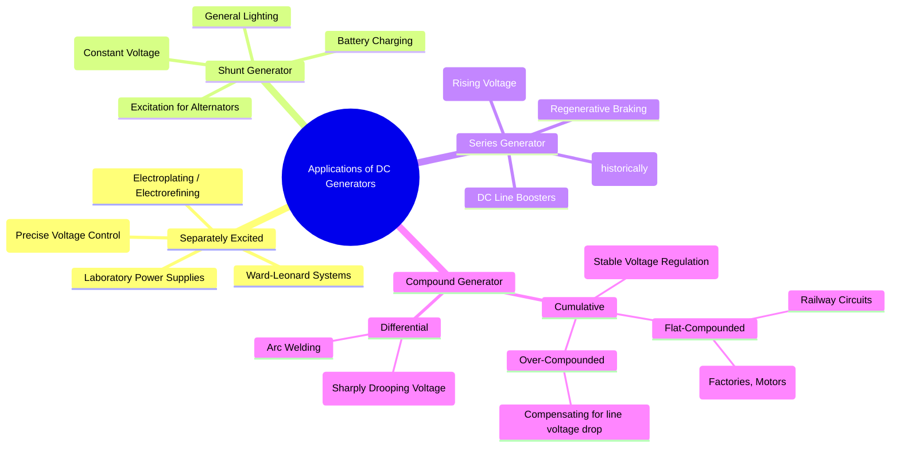

---
tags:
  - electrical-machines
  - dc-generators
  - applications
created: 2025-09-16
aliases:
  - DC Generator Applications
  - Uses of DC Generators
subject: "[[Electrical Machines]]"
parent:
  - DC Machines
modified: 2026-07-23T20:40:06
---
### Applications of DC Generators
#dc-generators #applications

> While AC systems dominate the world of power generation and transmission, DC generators retain importance in specific applications where their unique voltage-load characteristics are advantageous. The choice of a particular type of DC generator is determined almost entirely by its [[Characteristics of DC Generators|external characteristic curve]].

---
#### Applications of Separately Excited DC Generators
#separately-excited-generator/applications
*   **Characteristic**: The terminal voltage can be controlled over a wide range and is independent of the load current.
*   **Applications**:
    1.  **Ward-Leonard Systems**: These systems require very fine and wide-ranging speed control of a DC motor. A separately excited generator provides the variable armature voltage needed for this control.
    2.  **Electroplating and Electrorefining**: These processes require a stable, controlled DC voltage which can be adjusted precisely.
    3.  **Laboratory Use**: They serve as reliable and controllable DC power sources for testing and experiments.

---
#### Applications of Shunt DC Generators
#shunt-generator/applications
*   **Characteristic**: A nearly constant terminal voltage (slightly drooping).
*   **Applications**:
    1.  **General Lighting and Power**: Suitable for supplying loads that are physically close to the generator and require a stable voltage.
    2.  **Battery Charging**: The constant voltage characteristic is ideal for charging large batteries, as it prevents excessive charging currents.
    3.  **Excitation for Alternators**: Shunt generators are often used as **exciters** to provide the DC field current for large synchronous generators (alternators) in power plants.

---
#### Applications of Series DC Generators
#series-generator/applications
*   **Characteristic**: A rising voltage characteristic, where the voltage increases as the load current increases.
*   **Applications**:
    1.  **DC Transmission Line Boosters**: A series generator can be connected in series with a long DC feeder line. As the line current increases, the voltage drop ($IR$) in the line also increases. The series generator's voltage also rises, compensating for the line drop and keeping the voltage at the load end constant.
    2.  **Regenerative Braking**: In applications like electric locomotives, the DC motor can be operated as a series generator during braking to feed power back to the supply line.

---
#### Applications of Compound DC Generators
#compound-generator/applications
These are the most widely used DC generators because their characteristics can be tailored to the application.

##### 1. Cumulative Compound Generators
*   **Characteristic**: Excellent voltage regulation. The voltage can be made to be flat, rising, or drooping.
*   **Applications**:
    *   **Flat-Compounded**: These are used for loads that require a very stable voltage over a wide range, even if the load is located far from the generator. Examples include power for DC motors in industrial settings (elevators, conveyors, machine tools), and lighting circuits in factories.
    *   **Over-Compounded**: These are used to compensate for the voltage drop in long feeders. The rise in terminal voltage with load matches the line drop, ensuring a constant voltage at the remote load.

##### 2. Differential Compound Generators
*   **Characteristic**: A sharply drooping terminal voltage. The voltage drops significantly as the load current increases.
*   **Applications**:
    *   **Arc Welding**: This is the primary application. When the welding electrode touches the workpiece, a very large short-circuit current flows. The generator's voltage drops sharply, which limits this current to a safe value. When the arc is struck, the voltage recovers to maintain the arc. This characteristic is ideal for welding.

---
### Related Concepts
#dc-generators/related-concepts

> [[Types of DC Generators]]

[[Characteristics of DC Generators]]
[[Principle of Operation of DC Generators]]